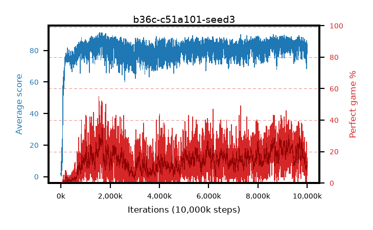

# b36c-c51a101-seed3

step **10,000,000** · 4000 evals · trailing **79.85** · peak **86.74** @1,682,500 · sef **0.0** · best30 **29.9** @1,685,000

## Config

| | |
|---|---|
| adam_epsilon | 0.0003125 |
| algo | c51 |
| batch_size | 32 |
| beta_anneal_steps | 300000 |
| collect_envs | 1 |
| discount | 0.99 |
| dist_atoms | 101 |
| dist_embedding | 64 |
| dist_fraction_entropy | 0.001 |
| dist_fraction_lr | 2.5e-09 |
| dist_kappa | 1.0 |
| dist_policy_samples | 32 |
| dist_quantiles | 32 |
| dist_risk_alpha | 1.0 |
| dist_risk_train | False |
| dist_tau_prime_samples | 64 |
| dist_tau_samples | 64 |
| dist_v_max | 110.0 |
| dist_v_min | -10.0 |
| epsilon_anneal_steps | 250000 |
| epsilon_schedule | linear |
| eval_interval | 2500 |
| eval_queue | True |
| eval_queue_depth | 16 |
| eval_workers | 8 |
| fc_layers | (320,) |
| fork_branches | 1 |
| gradient_clipping | 0.0 |
| graph_eval_episodes | 100 |
| guided_fraction | 0.0 |
| init_from | None |
| initial_collect_steps | 20000 |
| initial_epsilon | 1.0 |
| is_beta | 0.4 |
| is_beta_final | 1.0 |
| is_weights | False |
| learning_rate | 0.00025 |
| max_steps | 10000000 |
| min_checkpoint_score | 40.0 |
| min_epsilon | 0.01 |
| munchausen_alpha | 0.0 |
| munchausen_l0 | -1.0 |
| munchausen_tau | 0.03 |
| n_step_update | 1 |
| priority_exponent | 0.0 |
| replay_buffer_max_length | 1000000 |
| replay_ratio | 0.25 |
| seed | 3 |
| target_update_period | 2000 |
| target_update_tau | 1.0 |
| torch_threads | 1 |

## Evals

| step | avg score | trailing avg | min score | max score | avg reward | perfect % | epsilon |
|---|---|---|---|---|---|---|---|
| 2500 | 2.07 | 2.07 | 1.0 | 10.0 | 1.513 | 0.0 | 0.9901 |
| 5000 | 0.68 | 1.38 | 0.0 | 4.0 | 0.123 | 0.0 | 0.9802 |
| 7500 | 0.48 | 1.08 | 0.0 | 4.0 | -0.074 | 0.0 | 0.9703 |
| ... | ... | ... | ... | ... | ... | ... | ... |
| 9972500 | 86.23 | 79.49 | 37.0 | 95.0 | 110.929 | 26.0 | 0.01 |
| 9975000 | 68.54 | 79.13 | 31.0 | 90.0 | 67.447 | 0.0 | 0.01 |
| 9977500 | 80.84 | 79.32 | 45.0 | 95.0 | 86.64 | 7.0 | 0.01 |
| 9980000 | 86.01 | 79.35 | 29.0 | 95.0 | 108.721 | 24.0 | 0.01 |
| 9982500 | 80.59 | 79.26 | 24.0 | 95.0 | 88.339 | 9.0 | 0.01 |
| 9985000 | 83.28 | 79.5 | 25.0 | 95.0 | 98.001 | 16.0 | 0.01 |
| 9987500 | 77.94 | 79.47 | 40.0 | 95.0 | 84.742 | 8.0 | 0.01 |
| 9990000 | 81.26 | 79.57 | 43.0 | 95.0 | 94.989 | 15.0 | 0.01 |
| 9992500 | 80.73 | 79.68 | 50.0 | 95.0 | 86.513 | 7.0 | 0.01 |
| 9995000 | 81.65 | 79.69 | 43.0 | 95.0 | 85.45 | 5.0 | 0.01 |
| 9997500 | 84.17 | 79.91 | 65.0 | 95.0 | 92.91 | 10.0 | 0.01 |
| 10000000 | 83.04 | 79.85 | 53.0 | 95.0 | 96.823 | 15.0 | 0.01 |
