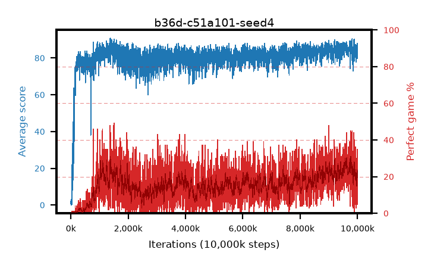

# b36d-c51a101-seed4

step **10,000,000** · 4000 evals · trailing **83.85** · peak **86.26** @9,620,000 · sef **0.0** · best30 **28.5** @9,615,000

## Config

| | |
|---|---|
| adam_epsilon | 0.0003125 |
| algo | c51 |
| batch_size | 32 |
| beta_anneal_steps | 300000 |
| collect_envs | 1 |
| discount | 0.99 |
| dist_atoms | 101 |
| dist_embedding | 64 |
| dist_fraction_entropy | 0.001 |
| dist_fraction_lr | 2.5e-09 |
| dist_kappa | 1.0 |
| dist_policy_samples | 32 |
| dist_quantiles | 32 |
| dist_risk_alpha | 1.0 |
| dist_risk_train | False |
| dist_tau_prime_samples | 64 |
| dist_tau_samples | 64 |
| dist_v_max | 110.0 |
| dist_v_min | -10.0 |
| epsilon_anneal_steps | 250000 |
| epsilon_schedule | linear |
| eval_interval | 2500 |
| eval_queue | True |
| eval_queue_depth | 16 |
| eval_workers | 8 |
| fc_layers | (320,) |
| fork_branches | 1 |
| gradient_clipping | 0.0 |
| graph_eval_episodes | 100 |
| guided_fraction | 0.0 |
| init_from | None |
| initial_collect_steps | 20000 |
| initial_epsilon | 1.0 |
| is_beta | 0.4 |
| is_beta_final | 1.0 |
| is_weights | False |
| learning_rate | 0.00025 |
| max_steps | 10000000 |
| min_checkpoint_score | 40.0 |
| min_epsilon | 0.01 |
| munchausen_alpha | 0.0 |
| munchausen_l0 | -1.0 |
| munchausen_tau | 0.03 |
| n_step_update | 1 |
| priority_exponent | 0.0 |
| replay_buffer_max_length | 1000000 |
| replay_ratio | 0.25 |
| seed | 4 |
| target_update_period | 2000 |
| target_update_tau | 1.0 |
| torch_threads | 1 |

## Evals

| step | avg score | trailing avg | min score | max score | avg reward | perfect % | epsilon |
|---|---|---|---|---|---|---|---|
| 2500 | 0.83 | 0.83 | 0.0 | 7.0 | 0.274 | 0.0 | 0.9901 |
| 5000 | 2.7 | 1.77 | 0.0 | 11.0 | 2.12 | 0.0 | 0.9802 |
| 7500 | 0.73 | 1.42 | 0.0 | 4.0 | 0.174 | 0.0 | 0.9703 |
| ... | ... | ... | ... | ... | ... | ... | ... |
| 9972500 | 82.59 | 83.8 | 29.0 | 95.0 | 100.595 | 20.0 | 0.01 |
| 9975000 | 85.89 | 84.08 | 41.0 | 95.0 | 105.798 | 22.0 | 0.01 |
| 9977500 | 82.49 | 83.7 | 19.0 | 95.0 | 103.369 | 23.0 | 0.01 |
| 9980000 | 84.58 | 83.91 | 17.0 | 95.0 | 106.632 | 24.0 | 0.01 |
| 9982500 | 83.99 | 84.0 | 35.0 | 95.0 | 98.152 | 17.0 | 0.01 |
| 9985000 | 88.1 | 83.85 | 49.0 | 95.0 | 121.412 | 35.0 | 0.01 |
| 9987500 | 86.4 | 84.0 | 39.0 | 95.0 | 117.708 | 33.0 | 0.01 |
| 9990000 | 82.31 | 83.83 | 38.0 | 95.0 | 92.976 | 13.0 | 0.01 |
| 9992500 | 83.57 | 83.8 | 41.0 | 95.0 | 96.702 | 16.0 | 0.01 |
| 9995000 | 83.37 | 83.9 | 52.0 | 95.0 | 95.581 | 15.0 | 0.01 |
| 9997500 | 79.77 | 83.86 | 35.0 | 95.0 | 81.927 | 5.0 | 0.01 |
| 10000000 | 82.78 | 83.85 | 24.0 | 95.0 | 92.515 | 13.0 | 0.01 |
