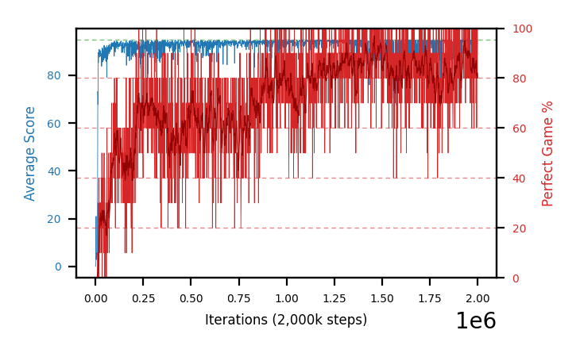

# b37a-chase10g75seed5

Blue is average score (food eaten) on the left axis, red is perfect-game percentage on the right.

Latest eval: step 2000000, avg score 95.0, perfect games 100%.

## Config

| setting | value |
|---|---|
| policy_name | b37a-chase10g75seed5 |
| seed | 5 |
| zeroed_observations | none |
| learning_rate | 1e-05 |
| batch_size | 128 |
| discount | 0.9975 |
| target_update_period | 1000 |
| target_update_tau | 1.0 |
| gradient_clipping | none |
| n_step_update | 1 |
| initial_epsilon | 0.4 |
| min_epsilon | 0.002 |
| epsilon_schedule | bootstrap on avg_reward [2, 5, 10, 15, 20] then geometric to floor by 80% trailing-30 perfect |
| guided_fraction | 0.8 |
| forking | up to 4 live branches including the main line, fork p=0.5 at length >= 85, branch capped at 60 steps, one branch advanced per iteration |
| exploration_shield | 80% of refinement-phase episodes draw the epsilon move from non-fatal actions; greedy moves never shielded |
| fc_layer_params | (320,) |
| replay_buffer | cpprb prioritized, capacity 100000 |
| priority_exponent (alpha) | 0.6 |
| priority_signal | td_error |
| importance_sampling_beta | disabled |
| max_steps | 2000000 |
| initial_populate_steps | 1000 |
| eval | 10 episodes every 1000 steps |
| grid | 9x9, max possible score 95 |
| DEATH_REWARD | -5.0 |
| FOOD_REWARD | 1.0 |
| FOOD_DISTANCE_REWARD | 0.0 |
| CHASE_SAFE_SHAPING | c=0.1, potential-based on head/food/tail in one region, gated to snake length >= 75 |
| eval_only | False |
| min_checkpoint_score | 40.0 |

## Evals

2001 evals so far. Full series in [`b37a-chase10g75seed5_evals.json`](b37a-chase10g75seed5_evals.json).

| step | avg score | trailing avg | min score | max score | avg reward | perfect % | epsilon |
|---|---|---|---|---|---|---|---|
| 0 | 0.0 | 0.0 | 0 | 0/95 | -5.0 | 0 | 0.4 |
| 1000 | 0.8 | 0.8 | 0 | 4/95 | 0.3 | 0 | 0.4 |
| 2000 | 1.8 | 1.3 | 0 | 6/95 | 1.3 | 0 | 0.4 |
| ... | | | | | | | |
| 1989000 | 95.0 | 92.76 | 95 | 95/95 | 193.953 | 100 | 0.002 |
| 1990000 | 93.9 | 94.34 | 86 | 95/95 | 172.955 | 80 | 0.002 |
| 1991000 | 94.7 | 94.32 | 92 | 95/95 | 183.708 | 90 | 0.002 |
| 1992000 | 94.3 | 94.28 | 92 | 95/95 | 162.956 | 70 | 0.002 |
| 1993000 | 94.7 | 94.52 | 93 | 95/95 | 173.306 | 80 | 0.002 |
| 1994000 | 95.0 | 94.52 | 95 | 95/95 | 193.956 | 100 | 0.002 |
| 1995000 | 85.8 | 92.9 | 9 | 95/95 | 144.509 | 60 | 0.002 |
| 1996000 | 85.1 | 90.98 | 9 | 95/95 | 144.26 | 60 | 0.002 |
| 1997000 | 95.0 | 91.12 | 95 | 95/95 | 193.958 | 100 | 0.002 |
| 1998000 | 89.0 | 89.98 | 36 | 95/95 | 167.159 | 80 | 0.002 |
| 1999000 | 94.0 | 89.78 | 89 | 95/95 | 173.057 | 80 | 0.002 |
| 2000000 | 95.0 | 91.62 | 95 | 95/95 | 193.956 | 100 | 0.002 |
