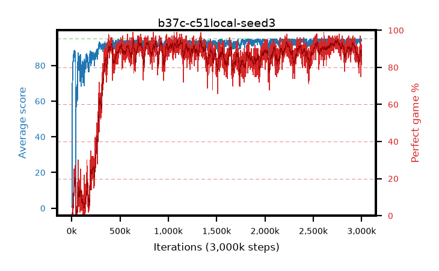

# b37c-c51local-seed3

step **3,000,000** · 3000 evals · trailing **94.16** · peak **94.52** @2,907,000 · sef **83.2** · best30 **94.1** @2,750,000

## Config

| | |
|---|---|
| adam_epsilon | 1e-07 |
| algo | c51 |
| batch_size | 128 |
| beta_anneal_steps | 300000 |
| collect_envs | 1 |
| discount | 0.99 |
| dist_atoms | 51 |
| dist_embedding | 64 |
| dist_fraction_entropy | 0.001 |
| dist_fraction_lr | 2.5e-09 |
| dist_kappa | 1.0 |
| dist_policy_samples | 32 |
| dist_quantiles | 32 |
| dist_risk_alpha | 1.0 |
| dist_risk_train | False |
| dist_tau_prime_samples | 64 |
| dist_tau_samples | 64 |
| dist_v_max | 110.0 |
| dist_v_min | -10.0 |
| epsilon_anneal_steps | 250000 |
| epsilon_schedule | eval |
| eval_interval | 1000 |
| eval_queue | True |
| eval_queue_depth | 16 |
| eval_workers | 8 |
| fc_layers | (320,) |
| fork_branches | 4 |
| fork_max_steps | 60 |
| fork_min_length | 85 |
| fork_prob | 0.5 |
| gradient_clipping | 0.0 |
| graph_eval_episodes | 100 |
| guided_fraction | 0.8 |
| init_from | None |
| initial_collect_steps | 2000 |
| initial_epsilon | 0.4 |
| is_beta | 0.4 |
| is_beta_final | 1.0 |
| is_weights | True |
| learning_rate | 1e-05 |
| max_steps | 3000000 |
| min_checkpoint_score | 40.0 |
| min_epsilon | 0.002 |
| munchausen_alpha | 0.0 |
| munchausen_l0 | -1.0 |
| munchausen_tau | 0.03 |
| n_step_update | 1 |
| priority_exponent | 0.6 |
| replay_buffer_max_length | 100000 |
| replay_ratio | 1.0 |
| seed | 3 |
| target_update_period | 8 |
| target_update_tau | 1.0 |
| torch_threads | 1 |

## Evals

| step | avg score | trailing avg | min score | max score | avg reward | perfect % | epsilon |
|---|---|---|---|---|---|---|---|
| 1000 | 0.68 | 0.68 | 0.0 | 4.0 | 0.126 | 0.0 | 0.4 |
| 2000 | 0.53 | 0.6 | 0.0 | 4.0 | -0.025 | 0.0 | 0.4 |
| 3000 | 0.6 | 0.6 | 0.0 | 4.0 | 0.047 | 0.0 | 0.4 |
| ... | ... | ... | ... | ... | ... | ... | ... |
| 2989000 | 93.25 | 94.14 | 29.0 | 95.0 | 175.78 | 84.0 | 0.002 |
| 2990000 | 94.86 | 94.16 | 92.0 | 95.0 | 186.329 | 93.0 | 0.002 |
| 2991000 | 93.65 | 94.16 | 39.0 | 95.0 | 177.152 | 85.0 | 0.002 |
| 2992000 | 93.92 | 94.14 | 54.0 | 95.0 | 167.401 | 75.0 | 0.002 |
| 2993000 | 94.77 | 94.14 | 89.0 | 95.0 | 184.31 | 91.0 | 0.002 |
| 2994000 | 94.13 | 94.14 | 41.0 | 95.0 | 179.631 | 87.0 | 0.002 |
| 2995000 | 93.32 | 94.14 | 25.0 | 95.0 | 169.803 | 78.0 | 0.002 |
| 2996000 | 94.78 | 94.14 | 92.0 | 95.0 | 182.274 | 89.0 | 0.002 |
| 2997000 | 94.69 | 94.17 | 84.0 | 95.0 | 183.281 | 90.0 | 0.002 |
| 2998000 | 94.3 | 94.16 | 46.0 | 95.0 | 184.796 | 92.0 | 0.002 |
| 2999000 | 93.85 | 94.14 | 21.0 | 95.0 | 179.422 | 87.0 | 0.002 |
| 3000000 | 94.64 | 94.16 | 80.0 | 95.0 | 182.194 | 89.0 | 0.002 |
