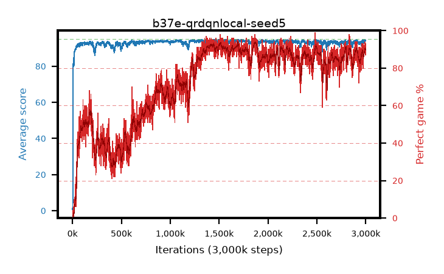

# b37e-qrdqnlocal-seed5

step **3,000,000** · 3000 evals · trailing **93.71** · peak **94.26** @1,876,000 · sef **54.5** · best30 **93.3** @1,876,000

## Config

| | |
|---|---|
| adam_epsilon | 1e-07 |
| algo | qrdqn |
| batch_size | 128 |
| beta_anneal_steps | 300000 |
| collect_envs | 1 |
| discount | 0.99 |
| dist_atoms | 51 |
| dist_embedding | 64 |
| dist_fraction_entropy | 0.001 |
| dist_fraction_lr | 2.5e-09 |
| dist_kappa | 1.0 |
| dist_policy_samples | 32 |
| dist_quantiles | 32 |
| dist_risk_alpha | 1.0 |
| dist_risk_train | False |
| dist_tau_prime_samples | 64 |
| dist_tau_samples | 64 |
| dist_v_max | 110.0 |
| dist_v_min | -10.0 |
| epsilon_anneal_steps | 250000 |
| epsilon_schedule | eval |
| eval_interval | 1000 |
| eval_queue | True |
| eval_queue_depth | 16 |
| eval_workers | 8 |
| fc_layers | (320,) |
| fork_branches | 4 |
| fork_max_steps | 60 |
| fork_min_length | 85 |
| fork_prob | 0.5 |
| gradient_clipping | 0.0 |
| graph_eval_episodes | 100 |
| guided_fraction | 0.8 |
| init_from | None |
| initial_collect_steps | 2000 |
| initial_epsilon | 0.4 |
| is_beta | 0.4 |
| is_beta_final | 1.0 |
| is_weights | True |
| learning_rate | 1e-05 |
| max_steps | 3000000 |
| min_checkpoint_score | 40.0 |
| min_epsilon | 0.002 |
| munchausen_alpha | 0.0 |
| munchausen_l0 | -1.0 |
| munchausen_tau | 0.03 |
| n_step_update | 1 |
| priority_exponent | 0.6 |
| replay_buffer_max_length | 100000 |
| replay_ratio | 1.0 |
| seed | 5 |
| target_update_period | 8 |
| target_update_tau | 1.0 |
| torch_threads | 1 |

## Evals

| step | avg score | trailing avg | min score | max score | avg reward | perfect % | epsilon |
|---|---|---|---|---|---|---|---|
| 1000 | 0.65 | 0.65 | 0.0 | 4.0 | 0.097 | 0.0 | 0.4 |
| 2000 | 2.21 | 1.43 | 1.0 | 7.0 | 1.657 | 0.0 | 0.4 |
| 3000 | 5.53 | 2.8 | 1.0 | 22.0 | 4.951 | 0.0 | 0.4 |
| ... | ... | ... | ... | ... | ... | ... | ... |
| 2989000 | 94.27 | 93.46 | 71.0 | 95.0 | 186.778 | 94.0 | 0.002 |
| 2990000 | 94.6 | 93.51 | 80.0 | 95.0 | 184.976 | 92.0 | 0.002 |
| 2991000 | 94.25 | 93.52 | 76.0 | 95.0 | 182.664 | 90.0 | 0.002 |
| 2992000 | 93.51 | 93.5 | 61.0 | 95.0 | 180.926 | 89.0 | 0.002 |
| 2993000 | 94.01 | 93.54 | 74.0 | 95.0 | 182.477 | 90.0 | 0.002 |
| 2994000 | 93.28 | 93.55 | 51.0 | 95.0 | 180.77 | 89.0 | 0.002 |
| 2995000 | 94.16 | 93.54 | 51.0 | 95.0 | 179.36 | 87.0 | 0.002 |
| 2996000 | 94.08 | 93.57 | 78.0 | 95.0 | 179.394 | 87.0 | 0.002 |
| 2997000 | 94.28 | 93.62 | 47.0 | 95.0 | 185.638 | 93.0 | 0.002 |
| 2998000 | 93.98 | 93.64 | 72.0 | 95.0 | 182.37 | 90.0 | 0.002 |
| 2999000 | 93.92 | 93.69 | 69.0 | 95.0 | 182.441 | 90.0 | 0.002 |
| 3000000 | 94.35 | 93.71 | 71.0 | 95.0 | 182.607 | 90.0 | 0.002 |
