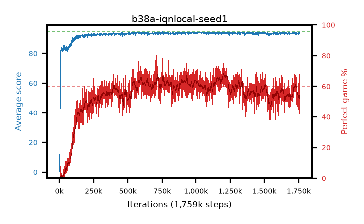

# b38a-iqnlocal-seed1

step **1,759,000** · 1759 evals · trailing **93.52** · peak **93.98** @1,032,000 · sef **0.1** · best30 **67.5** @1,222,000

## Config

| | |
|---|---|
| adam_epsilon | 1e-07 |
| algo | iqn |
| batch_size | 128 |
| beta_anneal_steps | 300000 |
| collect_envs | 1 |
| discount | 0.99 |
| dist_atoms | 51 |
| dist_embedding | 64 |
| dist_fraction_entropy | 0.001 |
| dist_fraction_lr | 2.5e-09 |
| dist_kappa | 1.0 |
| dist_policy_samples | 32 |
| dist_quantiles | 32 |
| dist_risk_alpha | 1.0 |
| dist_risk_train | False |
| dist_tau_prime_samples | 8 |
| dist_tau_samples | 8 |
| dist_v_max | 110.0 |
| dist_v_min | -10.0 |
| epsilon_anneal_steps | 250000 |
| epsilon_schedule | eval |
| eval_interval | 1000 |
| eval_queue | True |
| eval_queue_depth | 16 |
| eval_workers | 8 |
| fc_layers | (320,) |
| fork_branches | 4 |
| fork_max_steps | 60 |
| fork_min_length | 85 |
| fork_prob | 0.5 |
| gradient_clipping | 0.0 |
| graph_eval_episodes | 100 |
| guided_fraction | 0.8 |
| init_from | None |
| initial_collect_steps | 2000 |
| initial_epsilon | 0.4 |
| is_beta | 0.4 |
| is_beta_final | 1.0 |
| is_weights | True |
| learning_rate | 1e-05 |
| max_steps | 2000000 |
| min_checkpoint_score | 40.0 |
| min_epsilon | 0.002 |
| munchausen_alpha | 0.0 |
| munchausen_l0 | -1.0 |
| munchausen_tau | 0.03 |
| n_step_update | 1 |
| priority_exponent | 0.6 |
| replay_buffer_max_length | 100000 |
| replay_ratio | 1.0 |
| seed | 1 |
| target_update_period | 8 |
| target_update_tau | 1.0 |
| torch_threads | 1 |

## Evals

| step | avg score | trailing avg | min score | max score | avg reward | perfect % | epsilon |
|---|---|---|---|---|---|---|---|
| 1000 | 0.63 | 0.63 | 0.0 | 5.0 | 0.076 | 0.0 | 0.4 |
| 2000 | 0.54 | 0.58 | 0.0 | 3.0 | -0.013 | 0.0 | 0.4 |
| 3000 | 0.76 | 0.64 | 0.0 | 4.0 | 0.206 | 0.0 | 0.4 |
| ... | ... | ... | ... | ... | ... | ... | ... |
| 1748000 | 94.03 | 93.64 | 90.0 | 95.0 | 154.51 | 62.0 | 0.00333 |
| 1749000 | 93.88 | 93.64 | 86.0 | 95.0 | 150.23 | 58.0 | 0.00333 |
| 1750000 | 92.73 | 93.62 | 54.0 | 95.0 | 136.096 | 45.0 | 0.00336 |
| 1751000 | 93.73 | 93.61 | 89.0 | 95.0 | 144.311 | 52.0 | 0.00338 |
| 1752000 | 93.37 | 93.58 | 80.0 | 95.0 | 140.773 | 49.0 | 0.00342 |
| 1753000 | 93.57 | 93.58 | 86.0 | 95.0 | 141.945 | 50.0 | 0.00344 |
| 1754000 | 93.92 | 93.58 | 90.0 | 95.0 | 152.364 | 60.0 | 0.00347 |
| 1755000 | 93.1 | 93.55 | 78.0 | 95.0 | 133.484 | 42.0 | 0.00349 |
| 1756000 | 93.27 | 93.52 | 54.0 | 95.0 | 150.663 | 59.0 | 0.00348 |
| 1757000 | 94.2 | 93.54 | 89.0 | 95.0 | 160.576 | 68.0 | 0.00353 |
| 1758000 | 93.93 | 93.54 | 90.0 | 95.0 | 150.241 | 58.0 | 0.00354 |
| 1759000 | 93.59 | 93.52 | 82.0 | 95.0 | 138.922 | 47.0 | 0.00354 |
