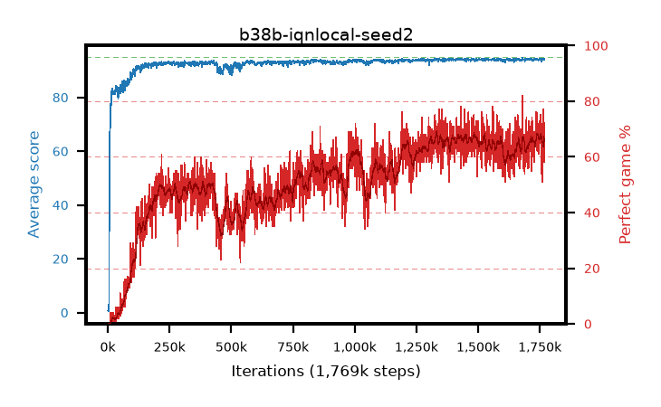

# b38b-iqnlocal-seed2

step **1,769,000** · 1769 evals · trailing **94.12** · peak **94.15** @1,755,000 · sef **0.1** · best30 **67.3** @1,759,000

## Config

| | |
|---|---|
| adam_epsilon | 1e-07 |
| algo | iqn |
| batch_size | 128 |
| beta_anneal_steps | 300000 |
| collect_envs | 1 |
| discount | 0.99 |
| dist_atoms | 51 |
| dist_embedding | 64 |
| dist_fraction_entropy | 0.001 |
| dist_fraction_lr | 2.5e-09 |
| dist_kappa | 1.0 |
| dist_policy_samples | 32 |
| dist_quantiles | 32 |
| dist_risk_alpha | 1.0 |
| dist_risk_train | False |
| dist_tau_prime_samples | 8 |
| dist_tau_samples | 8 |
| dist_v_max | 110.0 |
| dist_v_min | -10.0 |
| epsilon_anneal_steps | 250000 |
| epsilon_schedule | eval |
| eval_interval | 1000 |
| eval_queue | True |
| eval_queue_depth | 16 |
| eval_workers | 8 |
| fc_layers | (320,) |
| fork_branches | 4 |
| fork_max_steps | 60 |
| fork_min_length | 85 |
| fork_prob | 0.5 |
| gradient_clipping | 0.0 |
| graph_eval_episodes | 100 |
| guided_fraction | 0.8 |
| init_from | None |
| initial_collect_steps | 2000 |
| initial_epsilon | 0.4 |
| is_beta | 0.4 |
| is_beta_final | 1.0 |
| is_weights | True |
| learning_rate | 1e-05 |
| max_steps | 2000000 |
| min_checkpoint_score | 40.0 |
| min_epsilon | 0.002 |
| munchausen_alpha | 0.0 |
| munchausen_l0 | -1.0 |
| munchausen_tau | 0.03 |
| n_step_update | 1 |
| priority_exponent | 0.6 |
| replay_buffer_max_length | 100000 |
| replay_ratio | 1.0 |
| seed | 2 |
| target_update_period | 8 |
| target_update_tau | 1.0 |
| torch_threads | 1 |

## Evals

| step | avg score | trailing avg | min score | max score | avg reward | perfect % | epsilon |
|---|---|---|---|---|---|---|---|
| 1000 | 0.67 | 0.67 | 0.0 | 3.0 | 0.118 | 0.0 | 0.4 |
| 2000 | 0.51 | 0.59 | 0.0 | 3.0 | -0.043 | 0.0 | 0.4 |
| 3000 | 1.0 | 0.73 | 0.0 | 5.0 | 0.445 | 0.0 | 0.4 |
| ... | ... | ... | ... | ... | ... | ... | ... |
| 1758000 | 94.19 | 94.13 | 86.0 | 95.0 | 161.152 | 69.0 | 0.00271 |
| 1759000 | 94.24 | 94.13 | 85.0 | 95.0 | 164.245 | 72.0 | 0.00269 |
| 1760000 | 93.89 | 94.12 | 88.0 | 95.0 | 142.612 | 51.0 | 0.00269 |
| 1761000 | 94.16 | 94.12 | 86.0 | 95.0 | 160.191 | 68.0 | 0.00268 |
| 1762000 | 94.02 | 94.12 | 86.0 | 95.0 | 154.071 | 62.0 | 0.00271 |
| 1763000 | 94.11 | 94.12 | 86.0 | 95.0 | 155.02 | 63.0 | 0.0027 |
| 1764000 | 94.2 | 94.11 | 84.0 | 95.0 | 159.985 | 68.0 | 0.00271 |
| 1765000 | 94.32 | 94.12 | 84.0 | 95.0 | 169.321 | 77.0 | 0.00272 |
| 1766000 | 94.45 | 94.13 | 89.0 | 95.0 | 169.57 | 77.0 | 0.00274 |
| 1767000 | 94.09 | 94.12 | 90.0 | 95.0 | 149.768 | 58.0 | 0.00271 |
| 1768000 | 94.34 | 94.12 | 91.0 | 95.0 | 161.259 | 69.0 | 0.00269 |
| 1769000 | 94.07 | 94.12 | 83.0 | 95.0 | 152.62 | 61.0 | 0.00272 |
