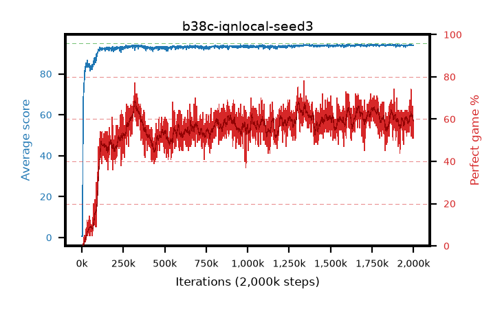

# b38c-iqnlocal-seed3

step **2,000,000** · 2000 evals · trailing **94.06** · peak **94.16** @1,768,000 · sef **0.0** · best30 **66.3** @337,000

## Config

| | |
|---|---|
| adam_epsilon | 1e-07 |
| algo | iqn |
| batch_size | 128 |
| beta_anneal_steps | 300000 |
| collect_envs | 1 |
| discount | 0.99 |
| dist_atoms | 51 |
| dist_embedding | 64 |
| dist_fraction_entropy | 0.001 |
| dist_fraction_lr | 2.5e-09 |
| dist_kappa | 1.0 |
| dist_policy_samples | 32 |
| dist_quantiles | 32 |
| dist_risk_alpha | 1.0 |
| dist_risk_train | False |
| dist_tau_prime_samples | 8 |
| dist_tau_samples | 8 |
| dist_v_max | 110.0 |
| dist_v_min | -10.0 |
| epsilon_anneal_steps | 250000 |
| epsilon_schedule | eval |
| eval_interval | 1000 |
| eval_queue | True |
| eval_queue_depth | 16 |
| eval_workers | 8 |
| fc_layers | (320,) |
| fork_branches | 4 |
| fork_max_steps | 60 |
| fork_min_length | 85 |
| fork_prob | 0.5 |
| gradient_clipping | 0.0 |
| graph_eval_episodes | 100 |
| guided_fraction | 0.8 |
| init_from | None |
| initial_collect_steps | 2000 |
| initial_epsilon | 0.4 |
| is_beta | 0.4 |
| is_beta_final | 1.0 |
| is_weights | True |
| learning_rate | 1e-05 |
| max_steps | 2000000 |
| min_checkpoint_score | 40.0 |
| min_epsilon | 0.002 |
| munchausen_alpha | 0.0 |
| munchausen_l0 | -1.0 |
| munchausen_tau | 0.03 |
| n_step_update | 1 |
| priority_exponent | 0.6 |
| replay_buffer_max_length | 100000 |
| replay_ratio | 1.0 |
| seed | 3 |
| target_update_period | 8 |
| target_update_tau | 1.0 |
| torch_threads | 1 |

## Evals

| step | avg score | trailing avg | min score | max score | avg reward | perfect % | epsilon |
|---|---|---|---|---|---|---|---|
| 1000 | 0.68 | 0.68 | 0.0 | 5.0 | 0.126 | 0.0 | 0.4 |
| 2000 | 0.59 | 0.64 | 0.0 | 3.0 | 0.036 | 0.0 | 0.4 |
| 3000 | 0.71 | 0.66 | 0.0 | 4.0 | 0.157 | 0.0 | 0.4 |
| ... | ... | ... | ... | ... | ... | ... | ... |
| 1989000 | 94.16 | 94.04 | 91.0 | 95.0 | 154.553 | 62.0 | 0.00313 |
| 1990000 | 94.04 | 94.04 | 91.0 | 95.0 | 147.024 | 55.0 | 0.00314 |
| 1991000 | 93.96 | 94.04 | 78.0 | 95.0 | 153.037 | 61.0 | 0.00311 |
| 1992000 | 94.02 | 94.04 | 87.0 | 95.0 | 153.017 | 61.0 | 0.00312 |
| 1993000 | 94.12 | 94.06 | 91.0 | 95.0 | 153.505 | 61.0 | 0.00313 |
| 1994000 | 94.14 | 94.06 | 91.0 | 95.0 | 158.271 | 66.0 | 0.00313 |
| 1995000 | 94.12 | 94.07 | 91.0 | 95.0 | 156.344 | 64.0 | 0.00311 |
| 1996000 | 93.91 | 94.07 | 90.0 | 95.0 | 142.98 | 51.0 | 0.00309 |
| 1997000 | 93.9 | 94.07 | 83.0 | 95.0 | 150.181 | 58.0 | 0.00308 |
| 1998000 | 93.98 | 94.07 | 91.0 | 95.0 | 149.166 | 57.0 | 0.00309 |
| 1999000 | 94.08 | 94.07 | 91.0 | 95.0 | 151.105 | 59.0 | 0.00309 |
| 2000000 | 93.9 | 94.06 | 88.0 | 95.0 | 142.977 | 51.0 | 0.0031 |
