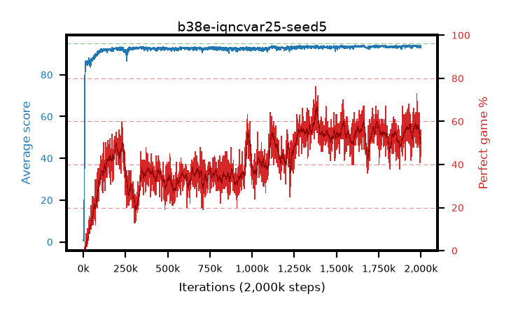

# b38e-iqncvar25-seed5

step **2,000,000** · 2000 evals · trailing **93.56** · peak **93.77** @1,939,000 · sef **0.0** · best30 **62.7** @1,390,000

## Config

| | |
|---|---|
| adam_epsilon | 1e-07 |
| algo | iqn |
| batch_size | 128 |
| beta_anneal_steps | 300000 |
| collect_envs | 1 |
| discount | 0.99 |
| dist_atoms | 51 |
| dist_embedding | 64 |
| dist_fraction_entropy | 0.001 |
| dist_fraction_lr | 2.5e-09 |
| dist_kappa | 1.0 |
| dist_policy_samples | 32 |
| dist_quantiles | 32 |
| dist_risk_alpha | 0.25 |
| dist_risk_train | True |
| dist_tau_prime_samples | 8 |
| dist_tau_samples | 8 |
| dist_v_max | 110.0 |
| dist_v_min | -10.0 |
| epsilon_anneal_steps | 250000 |
| epsilon_schedule | eval |
| eval_interval | 1000 |
| eval_queue | True |
| eval_queue_depth | 16 |
| eval_workers | 8 |
| fc_layers | (320,) |
| fork_branches | 4 |
| fork_max_steps | 60 |
| fork_min_length | 85 |
| fork_prob | 0.5 |
| gradient_clipping | 0.0 |
| graph_eval_episodes | 100 |
| guided_fraction | 0.8 |
| init_from | None |
| initial_collect_steps | 2000 |
| initial_epsilon | 0.4 |
| is_beta | 0.4 |
| is_beta_final | 1.0 |
| is_weights | True |
| learning_rate | 1e-05 |
| max_steps | 2000000 |
| min_checkpoint_score | 40.0 |
| min_epsilon | 0.002 |
| munchausen_alpha | 0.0 |
| munchausen_l0 | -1.0 |
| munchausen_tau | 0.03 |
| n_step_update | 1 |
| priority_exponent | 0.6 |
| replay_buffer_max_length | 100000 |
| replay_ratio | 1.0 |
| seed | 5 |
| target_update_period | 8 |
| target_update_tau | 1.0 |
| torch_threads | 1 |

## Evals

| step | avg score | trailing avg | min score | max score | avg reward | perfect % | epsilon |
|---|---|---|---|---|---|---|---|
| 1000 | 0.86 | 0.86 | 0.0 | 4.0 | 0.301 | 0.0 | 0.4 |
| 2000 | 0.49 | 0.68 | 0.0 | 5.0 | -0.063 | 0.0 | 0.4 |
| 3000 | 0.62 | 0.66 | 0.0 | 4.0 | 0.067 | 0.0 | 0.4 |
| ... | ... | ... | ... | ... | ... | ... | ... |
| 1989000 | 93.46 | 93.69 | 76.0 | 95.0 | 145.754 | 54.0 | 0.00332 |
| 1990000 | 92.97 | 93.67 | 72.0 | 95.0 | 140.292 | 49.0 | 0.00337 |
| 1991000 | 93.57 | 93.67 | 78.0 | 95.0 | 147.705 | 56.0 | 0.00339 |
| 1992000 | 93.87 | 93.67 | 83.0 | 95.0 | 156.058 | 64.0 | 0.0034 |
| 1993000 | 93.38 | 93.66 | 76.0 | 95.0 | 138.701 | 47.0 | 0.0034 |
| 1994000 | 93.33 | 93.65 | 67.0 | 95.0 | 138.377 | 47.0 | 0.00339 |
| 1995000 | 93.39 | 93.62 | 84.0 | 95.0 | 132.669 | 41.0 | 0.00341 |
| 1996000 | 93.42 | 93.6 | 82.0 | 95.0 | 139.448 | 48.0 | 0.00346 |
| 1997000 | 93.66 | 93.6 | 82.0 | 95.0 | 141.656 | 50.0 | 0.00351 |
| 1998000 | 92.83 | 93.57 | 63.0 | 95.0 | 134.894 | 44.0 | 0.00354 |
| 1999000 | 93.87 | 93.56 | 86.0 | 95.0 | 148.136 | 56.0 | 0.00355 |
| 2000000 | 93.37 | 93.56 | 85.0 | 95.0 | 141.77 | 50.0 | 0.00357 |
