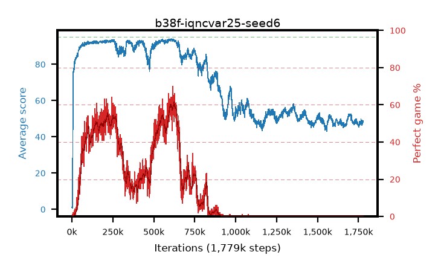

# b38f-iqncvar25-seed6

step **1,779,000** · 1779 evals · trailing **47.5** · peak **93.45** @620,000 · sef **0.0** · best30 **59.6** @621,000

## Config

| | |
|---|---|
| adam_epsilon | 1e-07 |
| algo | iqn |
| batch_size | 128 |
| beta_anneal_steps | 300000 |
| collect_envs | 1 |
| discount | 0.99 |
| dist_atoms | 51 |
| dist_embedding | 64 |
| dist_fraction_entropy | 0.001 |
| dist_fraction_lr | 2.5e-09 |
| dist_kappa | 1.0 |
| dist_policy_samples | 32 |
| dist_quantiles | 32 |
| dist_risk_alpha | 0.25 |
| dist_risk_train | True |
| dist_tau_prime_samples | 8 |
| dist_tau_samples | 8 |
| dist_v_max | 110.0 |
| dist_v_min | -10.0 |
| epsilon_anneal_steps | 250000 |
| epsilon_schedule | eval |
| eval_interval | 1000 |
| eval_queue | True |
| eval_queue_depth | 16 |
| eval_workers | 8 |
| fc_layers | (320,) |
| fork_branches | 4 |
| fork_max_steps | 60 |
| fork_min_length | 85 |
| fork_prob | 0.5 |
| gradient_clipping | 0.0 |
| graph_eval_episodes | 100 |
| guided_fraction | 0.8 |
| init_from | None |
| initial_collect_steps | 2000 |
| initial_epsilon | 0.4 |
| is_beta | 0.4 |
| is_beta_final | 1.0 |
| is_weights | True |
| learning_rate | 1e-05 |
| max_steps | 2000000 |
| min_checkpoint_score | 40.0 |
| min_epsilon | 0.002 |
| munchausen_alpha | 0.0 |
| munchausen_l0 | -1.0 |
| munchausen_tau | 0.03 |
| n_step_update | 1 |
| priority_exponent | 0.6 |
| replay_buffer_max_length | 100000 |
| replay_ratio | 1.0 |
| seed | 6 |
| target_update_period | 8 |
| target_update_tau | 1.0 |
| torch_threads | 1 |

## Evals

| step | avg score | trailing avg | min score | max score | avg reward | perfect % | epsilon |
|---|---|---|---|---|---|---|---|
| 1000 | 1.22 | 1.22 | 0.0 | 7.0 | 0.657 | 0.0 | 0.4 |
| 2000 | 0.73 | 0.97 | 0.0 | 5.0 | 0.176 | 0.0 | 0.4 |
| 3000 | 2.26 | 1.4 | 0.0 | 12.0 | 1.696 | 0.0 | 0.4 |
| ... | ... | ... | ... | ... | ... | ... | ... |
| 1768000 | 48.16 | 47.28 | 21.0 | 64.0 | 43.035 | 0.0 | 0.0125 |
| 1769000 | 46.3 | 47.23 | 13.0 | 64.0 | 41.184 | 0.0 | 0.0125 |
| 1770000 | 48.31 | 47.25 | 18.0 | 65.0 | 43.183 | 0.0 | 0.0125 |
| 1771000 | 46.76 | 47.24 | 27.0 | 65.0 | 41.635 | 0.0 | 0.0125 |
| 1772000 | 49.32 | 47.27 | 28.0 | 65.0 | 44.187 | 0.0 | 0.0125 |
| 1773000 | 47.04 | 47.25 | 25.0 | 65.0 | 41.918 | 0.0 | 0.0125 |
| 1774000 | 48.28 | 47.27 | 24.0 | 65.0 | 43.15 | 0.0 | 0.0125 |
| 1775000 | 47.27 | 47.27 | 29.0 | 59.0 | 42.143 | 0.0 | 0.0125 |
| 1776000 | 48.69 | 47.34 | 28.0 | 63.0 | 43.555 | 0.0 | 0.0125 |
| 1777000 | 48.74 | 47.42 | 23.0 | 65.0 | 43.609 | 0.0 | 0.0125 |
| 1778000 | 48.0 | 47.46 | 26.0 | 69.0 | 42.871 | 0.0 | 0.0125 |
| 1779000 | 48.02 | 47.5 | 24.0 | 62.0 | 42.892 | 0.0 | 0.0125 |
