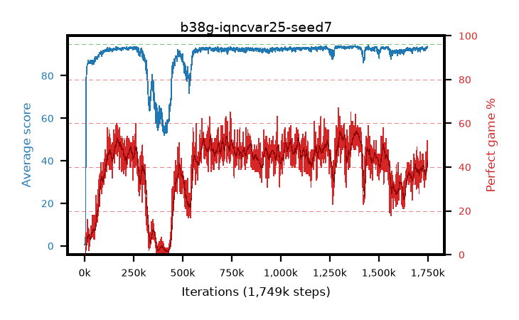

# b38g-iqncvar25-seed7

step **1,749,000** · 1749 evals · trailing **92.86** · peak **93.71** @1,392,000 · sef **0.0** · best30 **55.4** @1,395,000

## Config

| | |
|---|---|
| adam_epsilon | 1e-07 |
| algo | iqn |
| batch_size | 128 |
| beta_anneal_steps | 300000 |
| collect_envs | 1 |
| discount | 0.99 |
| dist_atoms | 51 |
| dist_embedding | 64 |
| dist_fraction_entropy | 0.001 |
| dist_fraction_lr | 2.5e-09 |
| dist_kappa | 1.0 |
| dist_policy_samples | 32 |
| dist_quantiles | 32 |
| dist_risk_alpha | 0.25 |
| dist_risk_train | True |
| dist_tau_prime_samples | 8 |
| dist_tau_samples | 8 |
| dist_v_max | 110.0 |
| dist_v_min | -10.0 |
| epsilon_anneal_steps | 250000 |
| epsilon_schedule | eval |
| eval_interval | 1000 |
| eval_queue | True |
| eval_queue_depth | 16 |
| eval_workers | 8 |
| fc_layers | (320,) |
| fork_branches | 4 |
| fork_max_steps | 60 |
| fork_min_length | 85 |
| fork_prob | 0.5 |
| gradient_clipping | 0.0 |
| graph_eval_episodes | 100 |
| guided_fraction | 0.8 |
| init_from | None |
| initial_collect_steps | 2000 |
| initial_epsilon | 0.4 |
| is_beta | 0.4 |
| is_beta_final | 1.0 |
| is_weights | True |
| learning_rate | 1e-05 |
| max_steps | 2000000 |
| min_checkpoint_score | 40.0 |
| min_epsilon | 0.002 |
| munchausen_alpha | 0.0 |
| munchausen_l0 | -1.0 |
| munchausen_tau | 0.03 |
| n_step_update | 1 |
| priority_exponent | 0.6 |
| replay_buffer_max_length | 100000 |
| replay_ratio | 1.0 |
| seed | 7 |
| target_update_period | 8 |
| target_update_tau | 1.0 |
| torch_threads | 1 |

## Evals

| step | avg score | trailing avg | min score | max score | avg reward | perfect % | epsilon |
|---|---|---|---|---|---|---|---|
| 1000 | 0.56 | 0.56 | 0.0 | 3.0 | 0.006 | 0.0 | 0.4 |
| 2000 | 0.57 | 0.56 | 0.0 | 4.0 | 0.016 | 0.0 | 0.4 |
| 3000 | 0.65 | 0.59 | 0.0 | 4.0 | 0.097 | 0.0 | 0.4 |
| ... | ... | ... | ... | ... | ... | ... | ... |
| 1738000 | 91.97 | 92.74 | 41.0 | 95.0 | 122.758 | 34.0 | 0.00509 |
| 1739000 | 92.72 | 92.74 | 56.0 | 95.0 | 123.081 | 34.0 | 0.00511 |
| 1740000 | 93.31 | 92.78 | 83.0 | 95.0 | 136.937 | 47.0 | 0.00514 |
| 1741000 | 92.54 | 92.76 | 37.0 | 95.0 | 128.883 | 40.0 | 0.00516 |
| 1742000 | 93.41 | 92.76 | 87.0 | 95.0 | 132.981 | 43.0 | 0.00516 |
| 1743000 | 92.62 | 92.81 | 62.0 | 95.0 | 129.256 | 40.0 | 0.00517 |
| 1744000 | 93.22 | 92.81 | 85.0 | 95.0 | 130.95 | 41.0 | 0.00515 |
| 1745000 | 92.68 | 92.81 | 60.0 | 95.0 | 127.153 | 38.0 | 0.00514 |
| 1746000 | 93.32 | 92.81 | 86.0 | 95.0 | 131.849 | 42.0 | 0.00511 |
| 1747000 | 93.2 | 92.82 | 83.0 | 95.0 | 129.846 | 40.0 | 0.00511 |
| 1748000 | 93.52 | 92.84 | 80.0 | 95.0 | 142.641 | 52.0 | 0.00512 |
| 1749000 | 93.68 | 92.86 | 88.0 | 95.0 | 138.292 | 48.0 | 0.0051 |
