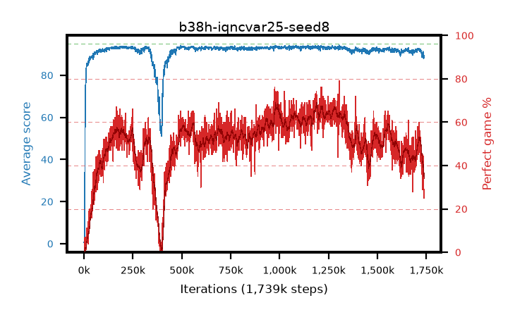

# b38h-iqncvar25-seed8

step **1,739,000** · 1739 evals · trailing **90.78** · peak **93.47** @1,096,000 · sef **0.0** · best30 **66.4** @999,000

## Config

| | |
|---|---|
| adam_epsilon | 1e-07 |
| algo | iqn |
| batch_size | 128 |
| beta_anneal_steps | 300000 |
| collect_envs | 1 |
| discount | 0.99 |
| dist_atoms | 51 |
| dist_embedding | 64 |
| dist_fraction_entropy | 0.001 |
| dist_fraction_lr | 2.5e-09 |
| dist_kappa | 1.0 |
| dist_policy_samples | 32 |
| dist_quantiles | 32 |
| dist_risk_alpha | 0.25 |
| dist_risk_train | True |
| dist_tau_prime_samples | 8 |
| dist_tau_samples | 8 |
| dist_v_max | 110.0 |
| dist_v_min | -10.0 |
| epsilon_anneal_steps | 250000 |
| epsilon_schedule | eval |
| eval_interval | 1000 |
| eval_queue | True |
| eval_queue_depth | 16 |
| eval_workers | 8 |
| fc_layers | (320,) |
| fork_branches | 4 |
| fork_max_steps | 60 |
| fork_min_length | 85 |
| fork_prob | 0.5 |
| gradient_clipping | 0.0 |
| graph_eval_episodes | 100 |
| guided_fraction | 0.8 |
| init_from | None |
| initial_collect_steps | 2000 |
| initial_epsilon | 0.4 |
| is_beta | 0.4 |
| is_beta_final | 1.0 |
| is_weights | True |
| learning_rate | 1e-05 |
| max_steps | 2000000 |
| min_checkpoint_score | 40.0 |
| min_epsilon | 0.002 |
| munchausen_alpha | 0.0 |
| munchausen_l0 | -1.0 |
| munchausen_tau | 0.03 |
| n_step_update | 1 |
| priority_exponent | 0.6 |
| replay_buffer_max_length | 100000 |
| replay_ratio | 1.0 |
| seed | 8 |
| target_update_period | 8 |
| target_update_tau | 1.0 |
| torch_threads | 1 |

## Evals

| step | avg score | trailing avg | min score | max score | avg reward | perfect % | epsilon |
|---|---|---|---|---|---|---|---|
| 1000 | 0.66 | 0.66 | 0.0 | 4.0 | 0.107 | 0.0 | 0.4 |
| 2000 | 0.62 | 0.64 | 0.0 | 5.0 | 0.067 | 0.0 | 0.4 |
| 3000 | 0.75 | 0.68 | 0.0 | 4.0 | 0.196 | 0.0 | 0.4 |
| ... | ... | ... | ... | ... | ... | ... | ... |
| 1728000 | 90.42 | 91.68 | 53.0 | 95.0 | 128.935 | 42.0 | 0.00403 |
| 1729000 | 90.65 | 91.62 | 69.0 | 95.0 | 131.223 | 44.0 | 0.00405 |
| 1730000 | 88.78 | 91.51 | 61.0 | 95.0 | 113.796 | 29.0 | 0.00408 |
| 1731000 | 90.38 | 91.5 | 57.0 | 95.0 | 127.756 | 41.0 | 0.00408 |
| 1732000 | 90.38 | 91.47 | 67.0 | 95.0 | 131.782 | 45.0 | 0.00415 |
| 1733000 | 91.23 | 91.47 | 69.0 | 95.0 | 131.679 | 44.0 | 0.00417 |
| 1734000 | 89.32 | 91.37 | 52.0 | 95.0 | 118.388 | 33.0 | 0.00418 |
| 1735000 | 89.1 | 91.26 | 51.0 | 95.0 | 122.216 | 37.0 | 0.00418 |
| 1736000 | 87.9 | 91.11 | 53.0 | 95.0 | 112.723 | 29.0 | 0.00426 |
| 1737000 | 88.23 | 90.99 | 66.0 | 95.0 | 109.039 | 25.0 | 0.00431 |
| 1738000 | 89.1 | 90.87 | 69.0 | 95.0 | 113.854 | 29.0 | 0.00438 |
| 1739000 | 89.31 | 90.78 | 73.0 | 95.0 | 114.192 | 29.0 | 0.00448 |
