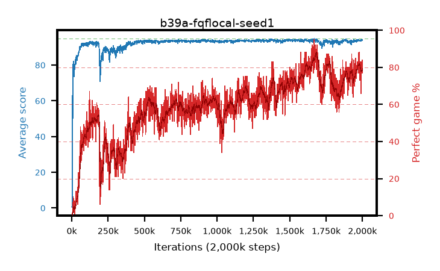

# b39a-fqflocal-seed1

step **2,000,000** · 2000 evals · trailing **93.93** · peak **94.06** @1,386,000 · sef **7.7** · best30 **85.9** @1,683,000

## Config

| | |
|---|---|
| adam_epsilon | 1e-07 |
| algo | fqf |
| batch_size | 128 |
| beta_anneal_steps | 300000 |
| collect_envs | 1 |
| discount | 0.99 |
| dist_atoms | 51 |
| dist_embedding | 64 |
| dist_fraction_entropy | 0.001 |
| dist_fraction_lr | 2.5e-09 |
| dist_kappa | 1.0 |
| dist_policy_samples | 32 |
| dist_quantiles | 8 |
| dist_risk_alpha | 1.0 |
| dist_risk_train | False |
| dist_tau_prime_samples | 64 |
| dist_tau_samples | 64 |
| dist_v_max | 110.0 |
| dist_v_min | -10.0 |
| epsilon_anneal_steps | 250000 |
| epsilon_schedule | eval |
| eval_interval | 1000 |
| eval_queue | True |
| eval_queue_depth | 16 |
| eval_workers | 8 |
| fc_layers | (320,) |
| fork_branches | 4 |
| fork_max_steps | 60 |
| fork_min_length | 85 |
| fork_prob | 0.5 |
| gradient_clipping | 0.0 |
| graph_eval_episodes | 100 |
| guided_fraction | 0.8 |
| init_from | None |
| initial_collect_steps | 2000 |
| initial_epsilon | 0.4 |
| is_beta | 0.4 |
| is_beta_final | 1.0 |
| is_weights | True |
| learning_rate | 1e-05 |
| max_steps | 2000000 |
| min_checkpoint_score | 40.0 |
| min_epsilon | 0.002 |
| munchausen_alpha | 0.0 |
| munchausen_l0 | -1.0 |
| munchausen_tau | 0.03 |
| n_step_update | 1 |
| priority_exponent | 0.6 |
| replay_buffer_max_length | 100000 |
| replay_ratio | 1.0 |
| seed | 1 |
| target_update_period | 8 |
| target_update_tau | 1.0 |
| torch_threads | 1 |

## Evals

| step | avg score | trailing avg | min score | max score | avg reward | perfect % | epsilon |
|---|---|---|---|---|---|---|---|
| 1000 | 0.71 | 0.71 | 0.0 | 5.0 | 0.157 | 0.0 | 0.4 |
| 2000 | 0.46 | 0.58 | 0.0 | 3.0 | -0.093 | 0.0 | 0.4 |
| 3000 | 3.54 | 1.57 | 1.0 | 13.0 | 2.981 | 0.0 | 0.4 |
| ... | ... | ... | ... | ... | ... | ... | ... |
| 1989000 | 93.64 | 93.83 | 65.0 | 95.0 | 172.633 | 81.0 | 0.002 |
| 1990000 | 93.52 | 93.85 | 79.0 | 95.0 | 156.766 | 66.0 | 0.002 |
| 1991000 | 94.29 | 93.85 | 83.0 | 95.0 | 174.242 | 82.0 | 0.002 |
| 1992000 | 93.44 | 93.86 | 51.0 | 95.0 | 166.114 | 75.0 | 0.002 |
| 1993000 | 94.06 | 93.87 | 75.0 | 95.0 | 172.857 | 81.0 | 0.002 |
| 1994000 | 94.1 | 93.88 | 79.0 | 95.0 | 168.732 | 77.0 | 0.002 |
| 1995000 | 94.26 | 93.9 | 85.0 | 95.0 | 168.912 | 77.0 | 0.002 |
| 1996000 | 94.09 | 93.92 | 72.0 | 95.0 | 175.005 | 83.0 | 0.002 |
| 1997000 | 93.79 | 93.91 | 72.0 | 95.0 | 169.447 | 78.0 | 0.00201 |
| 1998000 | 94.3 | 93.92 | 83.0 | 95.0 | 176.186 | 84.0 | 0.002 |
| 1999000 | 93.83 | 93.92 | 70.0 | 95.0 | 171.608 | 80.0 | 0.00201 |
| 2000000 | 93.86 | 93.93 | 74.0 | 95.0 | 168.521 | 77.0 | 0.002 |
