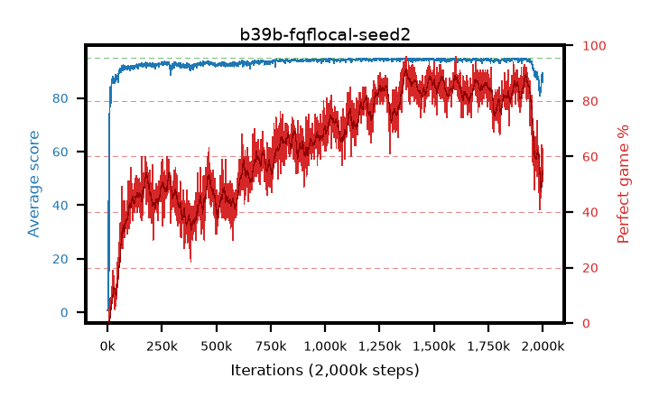

# b39b-fqflocal-seed2

step **2,000,000** · 2000 evals · trailing **86.11** · peak **94.66** @1,373,000 · sef **30.4** · best30 **89.5** @1,387,000

## Config

| | |
|---|---|
| adam_epsilon | 1e-07 |
| algo | fqf |
| batch_size | 128 |
| beta_anneal_steps | 300000 |
| collect_envs | 1 |
| discount | 0.99 |
| dist_atoms | 51 |
| dist_embedding | 64 |
| dist_fraction_entropy | 0.001 |
| dist_fraction_lr | 2.5e-09 |
| dist_kappa | 1.0 |
| dist_policy_samples | 32 |
| dist_quantiles | 8 |
| dist_risk_alpha | 1.0 |
| dist_risk_train | False |
| dist_tau_prime_samples | 64 |
| dist_tau_samples | 64 |
| dist_v_max | 110.0 |
| dist_v_min | -10.0 |
| epsilon_anneal_steps | 250000 |
| epsilon_schedule | eval |
| eval_interval | 1000 |
| eval_queue | True |
| eval_queue_depth | 16 |
| eval_workers | 8 |
| fc_layers | (320,) |
| fork_branches | 4 |
| fork_max_steps | 60 |
| fork_min_length | 85 |
| fork_prob | 0.5 |
| gradient_clipping | 0.0 |
| graph_eval_episodes | 100 |
| guided_fraction | 0.8 |
| init_from | None |
| initial_collect_steps | 2000 |
| initial_epsilon | 0.4 |
| is_beta | 0.4 |
| is_beta_final | 1.0 |
| is_weights | True |
| learning_rate | 1e-05 |
| max_steps | 2000000 |
| min_checkpoint_score | 40.0 |
| min_epsilon | 0.002 |
| munchausen_alpha | 0.0 |
| munchausen_l0 | -1.0 |
| munchausen_tau | 0.03 |
| n_step_update | 1 |
| priority_exponent | 0.6 |
| replay_buffer_max_length | 100000 |
| replay_ratio | 1.0 |
| seed | 2 |
| target_update_period | 8 |
| target_update_tau | 1.0 |
| torch_threads | 1 |

## Evals

| step | avg score | trailing avg | min score | max score | avg reward | perfect % | epsilon |
|---|---|---|---|---|---|---|---|
| 1000 | 0.68 | 0.68 | 0.0 | 5.0 | 0.127 | 0.0 | 0.4 |
| 2000 | 0.72 | 0.7 | 0.0 | 5.0 | 0.165 | 0.0 | 0.4 |
| 3000 | 1.36 | 0.92 | 0.0 | 12.0 | 0.804 | 0.0 | 0.4 |
| ... | ... | ... | ... | ... | ... | ... | ... |
| 1989000 | 82.19 | 86.86 | 42.0 | 95.0 | 123.744 | 45.0 | 0.00331 |
| 1990000 | 83.62 | 86.68 | 35.0 | 95.0 | 128.169 | 48.0 | 0.00335 |
| 1991000 | 84.01 | 86.49 | 37.0 | 95.0 | 126.536 | 46.0 | 0.0034 |
| 1992000 | 83.33 | 86.33 | 45.0 | 95.0 | 125.785 | 46.0 | 0.0034 |
| 1993000 | 86.6 | 86.27 | 47.0 | 95.0 | 140.561 | 57.0 | 0.00344 |
| 1994000 | 88.03 | 86.27 | 56.0 | 95.0 | 149.236 | 64.0 | 0.00346 |
| 1995000 | 88.13 | 86.23 | 52.0 | 95.0 | 143.041 | 58.0 | 0.00346 |
| 1996000 | 88.74 | 86.25 | 61.0 | 95.0 | 143.689 | 58.0 | 0.00345 |
| 1997000 | 88.61 | 86.2 | 56.0 | 95.0 | 148.706 | 63.0 | 0.00346 |
| 1998000 | 85.85 | 86.12 | 35.0 | 95.0 | 133.692 | 51.0 | 0.00346 |
| 1999000 | 88.3 | 86.07 | 57.0 | 95.0 | 139.159 | 54.0 | 0.00347 |
| 2000000 | 89.3 | 86.11 | 55.0 | 95.0 | 137.992 | 52.0 | 0.00349 |
