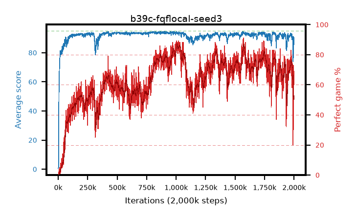

# b39c-fqflocal-seed3

step **2,000,000** · 2000 evals · trailing **88.81** · peak **94.06** @816,000 · sef **11.9** · best30 **85.7** @1,027,000

## Config

| | |
|---|---|
| adam_epsilon | 1e-07 |
| algo | fqf |
| batch_size | 128 |
| beta_anneal_steps | 300000 |
| collect_envs | 1 |
| discount | 0.99 |
| dist_atoms | 51 |
| dist_embedding | 64 |
| dist_fraction_entropy | 0.001 |
| dist_fraction_lr | 2.5e-09 |
| dist_kappa | 1.0 |
| dist_policy_samples | 32 |
| dist_quantiles | 8 |
| dist_risk_alpha | 1.0 |
| dist_risk_train | False |
| dist_tau_prime_samples | 64 |
| dist_tau_samples | 64 |
| dist_v_max | 110.0 |
| dist_v_min | -10.0 |
| epsilon_anneal_steps | 250000 |
| epsilon_schedule | eval |
| eval_interval | 1000 |
| eval_queue | True |
| eval_queue_depth | 16 |
| eval_workers | 8 |
| fc_layers | (320,) |
| fork_branches | 4 |
| fork_max_steps | 60 |
| fork_min_length | 85 |
| fork_prob | 0.5 |
| gradient_clipping | 0.0 |
| graph_eval_episodes | 100 |
| guided_fraction | 0.8 |
| init_from | None |
| initial_collect_steps | 2000 |
| initial_epsilon | 0.4 |
| is_beta | 0.4 |
| is_beta_final | 1.0 |
| is_weights | True |
| learning_rate | 1e-05 |
| max_steps | 2000000 |
| min_checkpoint_score | 40.0 |
| min_epsilon | 0.002 |
| munchausen_alpha | 0.0 |
| munchausen_l0 | -1.0 |
| munchausen_tau | 0.03 |
| n_step_update | 1 |
| priority_exponent | 0.6 |
| replay_buffer_max_length | 100000 |
| replay_ratio | 1.0 |
| seed | 3 |
| target_update_period | 8 |
| target_update_tau | 1.0 |
| torch_threads | 1 |

## Evals

| step | avg score | trailing avg | min score | max score | avg reward | perfect % | epsilon |
|---|---|---|---|---|---|---|---|
| 1000 | 0.66 | 0.66 | 0.0 | 4.0 | 0.106 | 0.0 | 0.4 |
| 2000 | 0.97 | 0.81 | 0.0 | 5.0 | 0.413 | 0.0 | 0.4 |
| 3000 | 1.83 | 1.15 | 0.0 | 12.0 | 1.272 | 0.0 | 0.4 |
| ... | ... | ... | ... | ... | ... | ... | ... |
| 1989000 | 87.4 | 91.42 | 36.0 | 95.0 | 136.637 | 52.0 | 0.00235 |
| 1990000 | 84.86 | 91.23 | 32.0 | 95.0 | 134.942 | 53.0 | 0.00235 |
| 1991000 | 75.03 | 90.7 | 15.0 | 95.0 | 91.92 | 21.0 | 0.00238 |
| 1992000 | 73.98 | 90.12 | 31.0 | 95.0 | 89.594 | 20.0 | 0.00241 |
| 1993000 | 77.47 | 89.66 | 9.0 | 95.0 | 107.786 | 34.0 | 0.00251 |
| 1994000 | 87.73 | 89.5 | 51.0 | 95.0 | 143.17 | 58.0 | 0.00261 |
| 1995000 | 91.01 | 89.48 | 36.0 | 95.0 | 161.935 | 73.0 | 0.00268 |
| 1996000 | 88.76 | 89.4 | 20.0 | 95.0 | 156.769 | 70.0 | 0.00271 |
| 1997000 | 86.82 | 89.22 | 27.0 | 95.0 | 145.641 | 61.0 | 0.0027 |
| 1998000 | 85.59 | 89.02 | 23.0 | 95.0 | 143.215 | 60.0 | 0.00271 |
| 1999000 | 90.53 | 88.98 | 30.0 | 95.0 | 157.897 | 69.0 | 0.00274 |
| 2000000 | 88.38 | 88.81 | 22.0 | 95.0 | 147.433 | 61.0 | 0.00277 |
