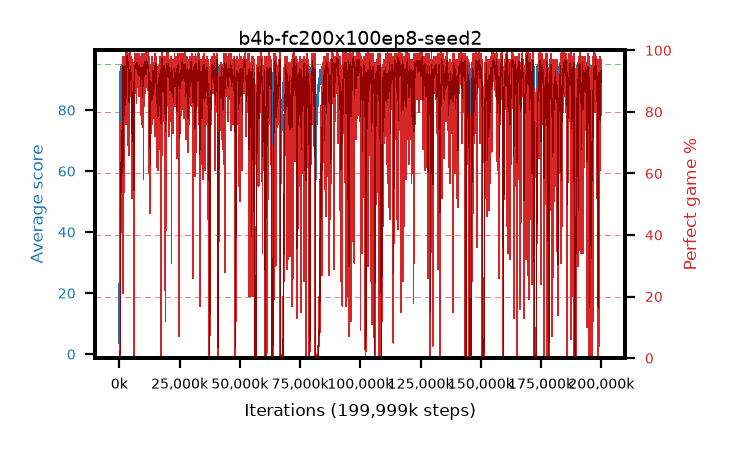

# b4b-fc200x100ep8-seed2

step **199,999,488** · 12207 evals · trailing **93.45** · peak **94.54** @88,571,904 · sef **80.8** · best30 **97.5** @169,328,640

## Config

| | |
|---|---|
| algo | ppo |
| collect_envs | 128 |
| discount | 0.99 |
| eval_interval | 16384 |
| eval_queue | True |
| eval_queue_depth | 16 |
| eval_workers | 8 |
| fc_layers | (200, 100) |
| graph_eval_episodes | 100 |
| max_steps | 199999488 |
| min_checkpoint_score | 40.0 |
| ppo_adam_epsilon | 1e-07 |
| ppo_clip | 0.2 |
| ppo_entropy_coef | 0.01 |
| ppo_entropy_coef_final | None |
| ppo_epochs | 8 |
| ppo_gae_lambda | 0.98 |
| ppo_gradient_clipping | 0.5 |
| ppo_horizon | 33.6 |
| ppo_learning_rate | 0.0003 |
| ppo_minibatch | 256 |
| ppo_normalize_adv | True |
| ppo_rollout | 128 |
| ppo_target_kl | 0.0 |
| ppo_transitions_per_rollout | 16384 |
| ppo_value_loss | huber |
| ppo_vf_coef | 0.5 |
| seed | 2 |
| torch_threads | 1 |

## Evals

| step | avg score | trailing avg | min score | max score | avg reward | perfect % | epsilon |
|---|---|---|---|---|---|---|---|
| 16384 | 3.7 | 3.7 | 1.0 | 14.0 | -1.3 | 0.0 |  |
| 32768 | 9.15 | 6.43 | 1.0 | 29.0 | 7.615 | 0.0 |  |
| 49152 | 30.52 | 14.46 | 9.0 | 56.0 | 25.52 | 0.0 |  |
| ... | ... | ... | ... | ... | ... | ... | ... |
| 199819264 | 94.25 | 92.82 | 76.0 | 95.0 | 184.93 | 92.0 |  |
| 199835648 | 93.81 | 92.94 | 77.0 | 95.0 | 181.37 | 89.0 |  |
| 199852032 | 93.04 | 93.09 | 6.0 | 95.0 | 181.64 | 90.0 |  |
| 199868416 | 93.41 | 93.06 | 3.0 | 95.0 | 183.095 | 91.0 |  |
| 199884800 | 94.38 | 92.94 | 77.0 | 95.0 | 187.14 | 94.0 |  |
| 199901184 | 94.2 | 92.99 | 34.0 | 95.0 | 190.08 | 97.0 |  |
| 199917568 | 90.39 | 92.95 | 26.0 | 95.0 | 167.55 | 79.0 |  |
| 199933952 | 91.62 | 93.41 | 13.0 | 95.0 | 180.22 | 90.0 |  |
| 199950336 | 92.45 | 93.44 | 28.0 | 95.0 | 180.01 | 89.0 |  |
| 199966720 | 92.11 | 93.14 | 34.0 | 95.0 | 176.55 | 86.0 |  |
| 199983104 | 94.41 | 93.38 | 72.0 | 95.0 | 187.17 | 94.0 |  |
| 199999488 | 91.62 | 93.45 | 17.0 | 95.0 | 184.38 | 94.0 |  |
