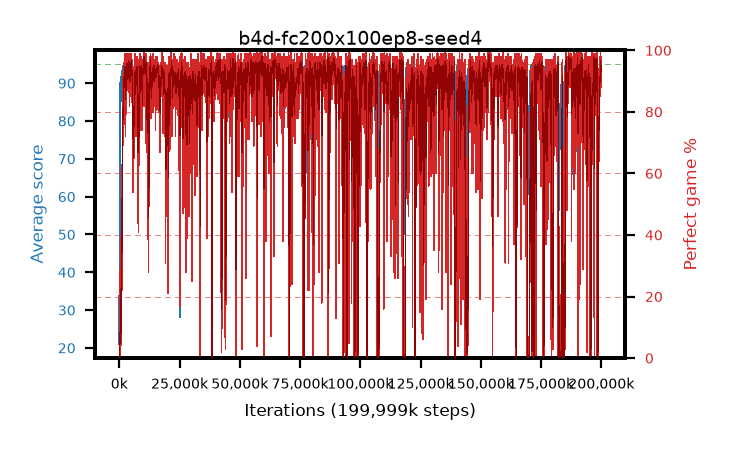

# b4d-fc200x100ep8-seed4

step **199,999,488** · 12207 evals · trailing **94.06** · peak **94.69** @187,449,344 · sef **79.5** · best30 **97.9** @153,681,920

## Config

| | |
|---|---|
| algo | ppo |
| collect_envs | 128 |
| discount | 0.99 |
| eval_interval | 16384 |
| eval_queue | True |
| eval_queue_depth | 16 |
| eval_workers | 8 |
| fc_layers | (200, 100) |
| graph_eval_episodes | 100 |
| max_steps | 199999488 |
| min_checkpoint_score | 40.0 |
| ppo_adam_epsilon | 1e-07 |
| ppo_clip | 0.2 |
| ppo_entropy_coef | 0.01 |
| ppo_entropy_coef_final | None |
| ppo_epochs | 8 |
| ppo_gae_lambda | 0.98 |
| ppo_gradient_clipping | 0.5 |
| ppo_horizon | 33.6 |
| ppo_learning_rate | 0.0003 |
| ppo_minibatch | 256 |
| ppo_normalize_adv | True |
| ppo_rollout | 128 |
| ppo_target_kl | 0.0 |
| ppo_transitions_per_rollout | 16384 |
| ppo_value_loss | huber |
| ppo_vf_coef | 0.5 |
| seed | 4 |
| torch_threads | 1 |

## Evals

| step | avg score | trailing avg | min score | max score | avg reward | perfect % | epsilon |
|---|---|---|---|---|---|---|---|
| 16384 | 21.01 | 21.01 | 2.0 | 44.0 | 16.01 | 0.0 |  |
| 32768 | 32.35 | 27.59 | 9.0 | 61.0 | 27.35 | 0.0 |  |
| 49152 | 29.4 | 25.2 | 7.0 | 49.0 | 24.4 | 0.0 |  |
| ... | ... | ... | ... | ... | ... | ... | ... |
| 199819264 | 93.36 | 93.95 | 22.0 | 95.0 | 184.04 | 92.0 |  |
| 199835648 | 94.41 | 93.84 | 78.0 | 95.0 | 187.17 | 94.0 |  |
| 199852032 | 93.53 | 93.89 | 21.0 | 95.0 | 187.33 | 95.0 |  |
| 199868416 | 94.36 | 94.02 | 67.0 | 95.0 | 188.205 | 95.0 |  |
| 199884800 | 92.05 | 93.99 | 11.0 | 95.0 | 182.73 | 92.0 |  |
| 199901184 | 94.66 | 94.02 | 76.0 | 95.0 | 191.625 | 98.0 |  |
| 199917568 | 93.03 | 94.03 | 17.0 | 95.0 | 183.755 | 92.0 |  |
| 199933952 | 93.07 | 93.92 | 10.0 | 95.0 | 186.87 | 95.0 |  |
| 199950336 | 92.85 | 93.97 | 22.0 | 95.0 | 186.65 | 95.0 |  |
| 199966720 | 93.36 | 94.05 | 24.0 | 95.0 | 179.88 | 88.0 |  |
| 199983104 | 94.05 | 93.99 | 71.0 | 95.0 | 183.825 | 91.0 |  |
| 199999488 | 93.86 | 94.06 | 36.0 | 95.0 | 186.62 | 94.0 |  |
