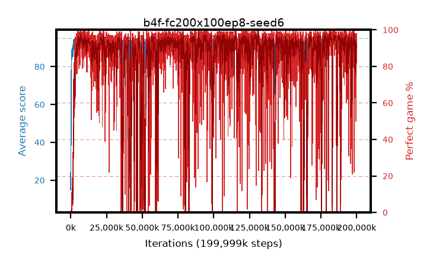

# b4f-fc200x100ep8-seed6

step **199,999,488** · 12207 evals · trailing **93.32** · peak **94.63** @185,024,512 · sef **83.1** · best30 **97.4** @181,633,024

## Config

| | |
|---|---|
| algo | ppo |
| collect_envs | 128 |
| discount | 0.99 |
| eval_interval | 16384 |
| eval_queue | True |
| eval_queue_depth | 16 |
| eval_workers | 8 |
| fc_layers | (200, 100) |
| graph_eval_episodes | 100 |
| max_steps | 199999488 |
| min_checkpoint_score | 40.0 |
| ppo_adam_epsilon | 1e-07 |
| ppo_clip | 0.2 |
| ppo_entropy_coef | 0.01 |
| ppo_entropy_coef_final | None |
| ppo_epochs | 8 |
| ppo_gae_lambda | 0.98 |
| ppo_gradient_clipping | 0.5 |
| ppo_horizon | 33.6 |
| ppo_learning_rate | 0.0003 |
| ppo_minibatch | 256 |
| ppo_normalize_adv | True |
| ppo_rollout | 128 |
| ppo_target_kl | 0.0 |
| ppo_transitions_per_rollout | 16384 |
| ppo_value_loss | huber |
| ppo_vf_coef | 0.5 |
| seed | 6 |
| torch_threads | 1 |

## Evals

| step | avg score | trailing avg | min score | max score | avg reward | perfect % | epsilon |
|---|---|---|---|---|---|---|---|
| 16384 | 15.07 | 22.41 | 3.0 | 39.0 | 12.005 | 0.0 |  |
| 32768 | 22.52 | 22.52 | 1.0 | 45.0 | 17.7 | 0.0 |  |
| 49152 | 24.68 | 23.6 | 5.0 | 38.0 | 19.77 | 0.0 |  |
| ... | ... | ... | ... | ... | ... | ... | ... |
| 199819264 | 94.04 | 92.99 | 47.0 | 95.0 | 187.84 | 95.0 |  |
| 199835648 | 93.88 | 93.0 | 36.0 | 95.0 | 186.64 | 94.0 |  |
| 199852032 | 94.1 | 93.03 | 44.0 | 95.0 | 186.86 | 94.0 |  |
| 199868416 | 92.4 | 93.0 | 10.0 | 95.0 | 182.04 | 91.0 |  |
| 199884800 | 93.69 | 93.04 | 35.0 | 95.0 | 181.25 | 89.0 |  |
| 199901184 | 91.42 | 92.94 | 28.0 | 95.0 | 173.78 | 84.0 |  |
| 199917568 | 93.33 | 92.89 | 42.0 | 95.0 | 173.61 | 82.0 |  |
| 199933952 | 94.53 | 93.12 | 70.0 | 95.0 | 188.33 | 95.0 |  |
| 199950336 | 94.52 | 93.48 | 62.0 | 95.0 | 189.36 | 96.0 |  |
| 199966720 | 94.72 | 93.22 | 84.0 | 95.0 | 188.52 | 95.0 |  |
| 199983104 | 94.67 | 93.41 | 77.0 | 95.0 | 191.59 | 98.0 |  |
| 199999488 | 94.51 | 93.32 | 77.0 | 95.0 | 189.35 | 96.0 |  |
