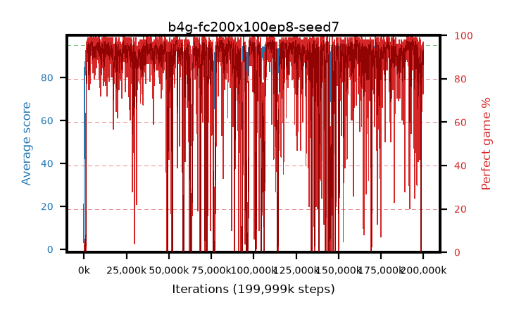

# b4g-fc200x100ep8-seed7

step **199,999,488** · 12207 evals · trailing **93.59** · peak **94.63** @193,839,104 · sef **82.1** · best30 **97.3** @54,689,792

## Config

| | |
|---|---|
| algo | ppo |
| collect_envs | 128 |
| discount | 0.99 |
| eval_interval | 16384 |
| eval_queue | True |
| eval_queue_depth | 16 |
| eval_workers | 8 |
| fc_layers | (200, 100) |
| graph_eval_episodes | 100 |
| max_steps | 199999488 |
| min_checkpoint_score | 40.0 |
| ppo_adam_epsilon | 1e-07 |
| ppo_clip | 0.2 |
| ppo_entropy_coef | 0.01 |
| ppo_entropy_coef_final | None |
| ppo_epochs | 8 |
| ppo_gae_lambda | 0.98 |
| ppo_gradient_clipping | 0.5 |
| ppo_horizon | 33.6 |
| ppo_learning_rate | 0.0003 |
| ppo_minibatch | 256 |
| ppo_normalize_adv | True |
| ppo_rollout | 128 |
| ppo_target_kl | 0.0 |
| ppo_transitions_per_rollout | 16384 |
| ppo_value_loss | huber |
| ppo_vf_coef | 0.5 |
| seed | 7 |
| torch_threads | 1 |

## Evals

| step | avg score | trailing avg | min score | max score | avg reward | perfect % | epsilon |
|---|---|---|---|---|---|---|---|
| 16384 | 3.18 | 3.18 | 0.0 | 13.0 | 1.87 | 0.0 |  |
| 32768 | 21.89 | 17.36 | 0.0 | 47.0 | 17.88 | 0.0 |  |
| 49152 | 27.01 | 15.1 | 2.0 | 47.0 | 22.1 | 0.0 |  |
| ... | ... | ... | ... | ... | ... | ... | ... |
| 199819264 | 92.24 | 93.69 | 76.0 | 95.0 | 163.16 | 73.0 |  |
| 199835648 | 89.76 | 93.82 | 11.0 | 95.0 | 163.8 | 76.0 |  |
| 199852032 | 93.37 | 93.74 | 59.0 | 95.0 | 175.73 | 84.0 |  |
| 199868416 | 94.77 | 93.72 | 87.0 | 95.0 | 189.61 | 96.0 |  |
| 199884800 | 94.47 | 93.68 | 73.0 | 95.0 | 190.44 | 97.0 |  |
| 199901184 | 94.58 | 93.7 | 66.0 | 95.0 | 189.465 | 96.0 |  |
| 199917568 | 92.19 | 93.64 | 12.0 | 95.0 | 182.915 | 92.0 |  |
| 199933952 | 92.44 | 93.69 | 6.0 | 95.0 | 183.255 | 92.0 |  |
| 199950336 | 94.74 | 93.66 | 84.0 | 95.0 | 190.62 | 97.0 |  |
| 199966720 | 92.35 | 93.59 | 12.0 | 95.0 | 183.12 | 92.0 |  |
| 199983104 | 94.21 | 93.66 | 73.0 | 95.0 | 187.015 | 94.0 |  |
| 199999488 | 93.5 | 93.59 | 15.0 | 95.0 | 185.265 | 93.0 |  |
