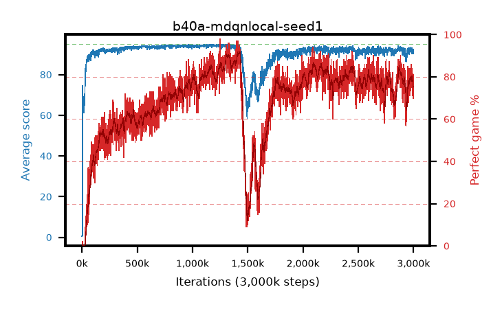

# b40a-mdqnlocal-seed1

step **3,000,000** · 3000 evals · trailing **91.77** · peak **94.36** @1,168,000 · sef **28.4** · best30 **91.5** @1,429,000

## Config

| | |
|---|---|
| adam_epsilon | 1e-07 |
| algo | dqn |
| batch_size | 128 |
| beta_anneal_steps | 300000 |
| collect_envs | 1 |
| discount | 0.99 |
| epsilon_anneal_steps | 250000 |
| epsilon_schedule | eval |
| eval_interval | 1000 |
| eval_queue | True |
| eval_queue_depth | 16 |
| eval_workers | 8 |
| fc_layers | (320,) |
| fork_branches | 4 |
| fork_max_steps | 60 |
| fork_min_length | 85 |
| fork_prob | 0.5 |
| gradient_clipping | 0.0 |
| graph_eval_episodes | 100 |
| guided_fraction | 0.8 |
| init_from | None |
| initial_collect_steps | 2000 |
| initial_epsilon | 0.4 |
| is_beta | 0.4 |
| is_beta_final | 1.0 |
| is_weights | True |
| learning_rate | 1e-05 |
| max_steps | 3000000 |
| min_checkpoint_score | 40.0 |
| min_epsilon | 0.002 |
| munchausen_alpha | 0.9 |
| munchausen_l0 | -1.0 |
| munchausen_tau | 0.03 |
| n_step_update | 1 |
| priority_exponent | 0.6 |
| replay_buffer_max_length | 100000 |
| replay_ratio | 1.0 |
| seed | 1 |
| target_update_period | 8 |
| target_update_tau | 1.0 |
| torch_threads | 1 |

## Evals

| step | avg score | trailing avg | min score | max score | avg reward | perfect % | epsilon |
|---|---|---|---|---|---|---|---|
| 1000 | 0.49 | 0.49 | 0.0 | 3.0 | -0.064 | 0.0 | 0.4 |
| 2000 | 0.61 | 0.55 | 0.0 | 6.0 | 0.056 | 0.0 | 0.4 |
| 3000 | 0.97 | 0.69 | 0.0 | 5.0 | 0.417 | 0.0 | 0.4 |
| ... | ... | ... | ... | ... | ... | ... | ... |
| 2989000 | 92.0 | 92.04 | 18.0 | 95.0 | 171.959 | 82.0 | 0.00206 |
| 2990000 | 91.09 | 91.98 | 50.0 | 95.0 | 165.956 | 77.0 | 0.00206 |
| 2991000 | 91.22 | 91.99 | 52.0 | 95.0 | 159.807 | 71.0 | 0.00205 |
| 2992000 | 91.91 | 92.0 | 43.0 | 95.0 | 167.873 | 78.0 | 0.00205 |
| 2993000 | 91.79 | 92.0 | 53.0 | 95.0 | 166.586 | 77.0 | 0.00205 |
| 2994000 | 92.43 | 91.99 | 49.0 | 95.0 | 166.243 | 76.0 | 0.00204 |
| 2995000 | 90.7 | 91.94 | 49.0 | 95.0 | 158.3 | 70.0 | 0.00203 |
| 2996000 | 90.24 | 91.88 | 38.0 | 95.0 | 160.145 | 72.0 | 0.00203 |
| 2997000 | 90.49 | 91.84 | 22.0 | 95.0 | 158.097 | 70.0 | 0.00204 |
| 2998000 | 91.47 | 91.78 | 40.0 | 95.0 | 169.424 | 80.0 | 0.00204 |
| 2999000 | 92.39 | 91.82 | 59.0 | 95.0 | 171.349 | 81.0 | 0.00204 |
| 3000000 | 92.42 | 91.77 | 54.0 | 95.0 | 168.258 | 78.0 | 0.00205 |
