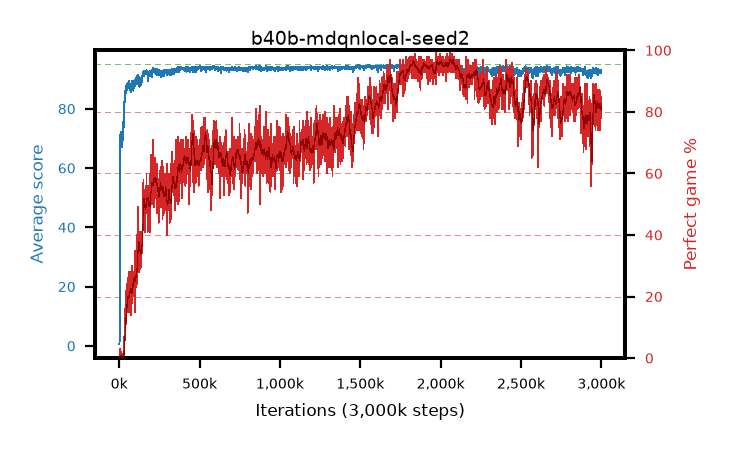

# b40b-mdqnlocal-seed2

step **3,000,000** · 3000 evals · trailing **92.65** · peak **94.54** @2,074,000 · sef **44.9** · best30 **96.5** @2,081,000

## Config

| | |
|---|---|
| adam_epsilon | 1e-07 |
| algo | dqn |
| batch_size | 128 |
| beta_anneal_steps | 300000 |
| collect_envs | 1 |
| discount | 0.99 |
| epsilon_anneal_steps | 250000 |
| epsilon_schedule | eval |
| eval_interval | 1000 |
| eval_queue | True |
| eval_queue_depth | 16 |
| eval_workers | 8 |
| fc_layers | (320,) |
| fork_branches | 4 |
| fork_max_steps | 60 |
| fork_min_length | 85 |
| fork_prob | 0.5 |
| gradient_clipping | 0.0 |
| graph_eval_episodes | 100 |
| guided_fraction | 0.8 |
| init_from | None |
| initial_collect_steps | 2000 |
| initial_epsilon | 0.4 |
| is_beta | 0.4 |
| is_beta_final | 1.0 |
| is_weights | True |
| learning_rate | 1e-05 |
| max_steps | 3000000 |
| min_checkpoint_score | 40.0 |
| min_epsilon | 0.002 |
| munchausen_alpha | 0.9 |
| munchausen_l0 | -1.0 |
| munchausen_tau | 0.03 |
| n_step_update | 1 |
| priority_exponent | 0.6 |
| replay_buffer_max_length | 100000 |
| replay_ratio | 1.0 |
| seed | 2 |
| target_update_period | 8 |
| target_update_tau | 1.0 |
| torch_threads | 1 |

## Evals

| step | avg score | trailing avg | min score | max score | avg reward | perfect % | epsilon |
|---|---|---|---|---|---|---|---|
| 1000 | 0.63 | 0.63 | 0.0 | 5.0 | 0.076 | 0.0 | 0.4 |
| 2000 | 0.6 | 0.61 | 0.0 | 5.0 | 0.046 | 0.0 | 0.4 |
| 3000 | 2.02 | 1.08 | 0.0 | 13.0 | 1.465 | 0.0 | 0.4 |
| ... | ... | ... | ... | ... | ... | ... | ... |
| 2989000 | 92.87 | 92.67 | 73.0 | 95.0 | 176.894 | 86.0 | 0.002 |
| 2990000 | 92.86 | 92.66 | 62.0 | 95.0 | 177.923 | 87.0 | 0.002 |
| 2991000 | 91.88 | 92.61 | 70.0 | 95.0 | 163.433 | 74.0 | 0.002 |
| 2992000 | 92.85 | 92.63 | 77.0 | 95.0 | 172.714 | 82.0 | 0.002 |
| 2993000 | 92.34 | 92.64 | 59.0 | 95.0 | 171.16 | 81.0 | 0.002 |
| 2994000 | 92.54 | 92.64 | 60.0 | 95.0 | 170.355 | 80.0 | 0.002 |
| 2995000 | 92.87 | 92.67 | 68.0 | 95.0 | 173.777 | 83.0 | 0.002 |
| 2996000 | 91.96 | 92.62 | 59.0 | 95.0 | 168.753 | 79.0 | 0.002 |
| 2997000 | 93.0 | 92.64 | 70.0 | 95.0 | 168.704 | 78.0 | 0.002 |
| 2998000 | 92.89 | 92.65 | 68.0 | 95.0 | 174.838 | 84.0 | 0.002 |
| 2999000 | 91.88 | 92.61 | 53.0 | 95.0 | 167.646 | 78.0 | 0.002 |
| 3000000 | 93.22 | 92.65 | 62.0 | 95.0 | 176.221 | 85.0 | 0.002 |
