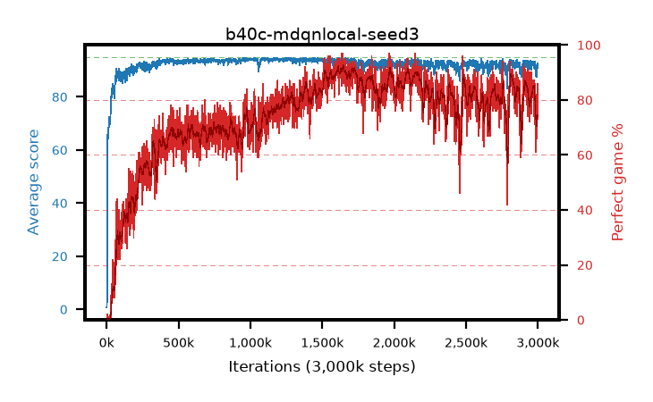

# b40c-mdqnlocal-seed3

step **3,000,000** · 3000 evals · trailing **90.79** · peak **94.29** @1,107,000 · sef **44.4** · best30 **91.5** @1,645,000

## Config

| | |
|---|---|
| adam_epsilon | 1e-07 |
| algo | dqn |
| batch_size | 128 |
| beta_anneal_steps | 300000 |
| collect_envs | 1 |
| discount | 0.99 |
| epsilon_anneal_steps | 250000 |
| epsilon_schedule | eval |
| eval_interval | 1000 |
| eval_queue | True |
| eval_queue_depth | 16 |
| eval_workers | 8 |
| fc_layers | (320,) |
| fork_branches | 4 |
| fork_max_steps | 60 |
| fork_min_length | 85 |
| fork_prob | 0.5 |
| gradient_clipping | 0.0 |
| graph_eval_episodes | 100 |
| guided_fraction | 0.8 |
| init_from | None |
| initial_collect_steps | 2000 |
| initial_epsilon | 0.4 |
| is_beta | 0.4 |
| is_beta_final | 1.0 |
| is_weights | True |
| learning_rate | 1e-05 |
| max_steps | 3000000 |
| min_checkpoint_score | 40.0 |
| min_epsilon | 0.002 |
| munchausen_alpha | 0.9 |
| munchausen_l0 | -1.0 |
| munchausen_tau | 0.03 |
| n_step_update | 1 |
| priority_exponent | 0.6 |
| replay_buffer_max_length | 100000 |
| replay_ratio | 1.0 |
| seed | 3 |
| target_update_period | 8 |
| target_update_tau | 1.0 |
| torch_threads | 1 |

## Evals

| step | avg score | trailing avg | min score | max score | avg reward | perfect % | epsilon |
|---|---|---|---|---|---|---|---|
| 1000 | 0.75 | 0.75 | 0.0 | 4.0 | 0.195 | 0.0 | 0.4 |
| 2000 | 0.75 | 0.75 | 0.0 | 4.0 | 0.197 | 0.0 | 0.4 |
| 3000 | 3.48 | 1.66 | 1.0 | 16.0 | 2.923 | 0.0 | 0.4 |
| ... | ... | ... | ... | ... | ... | ... | ... |
| 2989000 | 88.97 | 91.56 | 47.0 | 95.0 | 159.873 | 73.0 | 0.002 |
| 2990000 | 91.91 | 91.54 | 45.0 | 95.0 | 171.91 | 82.0 | 0.002 |
| 2991000 | 88.9 | 91.44 | 50.0 | 95.0 | 152.198 | 66.0 | 0.002 |
| 2992000 | 88.03 | 91.29 | 51.0 | 95.0 | 153.557 | 68.0 | 0.00202 |
| 2993000 | 90.77 | 91.22 | 53.0 | 95.0 | 168.82 | 80.0 | 0.00202 |
| 2994000 | 87.44 | 91.05 | 31.0 | 95.0 | 152.228 | 67.0 | 0.00202 |
| 2995000 | 89.67 | 90.97 | 49.0 | 95.0 | 157.253 | 70.0 | 0.00203 |
| 2996000 | 92.77 | 90.95 | 62.0 | 95.0 | 176.859 | 86.0 | 0.00205 |
| 2997000 | 91.12 | 90.93 | 56.0 | 95.0 | 161.593 | 73.0 | 0.00208 |
| 2998000 | 90.89 | 90.79 | 59.0 | 95.0 | 162.612 | 74.0 | 0.00211 |
| 2999000 | 91.47 | 90.88 | 51.0 | 95.0 | 169.361 | 80.0 | 0.00211 |
| 3000000 | 92.36 | 90.79 | 61.0 | 95.0 | 172.247 | 82.0 | 0.00215 |
