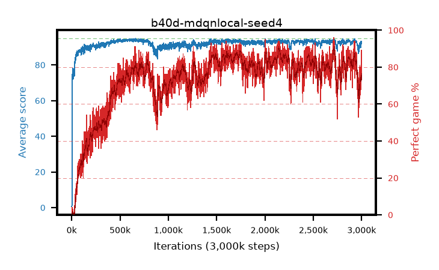

# b40d-mdqnlocal-seed4

step **3,000,000** · 3000 evals · trailing **91.21** · peak **94.1** @640,000 · sef **42.2** · best30 **88.7** @2,153,000

## Config

| | |
|---|---|
| adam_epsilon | 1e-07 |
| algo | dqn |
| batch_size | 128 |
| beta_anneal_steps | 300000 |
| collect_envs | 1 |
| discount | 0.99 |
| epsilon_anneal_steps | 250000 |
| epsilon_schedule | eval |
| eval_interval | 1000 |
| eval_queue | True |
| eval_queue_depth | 16 |
| eval_workers | 8 |
| fc_layers | (320,) |
| fork_branches | 4 |
| fork_max_steps | 60 |
| fork_min_length | 85 |
| fork_prob | 0.5 |
| gradient_clipping | 0.0 |
| graph_eval_episodes | 100 |
| guided_fraction | 0.8 |
| init_from | None |
| initial_collect_steps | 2000 |
| initial_epsilon | 0.4 |
| is_beta | 0.4 |
| is_beta_final | 1.0 |
| is_weights | True |
| learning_rate | 1e-05 |
| max_steps | 3000000 |
| min_checkpoint_score | 40.0 |
| min_epsilon | 0.002 |
| munchausen_alpha | 0.9 |
| munchausen_l0 | -1.0 |
| munchausen_tau | 0.03 |
| n_step_update | 1 |
| priority_exponent | 0.6 |
| replay_buffer_max_length | 100000 |
| replay_ratio | 1.0 |
| seed | 4 |
| target_update_period | 8 |
| target_update_tau | 1.0 |
| torch_threads | 1 |

## Evals

| step | avg score | trailing avg | min score | max score | avg reward | perfect % | epsilon |
|---|---|---|---|---|---|---|---|
| 1000 | 0.73 | 0.73 | 0.0 | 3.0 | 0.176 | 0.0 | 0.4 |
| 2000 | 0.64 | 0.69 | 0.0 | 3.0 | 0.087 | 0.0 | 0.4 |
| 3000 | 1.64 | 1.0 | 0.0 | 9.0 | 1.086 | 0.0 | 0.4 |
| ... | ... | ... | ... | ... | ... | ... | ... |
| 2989000 | 90.97 | 89.81 | 32.0 | 95.0 | 165.685 | 77.0 | 0.00262 |
| 2990000 | 90.55 | 89.85 | 45.0 | 95.0 | 156.996 | 69.0 | 0.00262 |
| 2991000 | 89.89 | 89.81 | 53.0 | 95.0 | 157.336 | 70.0 | 0.00262 |
| 2992000 | 93.09 | 89.97 | 72.0 | 95.0 | 167.717 | 77.0 | 0.00262 |
| 2993000 | 92.45 | 90.07 | 62.0 | 95.0 | 170.248 | 80.0 | 0.00262 |
| 2994000 | 91.18 | 90.19 | 49.0 | 95.0 | 156.459 | 68.0 | 0.00263 |
| 2995000 | 91.96 | 90.36 | 65.0 | 95.0 | 163.544 | 74.0 | 0.00263 |
| 2996000 | 91.61 | 90.65 | 49.0 | 95.0 | 162.256 | 73.0 | 0.00263 |
| 2997000 | 91.99 | 90.48 | 56.0 | 95.0 | 166.716 | 77.0 | 0.00262 |
| 2998000 | 93.22 | 90.86 | 61.0 | 95.0 | 180.43 | 89.0 | 0.00263 |
| 2999000 | 91.94 | 91.04 | 47.0 | 95.0 | 162.497 | 73.0 | 0.00257 |
| 3000000 | 93.31 | 91.21 | 68.0 | 95.0 | 175.233 | 84.0 | 0.00257 |
