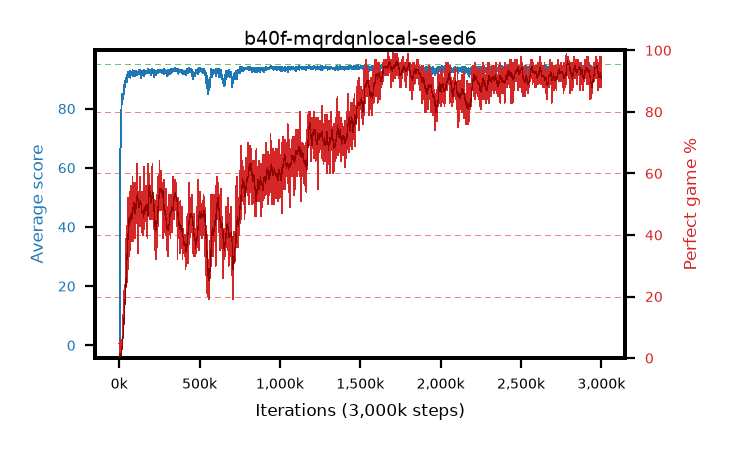

# b40f-mqrdqnlocal-seed6

step **3,000,000** · 3000 evals · trailing **93.89** · peak **94.56** @1,736,000 · sef **50.6** · best30 **95.6** @1,732,000

## Config

| | |
|---|---|
| adam_epsilon | 1e-07 |
| algo | qrdqn |
| batch_size | 128 |
| beta_anneal_steps | 300000 |
| collect_envs | 1 |
| discount | 0.99 |
| dist_atoms | 51 |
| dist_embedding | 64 |
| dist_fraction_entropy | 0.001 |
| dist_fraction_lr | 2.5e-09 |
| dist_kappa | 1.0 |
| dist_policy_samples | 32 |
| dist_quantiles | 32 |
| dist_risk_alpha | 1.0 |
| dist_risk_train | False |
| dist_tau_prime_samples | 64 |
| dist_tau_samples | 64 |
| dist_v_max | 110.0 |
| dist_v_min | -10.0 |
| epsilon_anneal_steps | 250000 |
| epsilon_schedule | eval |
| eval_interval | 1000 |
| eval_queue | True |
| eval_queue_depth | 16 |
| eval_workers | 8 |
| fc_layers | (320,) |
| fork_branches | 4 |
| fork_max_steps | 60 |
| fork_min_length | 85 |
| fork_prob | 0.5 |
| gradient_clipping | 0.0 |
| graph_eval_episodes | 100 |
| guided_fraction | 0.8 |
| init_from | None |
| initial_collect_steps | 2000 |
| initial_epsilon | 0.4 |
| is_beta | 0.4 |
| is_beta_final | 1.0 |
| is_weights | True |
| learning_rate | 1e-05 |
| max_steps | 3000000 |
| min_checkpoint_score | 40.0 |
| min_epsilon | 0.002 |
| munchausen_alpha | 0.9 |
| munchausen_l0 | -1.0 |
| munchausen_tau | 0.03 |
| n_step_update | 1 |
| priority_exponent | 0.6 |
| replay_buffer_max_length | 100000 |
| replay_ratio | 1.0 |
| seed | 6 |
| target_update_period | 8 |
| target_update_tau | 1.0 |
| torch_threads | 1 |

## Evals

| step | avg score | trailing avg | min score | max score | avg reward | perfect % | epsilon |
|---|---|---|---|---|---|---|---|
| 1000 | 0.65 | 0.65 | 0.0 | 3.0 | 0.097 | 0.0 | 0.4 |
| 2000 | 0.4 | 0.53 | 0.0 | 4.0 | -0.153 | 0.0 | 0.4 |
| 3000 | 0.65 | 0.57 | 0.0 | 5.0 | 0.096 | 0.0 | 0.4 |
| ... | ... | ... | ... | ... | ... | ... | ... |
| 2989000 | 94.86 | 94.03 | 88.0 | 95.0 | 191.39 | 98.0 | 0.002 |
| 2990000 | 94.71 | 94.06 | 85.0 | 95.0 | 187.121 | 94.0 | 0.002 |
| 2991000 | 93.83 | 94.04 | 62.0 | 95.0 | 182.172 | 90.0 | 0.002 |
| 2992000 | 93.14 | 94.01 | 54.0 | 95.0 | 183.485 | 92.0 | 0.002 |
| 2993000 | 94.51 | 94.02 | 75.0 | 95.0 | 187.002 | 94.0 | 0.002 |
| 2994000 | 93.36 | 94.0 | 54.0 | 95.0 | 179.498 | 88.0 | 0.002 |
| 2995000 | 93.88 | 93.99 | 44.0 | 95.0 | 182.094 | 90.0 | 0.002 |
| 2996000 | 93.08 | 93.93 | 60.0 | 95.0 | 179.269 | 88.0 | 0.002 |
| 2997000 | 94.16 | 93.92 | 64.0 | 95.0 | 180.312 | 88.0 | 0.002 |
| 2998000 | 93.12 | 93.89 | 22.0 | 95.0 | 184.462 | 93.0 | 0.002 |
| 2999000 | 93.46 | 93.85 | 60.0 | 95.0 | 183.829 | 92.0 | 0.002 |
| 3000000 | 94.78 | 93.89 | 79.0 | 95.0 | 191.322 | 98.0 | 0.002 |
