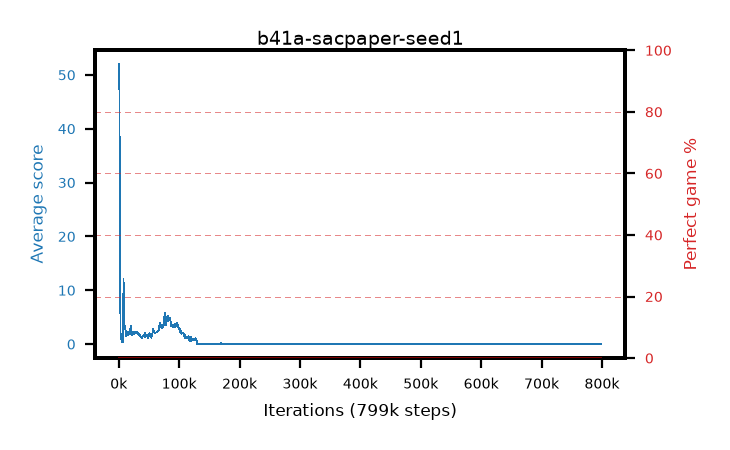

# b41a-sacpaper-seed1

step **799,000** · 799 evals · trailing **0.04** · peak **15.34** @2,000 · sef **0.0** · best30 **0.0** @799,000

**Below threshold since step 134,000** — 665,000 steps ago. Not a verdict; arms have recovered from longer.

## Config

| | |
|---|---|
| algo | sac |
| collect_envs | 16 |
| discount | 0.99 |
| eval_interval | 1000 |
| eval_queue | True |
| eval_queue_depth | 16 |
| eval_workers | 8 |
| fc_layers | (320,) |
| graph_eval_episodes | 100 |
| init_from | None |
| max_steps | 3125000 |
| min_checkpoint_score | 40.0 |
| sac_adam_epsilon | 1e-08 |
| sac_alpha | auto |
| sac_alpha_learning_rate | 0.0003 |
| sac_batch_size | 64 |
| sac_critic_combine | min |
| sac_critic_learning_rate | 0.0003 |
| sac_entropy_penalty | 0.0 |
| sac_init_alpha | 1.0 |
| sac_learning_rate | 0.0003 |
| sac_n_step | 1 |
| sac_prefill | 20000 |
| sac_priority_exponent | 0.0 |
| sac_q_clip | 0.0 |
| sac_replay_buffer_max_length | 1000000 |
| sac_replay_ratio | 0.25 |
| sac_target_entropy | 1.07664 |
| sac_target_entropy_ratio | 0.98 |
| sac_target_update_period | 2000 |
| sac_tau | 1.0 |
| seed | 1 |
| torch_threads | 1 |

## Evals

| step | avg score | trailing avg | min score | max score | avg reward | perfect % | epsilon |
|---|---|---|---|---|---|---|---|
| 1000 | 51.97 | 13.89 | 0.0 | 80.0 | 49.513 | 0.0 |  |
| 2000 | 21.13 | 15.34 | 1.0 | 76.0 | 20.209 | 0.0 |  |
| 3000 | 2.02 | 2.02 | 0.0 | 12.0 | 1.452 | 0.0 |  |
| ... | ... | ... | ... | ... | ... | ... | ... |
| 788000 | 0.04 | 0.04 | 0.0 | 1.0 | -4.963 | 0.0 |  |
| 789000 | 0.04 | 0.04 | 0.0 | 1.0 | -4.963 | 0.0 |  |
| 790000 | 0.03 | 0.04 | 0.0 | 1.0 | -4.973 | 0.0 |  |
| 791000 | 0.03 | 0.04 | 0.0 | 1.0 | -4.973 | 0.0 |  |
| 792000 | 0.05 | 0.04 | 0.0 | 1.0 | -4.953 | 0.0 |  |
| 793000 | 0.02 | 0.04 | 0.0 | 1.0 | -4.983 | 0.0 |  |
| 794000 | 0.05 | 0.04 | 0.0 | 1.0 | -4.953 | 0.0 |  |
| 795000 | 0.05 | 0.04 | 0.0 | 1.0 | -4.953 | 0.0 |  |
| 796000 | 0.02 | 0.04 | 0.0 | 1.0 | -4.983 | 0.0 |  |
| 797000 | 0.03 | 0.04 | 0.0 | 1.0 | -4.973 | 0.0 |  |
| 798000 | 0.06 | 0.04 | 0.0 | 1.0 | -4.943 | 0.0 |  |
| 799000 | 0.02 | 0.04 | 0.0 | 1.0 | -4.983 | 0.0 |  |
