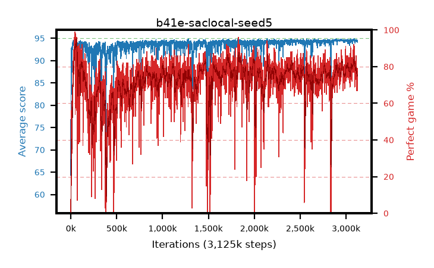

# b41e-saclocal-seed5

step **3,125,000** · 3125 evals · trailing **94.5** · peak **94.6** @2,950,000 · sef **26.0** · best30 **91.8** @65,000

## Config

| | |
|---|---|
| algo | sac |
| collect_envs | 16 |
| discount | 0.99 |
| eval_interval | 1000 |
| eval_queue | True |
| eval_queue_depth | 16 |
| eval_workers | 8 |
| fc_layers | (320,) |
| graph_eval_episodes | 100 |
| init_from | None |
| max_steps | 3125000 |
| min_checkpoint_score | 40.0 |
| sac_adam_epsilon | 1e-08 |
| sac_alpha | auto |
| sac_alpha_learning_rate | 0.0003 |
| sac_batch_size | 128 |
| sac_critic_combine | min |
| sac_critic_learning_rate | 0.0003 |
| sac_entropy_penalty | 0.0 |
| sac_init_alpha | 1.0 |
| sac_learning_rate | 0.0003 |
| sac_n_step | 1 |
| sac_prefill | 20000 |
| sac_priority_exponent | 0.6 |
| sac_q_clip | 0.0 |
| sac_replay_buffer_max_length | 100000 |
| sac_replay_ratio | 0.5 |
| sac_target_entropy | 0.109861 |
| sac_target_entropy_ratio | 0.1 |
| sac_target_update_period | 8 |
| sac_tau | 1.0 |
| seed | 5 |
| torch_threads | 1 |

## Evals

| step | avg score | trailing avg | min score | max score | avg reward | perfect % | epsilon |
|---|---|---|---|---|---|---|---|
| 1000 | 64.3 | 64.3 | 20.0 | 85.0 | 63.024 | 0.0 |  |
| 2000 | 85.21 | 74.75 | 50.0 | 95.0 | 96.838 | 13.0 |  |
| 3000 | 86.63 | 78.71 | 44.0 | 95.0 | 101.209 | 16.0 |  |
| ... | ... | ... | ... | ... | ... | ... | ... |
| 3114000 | 94.45 | 94.54 | 86.0 | 95.0 | 159.643 | 68.0 |  |
| 3115000 | 94.48 | 94.54 | 88.0 | 95.0 | 165.908 | 74.0 |  |
| 3116000 | 94.24 | 94.52 | 88.0 | 95.0 | 158.368 | 67.0 |  |
| 3117000 | 94.62 | 94.52 | 90.0 | 95.0 | 169.172 | 77.0 |  |
| 3118000 | 94.58 | 94.51 | 91.0 | 95.0 | 169.106 | 77.0 |  |
| 3119000 | 94.55 | 94.51 | 83.0 | 95.0 | 171.173 | 79.0 |  |
| 3120000 | 94.32 | 94.51 | 86.0 | 95.0 | 166.783 | 75.0 |  |
| 3121000 | 94.43 | 94.51 | 90.0 | 95.0 | 167.943 | 76.0 |  |
| 3122000 | 94.49 | 94.5 | 89.0 | 95.0 | 169.077 | 77.0 |  |
| 3123000 | 94.58 | 94.51 | 90.0 | 95.0 | 171.203 | 79.0 |  |
| 3124000 | 94.21 | 94.49 | 81.0 | 95.0 | 166.664 | 75.0 |  |
| 3125000 | 94.16 | 94.5 | 84.0 | 95.0 | 158.287 | 67.0 |  |
