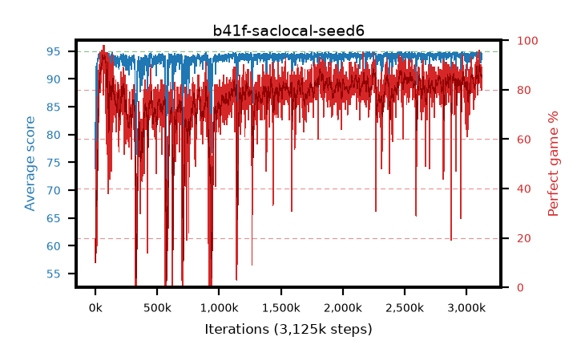

# b41f-saclocal-seed6

step **3,125,000** · 3125 evals · trailing **94.22** · peak **94.45** @2,478,000 · sef **47.4** · best30 **93.2** @78,000

## Config

| | |
|---|---|
| algo | sac |
| collect_envs | 16 |
| discount | 0.99 |
| eval_interval | 1000 |
| eval_queue | True |
| eval_queue_depth | 16 |
| eval_workers | 8 |
| fc_layers | (320,) |
| graph_eval_episodes | 100 |
| init_from | None |
| max_steps | 3125000 |
| min_checkpoint_score | 40.0 |
| sac_adam_epsilon | 1e-08 |
| sac_alpha | auto |
| sac_alpha_learning_rate | 0.0003 |
| sac_batch_size | 128 |
| sac_critic_combine | min |
| sac_critic_learning_rate | 0.0003 |
| sac_entropy_penalty | 0.0 |
| sac_init_alpha | 1.0 |
| sac_learning_rate | 0.0003 |
| sac_n_step | 1 |
| sac_prefill | 20000 |
| sac_priority_exponent | 0.6 |
| sac_q_clip | 0.0 |
| sac_replay_buffer_max_length | 100000 |
| sac_replay_ratio | 0.5 |
| sac_target_entropy | 0.109861 |
| sac_target_entropy_ratio | 0.1 |
| sac_target_update_period | 8 |
| sac_tau | 1.0 |
| seed | 6 |
| torch_threads | 1 |

## Evals

| step | avg score | trailing avg | min score | max score | avg reward | perfect % | epsilon |
|---|---|---|---|---|---|---|---|
| 1000 | 73.85 | 73.85 | 24.0 | 95.0 | 81.286 | 10.0 |  |
| 2000 | 87.94 | 80.89 | 24.0 | 95.0 | 117.611 | 31.0 |  |
| 3000 | 88.85 | 83.55 | 40.0 | 95.0 | 126.515 | 39.0 |  |
| ... | ... | ... | ... | ... | ... | ... | ... |
| 3114000 | 92.97 | 94.34 | 8.0 | 95.0 | 179.038 | 88.0 |  |
| 3115000 | 94.66 | 94.34 | 88.0 | 95.0 | 182.816 | 90.0 |  |
| 3116000 | 93.19 | 94.32 | 43.0 | 95.0 | 171.983 | 81.0 |  |
| 3117000 | 92.89 | 94.27 | 29.0 | 95.0 | 175.853 | 85.0 |  |
| 3118000 | 94.62 | 94.28 | 85.0 | 95.0 | 180.672 | 88.0 |  |
| 3119000 | 94.09 | 94.27 | 45.0 | 95.0 | 179.111 | 87.0 |  |
| 3120000 | 94.63 | 94.28 | 86.0 | 95.0 | 179.64 | 87.0 |  |
| 3121000 | 94.24 | 94.28 | 78.0 | 95.0 | 171.965 | 80.0 |  |
| 3122000 | 94.0 | 94.26 | 56.0 | 95.0 | 177.974 | 86.0 |  |
| 3123000 | 93.49 | 94.22 | 30.0 | 95.0 | 174.397 | 83.0 |  |
| 3124000 | 94.03 | 94.21 | 45.0 | 95.0 | 181.125 | 89.0 |  |
| 3125000 | 94.43 | 94.22 | 84.0 | 95.0 | 178.389 | 86.0 |  |
