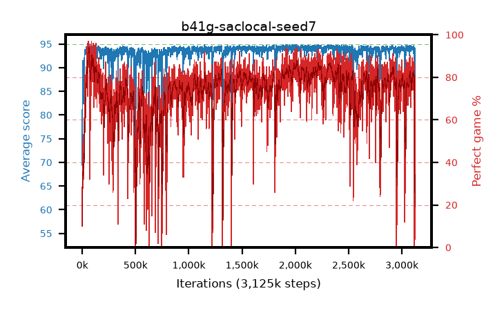

# b41g-saclocal-seed7

step **3,125,000** · 3125 evals · trailing **90.86** · peak **94.44** @2,240,000 · sef **35.5** · best30 **89.0** @67,000

## Config

| | |
|---|---|
| algo | sac |
| collect_envs | 16 |
| discount | 0.99 |
| eval_interval | 1000 |
| eval_queue | True |
| eval_queue_depth | 16 |
| eval_workers | 8 |
| fc_layers | (320,) |
| graph_eval_episodes | 100 |
| init_from | None |
| max_steps | 3125000 |
| min_checkpoint_score | 40.0 |
| sac_adam_epsilon | 1e-08 |
| sac_alpha | auto |
| sac_alpha_learning_rate | 0.0003 |
| sac_batch_size | 128 |
| sac_critic_combine | min |
| sac_critic_learning_rate | 0.0003 |
| sac_entropy_penalty | 0.0 |
| sac_init_alpha | 1.0 |
| sac_learning_rate | 0.0003 |
| sac_n_step | 1 |
| sac_prefill | 20000 |
| sac_priority_exponent | 0.6 |
| sac_q_clip | 0.0 |
| sac_replay_buffer_max_length | 100000 |
| sac_replay_ratio | 0.5 |
| sac_target_entropy | 0.109861 |
| sac_target_entropy_ratio | 0.1 |
| sac_target_update_period | 8 |
| sac_tau | 1.0 |
| seed | 7 |
| torch_threads | 1 |

## Evals

| step | avg score | trailing avg | min score | max score | avg reward | perfect % | epsilon |
|---|---|---|---|---|---|---|---|
| 1000 | 69.37 | 69.37 | 5.0 | 95.0 | 76.238 | 10.0 |  |
| 2000 | 89.13 | 79.25 | 43.0 | 95.0 | 128.808 | 41.0 |  |
| 3000 | 90.78 | 83.09 | 60.0 | 95.0 | 138.426 | 49.0 |  |
| ... | ... | ... | ... | ... | ... | ... | ... |
| 3114000 | 93.96 | 94.0 | 52.0 | 95.0 | 176.862 | 85.0 |  |
| 3115000 | 93.99 | 94.0 | 58.0 | 95.0 | 176.911 | 85.0 |  |
| 3116000 | 90.28 | 93.89 | 82.0 | 95.0 | 119.146 | 33.0 |  |
| 3117000 | 69.36 | 93.08 | 5.0 | 83.0 | 64.073 | 0.0 |  |
| 3118000 | 75.11 | 92.44 | 58.0 | 95.0 | 72.904 | 3.0 |  |
| 3119000 | 77.7 | 91.89 | 64.0 | 95.0 | 73.382 | 1.0 |  |
| 3120000 | 85.02 | 91.59 | 75.0 | 95.0 | 83.754 | 4.0 |  |
| 3121000 | 86.63 | 91.35 | 76.0 | 95.0 | 87.422 | 6.0 |  |
| 3122000 | 87.61 | 91.13 | 78.0 | 95.0 | 96.723 | 14.0 |  |
| 3123000 | 89.75 | 90.99 | 18.0 | 95.0 | 116.548 | 31.0 |  |
| 3124000 | 94.14 | 90.99 | 75.0 | 95.0 | 171.786 | 80.0 |  |
| 3125000 | 89.94 | 90.86 | 84.0 | 95.0 | 105.276 | 20.0 |  |
