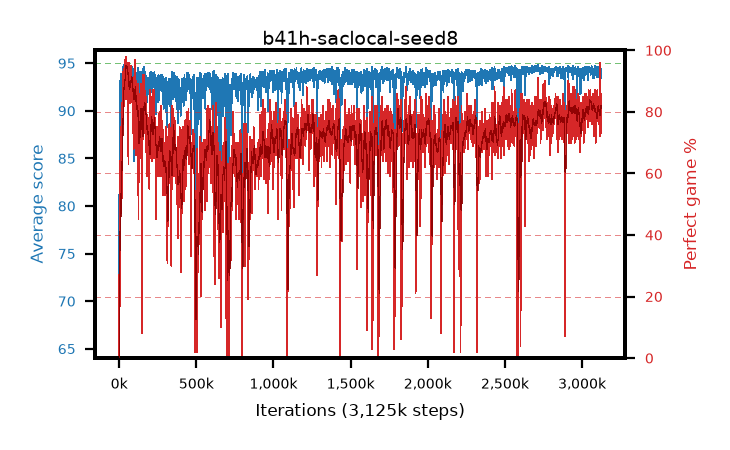

# b41h-saclocal-seed8

step **3,125,000** · 3125 evals · trailing **94.31** · peak **94.44** @2,713,000 · sef **18.2** · best30 **92.5** @59,000

## Config

| | |
|---|---|
| algo | sac |
| collect_envs | 16 |
| discount | 0.99 |
| eval_interval | 1000 |
| eval_queue | True |
| eval_queue_depth | 16 |
| eval_workers | 8 |
| fc_layers | (320,) |
| graph_eval_episodes | 100 |
| init_from | None |
| max_steps | 3125000 |
| min_checkpoint_score | 40.0 |
| sac_adam_epsilon | 1e-08 |
| sac_alpha | auto |
| sac_alpha_learning_rate | 0.0003 |
| sac_batch_size | 128 |
| sac_critic_combine | min |
| sac_critic_learning_rate | 0.0003 |
| sac_entropy_penalty | 0.0 |
| sac_init_alpha | 1.0 |
| sac_learning_rate | 0.0003 |
| sac_n_step | 1 |
| sac_prefill | 20000 |
| sac_priority_exponent | 0.6 |
| sac_q_clip | 0.0 |
| sac_replay_buffer_max_length | 100000 |
| sac_replay_ratio | 0.5 |
| sac_target_entropy | 0.109861 |
| sac_target_entropy_ratio | 0.1 |
| sac_target_update_period | 8 |
| sac_tau | 1.0 |
| seed | 8 |
| torch_threads | 1 |

## Evals

| step | avg score | trailing avg | min score | max score | avg reward | perfect % | epsilon |
|---|---|---|---|---|---|---|---|
| 1000 | 70.26 | 70.26 | 1.0 | 88.0 | 68.653 | 0.0 |  |
| 2000 | 88.57 | 79.41 | 49.0 | 95.0 | 132.233 | 45.0 |  |
| 3000 | 90.64 | 83.16 | 32.0 | 95.0 | 136.266 | 47.0 |  |
| ... | ... | ... | ... | ... | ... | ... | ... |
| 3114000 | 93.99 | 94.29 | 83.0 | 95.0 | 163.376 | 72.0 |  |
| 3115000 | 94.16 | 94.27 | 85.0 | 95.0 | 170.832 | 79.0 |  |
| 3116000 | 94.28 | 94.27 | 84.0 | 95.0 | 168.878 | 77.0 |  |
| 3117000 | 94.67 | 94.28 | 84.0 | 95.0 | 183.82 | 91.0 |  |
| 3118000 | 94.3 | 94.3 | 87.0 | 95.0 | 174.071 | 82.0 |  |
| 3119000 | 94.83 | 94.33 | 85.0 | 95.0 | 189.209 | 96.0 |  |
| 3120000 | 94.59 | 94.34 | 87.0 | 95.0 | 175.4 | 83.0 |  |
| 3121000 | 94.46 | 94.34 | 86.0 | 95.0 | 170.084 | 78.0 |  |
| 3122000 | 93.95 | 94.32 | 85.0 | 95.0 | 164.349 | 73.0 |  |
| 3123000 | 93.49 | 94.29 | 1.0 | 95.0 | 170.198 | 79.0 |  |
| 3124000 | 94.39 | 94.3 | 88.0 | 95.0 | 173.136 | 81.0 |  |
| 3125000 | 93.91 | 94.31 | 77.0 | 95.0 | 165.354 | 74.0 |  |
