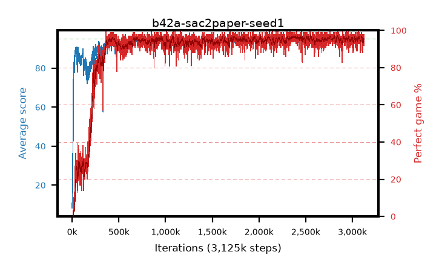

# b42a-sac2paper-seed1

step **3,125,000** · 3125 evals · trailing **94.09** · peak **94.45** @1,796,000 · sef **91.6** · best30 **96.6** @2,388,000

## Config

| | |
|---|---|
| algo | sac2 |
| collect_envs | 16 |
| discount | 0.99 |
| eval_interval | 1000 |
| eval_queue | True |
| eval_queue_depth | 16 |
| eval_workers | 8 |
| fc_layers | (512, 512) |
| graph_eval_episodes | 100 |
| init_from | None |
| max_steps | 3125000 |
| min_checkpoint_score | 40.0 |
| sac_adam_epsilon | 1e-08 |
| sac_alpha | 0.05 |
| sac_alpha_learning_rate | 0.0003 |
| sac_batch_size | 64 |
| sac_critic_combine | avg |
| sac_critic_learning_rate | 1e-05 |
| sac_critic_loss | mse |
| sac_entropy_penalty | 0.5 |
| sac_init_alpha | 1.0 |
| sac_learning_rate | 1e-05 |
| sac_n_step | 3 |
| sac_prefill | 20000 |
| sac_priority_exponent | 0.0 |
| sac_q_clip | 0.5 |
| sac_replay_buffer_max_length | 100000 |
| sac_replay_ratio | 0.1 |
| sac_target_entropy | 1.07664 |
| sac_target_entropy_ratio | 0.98 |
| sac_target_update_period | 1 |
| sac_tau | 0.005 |
| seed | 1 |
| torch_threads | 1 |

## Evals

| step | avg score | trailing avg | min score | max score | avg reward | perfect % | epsilon |
|---|---|---|---|---|---|---|---|
| 1000 | 8.28 | 8.28 | 0.0 | 18.0 | 4.467 | 0.0 |  |
| 2000 | 12.17 | 10.22 | 0.0 | 34.0 | 7.325 | 0.0 |  |
| 3000 | 13.98 | 11.48 | 0.0 | 33.0 | 9.134 | 0.0 |  |
| ... | ... | ... | ... | ... | ... | ... | ... |
| 3114000 | 93.26 | 94.08 | 4.0 | 95.0 | 186.916 | 95.0 |  |
| 3115000 | 94.77 | 94.11 | 78.0 | 95.0 | 191.415 | 98.0 |  |
| 3116000 | 93.84 | 94.11 | 46.0 | 95.0 | 185.486 | 93.0 |  |
| 3117000 | 94.42 | 94.12 | 59.0 | 95.0 | 187.971 | 95.0 |  |
| 3118000 | 94.62 | 94.11 | 60.0 | 95.0 | 191.217 | 98.0 |  |
| 3119000 | 94.22 | 94.12 | 54.0 | 95.0 | 188.814 | 96.0 |  |
| 3120000 | 94.23 | 94.11 | 58.0 | 95.0 | 186.741 | 94.0 |  |
| 3121000 | 94.67 | 94.11 | 63.0 | 95.0 | 191.266 | 98.0 |  |
| 3122000 | 94.74 | 94.12 | 81.0 | 95.0 | 190.341 | 97.0 |  |
| 3123000 | 94.27 | 94.12 | 58.0 | 95.0 | 186.839 | 94.0 |  |
| 3124000 | 94.31 | 94.11 | 64.0 | 95.0 | 187.838 | 95.0 |  |
| 3125000 | 94.15 | 94.09 | 75.0 | 95.0 | 184.812 | 92.0 |  |
