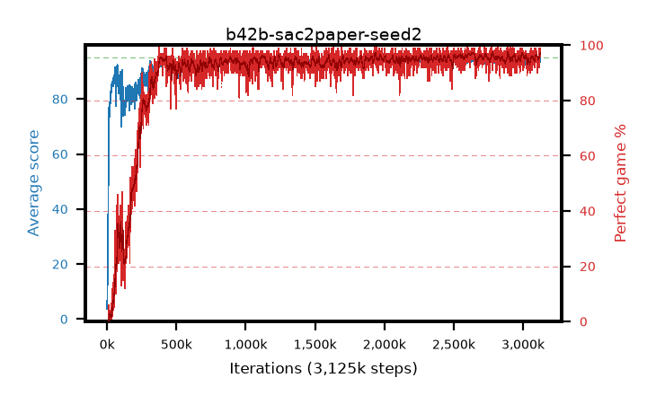

# b42b-sac2paper-seed2

step **3,125,000** · 3125 evals · trailing **94.12** · peak **94.34** @899,000 · sef **91.0** · best30 **97.1** @2,651,000

## Config

| | |
|---|---|
| algo | sac2 |
| collect_envs | 16 |
| discount | 0.99 |
| eval_interval | 1000 |
| eval_queue | True |
| eval_queue_depth | 16 |
| eval_workers | 8 |
| fc_layers | (512, 512) |
| graph_eval_episodes | 100 |
| init_from | None |
| max_steps | 3125000 |
| min_checkpoint_score | 40.0 |
| sac_adam_epsilon | 1e-08 |
| sac_alpha | 0.05 |
| sac_alpha_learning_rate | 0.0003 |
| sac_batch_size | 64 |
| sac_critic_combine | avg |
| sac_critic_learning_rate | 1e-05 |
| sac_critic_loss | mse |
| sac_entropy_penalty | 0.5 |
| sac_init_alpha | 1.0 |
| sac_learning_rate | 1e-05 |
| sac_n_step | 3 |
| sac_prefill | 20000 |
| sac_priority_exponent | 0.0 |
| sac_q_clip | 0.5 |
| sac_replay_buffer_max_length | 100000 |
| sac_replay_ratio | 0.1 |
| sac_target_entropy | 1.07664 |
| sac_target_entropy_ratio | 0.98 |
| sac_target_update_period | 1 |
| sac_tau | 0.005 |
| seed | 2 |
| torch_threads | 1 |

## Evals

| step | avg score | trailing avg | min score | max score | avg reward | perfect % | epsilon |
|---|---|---|---|---|---|---|---|
| 1000 | 3.67 | 3.67 | 0.0 | 14.0 | 2.969 | 0.0 |  |
| 2000 | 10.15 | 6.91 | 0.0 | 25.0 | 5.932 | 0.0 |  |
| 3000 | 13.86 | 9.23 | 1.0 | 31.0 | 9.015 | 0.0 |  |
| ... | ... | ... | ... | ... | ... | ... | ... |
| 3114000 | 94.53 | 94.2 | 70.0 | 95.0 | 189.186 | 96.0 |  |
| 3115000 | 93.21 | 94.21 | 6.0 | 95.0 | 183.88 | 92.0 |  |
| 3116000 | 94.31 | 94.19 | 27.0 | 95.0 | 190.916 | 98.0 |  |
| 3117000 | 94.08 | 94.17 | 52.0 | 95.0 | 188.696 | 96.0 |  |
| 3118000 | 94.13 | 94.15 | 32.0 | 95.0 | 190.733 | 98.0 |  |
| 3119000 | 94.84 | 94.15 | 79.0 | 95.0 | 192.465 | 99.0 |  |
| 3120000 | 94.38 | 94.14 | 70.0 | 95.0 | 190.035 | 97.0 |  |
| 3121000 | 94.37 | 94.16 | 57.0 | 95.0 | 189.987 | 97.0 |  |
| 3122000 | 93.42 | 94.13 | 31.0 | 95.0 | 188.072 | 96.0 |  |
| 3123000 | 94.59 | 94.13 | 54.0 | 95.0 | 192.191 | 99.0 |  |
| 3124000 | 94.75 | 94.15 | 73.0 | 95.0 | 191.39 | 98.0 |  |
| 3125000 | 94.1 | 94.12 | 56.0 | 95.0 | 188.713 | 96.0 |  |
