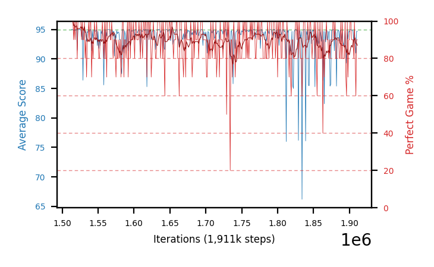

# b42c-cont3m-b40b

Blue is average score (food eaten) on the left axis, red is perfect-game percentage on the right.

Latest eval: step 1911000, avg score 94.7, perfect games 90%.

## Config

| setting | value |
|---|---|
| policy_name | b42c-cont3m-b40b |
| seed | 2 |
| zeroed_observations | none |
| learning_rate | 1e-05 |
| adam_epsilon | 1e-07 |
| perfect_game_reward | 100.0 |
| batch_size | 128 |
| discount | 0.9975 |
| target_update_period | 1000 |
| target_update_tau | 1.0 |
| gradient_clipping | none |
| n_step_update | 1 |
| initial_epsilon | 0.4 |
| min_epsilon | 0.002 |
| epsilon_schedule | bootstrap on avg_reward [2, 5, 10, 15, 20] then geometric to floor by 80% trailing-30 perfect |
| guided_fraction | 0.8 |
| forking | up to 4 live branches including the main line, fork p=0.5 at length >= 85, branch capped at 60 steps, one branch advanced per iteration |
| exploration_shield | 80% of refinement-phase episodes draw the epsilon move from non-fatal actions; greedy moves never shielded |
| fc_layer_params | (320,) |
| algo | ddqn, scalar head, Huber TD error |
| replay_buffer | cpprb prioritized, capacity 100000 |
| priority_exponent (alpha) | 0.6 |
| priority_signal | td_error |
| importance_sampling_beta | disabled |
| max_steps | 3000000 |
| initial_populate_steps | 1000 |
| eval | 10 episodes every 1000 steps |
| grid | 9x9, max possible score 95 |
| DEATH_REWARD | -5.0 |
| FOOD_REWARD | 1.0 |
| FOOD_DISTANCE_REWARD | 0.0 |
| CHASE_SAFE_SHAPING | c=0.1, potential-based on head/food/tail in one region, gated to snake length >= 75 |
| FREE_SPACE_SHAPING | off |
| eval_only | False |
| min_checkpoint_score | 40.0 |

## Evals

399 evals so far. Full series in [`b42c-cont3m-b40b_evals.json`](b42c-cont3m-b40b_evals.json).

| step | avg score | trailing avg | min score | max score | avg reward | perfect % | epsilon |
|---|---|---|---|---|---|---|---|
| 1513000 | 95.0 | 95.0 | 95 | 95/95 | 193.955 | 100 | 0.002 |
| 1514000 | 95.0 | 95.0 | 95 | 95/95 | 193.952 | 100 | 0.002 |
| 1515000 | 95.0 | 95.0 | 95 | 95/95 | 193.953 | 100 | 0.002 |
| ... | | | | | | | |
| 1900000 | 94.6 | 93.4 | 91 | 95/95 | 183.151 | 90 | 0.002 |
| 1901000 | 95.0 | 94.54 | 95 | 95/95 | 193.948 | 100 | 0.002 |
| 1902000 | 95.0 | 94.54 | 95 | 95/95 | 193.954 | 100 | 0.002 |
| 1903000 | 94.9 | 94.84 | 94 | 95/95 | 183.455 | 90 | 0.002 |
| 1904000 | 94.9 | 94.88 | 94 | 95/95 | 183.455 | 90 | 0.002 |
| 1905000 | 94.7 | 94.9 | 92 | 95/95 | 183.704 | 90 | 0.002 |
| 1906000 | 92.9 | 94.48 | 82 | 95/95 | 171.498 | 80 | 0.002 |
| 1907000 | 95.0 | 94.48 | 95 | 95/95 | 193.954 | 100 | 0.002 |
| 1908000 | 92.5 | 94.0 | 74 | 95/95 | 171.551 | 80 | 0.002 |
| 1909000 | 91.0 | 93.22 | 58 | 95/95 | 148.356 | 60 | 0.002 |
| 1910000 | 94.7 | 93.22 | 92 | 95/95 | 183.703 | 90 | 0.002 |
| 1911000 | 94.7 | 93.58 | 92 | 95/95 | 183.704 | 90 | 0.002 |
