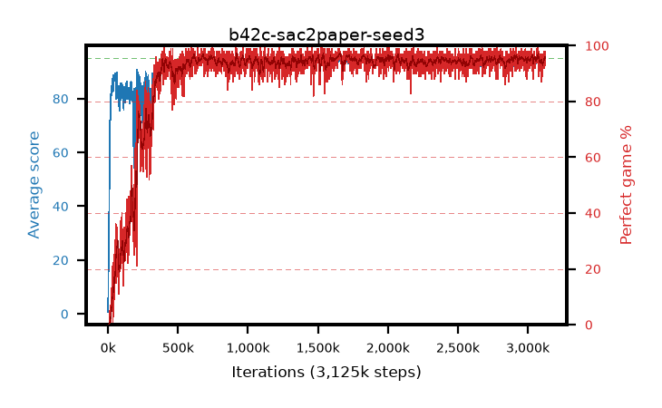

# b42c-sac2paper-seed3

step **3,125,000** · 3125 evals · trailing **93.68** · peak **94.47** @1,663,000 · sef **90.2** · best30 **96.6** @1,660,000

## Config

| | |
|---|---|
| algo | sac2 |
| collect_envs | 16 |
| discount | 0.99 |
| eval_interval | 1000 |
| eval_queue | True |
| eval_queue_depth | 16 |
| eval_workers | 8 |
| fc_layers | (512, 512) |
| graph_eval_episodes | 100 |
| init_from | None |
| max_steps | 3125000 |
| min_checkpoint_score | 40.0 |
| sac_adam_epsilon | 1e-08 |
| sac_alpha | 0.05 |
| sac_alpha_learning_rate | 0.0003 |
| sac_batch_size | 64 |
| sac_critic_combine | avg |
| sac_critic_learning_rate | 1e-05 |
| sac_critic_loss | mse |
| sac_entropy_penalty | 0.5 |
| sac_init_alpha | 1.0 |
| sac_learning_rate | 1e-05 |
| sac_n_step | 3 |
| sac_prefill | 20000 |
| sac_priority_exponent | 0.0 |
| sac_q_clip | 0.5 |
| sac_replay_buffer_max_length | 100000 |
| sac_replay_ratio | 0.1 |
| sac_target_entropy | 1.07664 |
| sac_target_entropy_ratio | 0.98 |
| sac_target_update_period | 1 |
| sac_tau | 0.005 |
| seed | 3 |
| torch_threads | 1 |

## Evals

| step | avg score | trailing avg | min score | max score | avg reward | perfect % | epsilon |
|---|---|---|---|---|---|---|---|
| 1000 | 0.69 | 0.69 | 0.0 | 4.0 | 0.136 | 0.0 |  |
| 2000 | 12.74 | 6.71 | 0.0 | 32.0 | 8.433 | 0.0 |  |
| 3000 | 17.99 | 10.47 | 0.0 | 38.0 | 13.326 | 0.0 |  |
| ... | ... | ... | ... | ... | ... | ... | ... |
| 3114000 | 94.14 | 93.7 | 31.0 | 95.0 | 189.791 | 97.0 |  |
| 3115000 | 92.06 | 93.63 | 27.0 | 95.0 | 182.685 | 92.0 |  |
| 3116000 | 94.66 | 93.66 | 62.0 | 95.0 | 191.216 | 98.0 |  |
| 3117000 | 93.62 | 93.68 | 4.0 | 95.0 | 189.184 | 97.0 |  |
| 3118000 | 93.84 | 93.75 | 41.0 | 95.0 | 188.488 | 96.0 |  |
| 3119000 | 94.01 | 93.74 | 45.0 | 95.0 | 187.617 | 95.0 |  |
| 3120000 | 93.93 | 93.72 | 47.0 | 95.0 | 187.449 | 95.0 |  |
| 3121000 | 94.19 | 93.74 | 31.0 | 95.0 | 190.841 | 98.0 |  |
| 3122000 | 94.71 | 93.76 | 73.0 | 95.0 | 189.319 | 96.0 |  |
| 3123000 | 93.07 | 93.7 | 41.0 | 95.0 | 184.75 | 93.0 |  |
| 3124000 | 93.49 | 93.67 | 4.0 | 95.0 | 187.101 | 95.0 |  |
| 3125000 | 94.1 | 93.68 | 26.0 | 95.0 | 189.717 | 97.0 |  |
