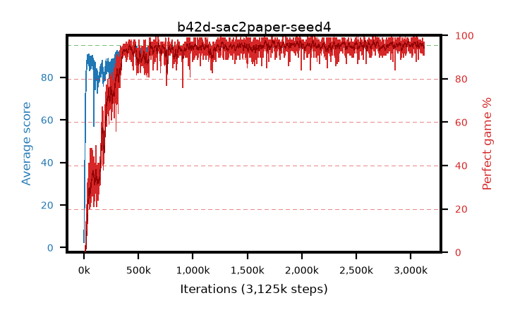

# b42d-sac2paper-seed4

step **3,125,000** · 3125 evals · trailing **94.25** · peak **94.58** @2,669,000 · sef **90.8** · best30 **97.0** @1,750,000

## Config

| | |
|---|---|
| algo | sac2 |
| collect_envs | 16 |
| discount | 0.99 |
| eval_interval | 1000 |
| eval_queue | True |
| eval_queue_depth | 16 |
| eval_workers | 8 |
| fc_layers | (512, 512) |
| graph_eval_episodes | 100 |
| init_from | None |
| max_steps | 3125000 |
| min_checkpoint_score | 40.0 |
| sac_adam_epsilon | 1e-08 |
| sac_alpha | 0.05 |
| sac_alpha_learning_rate | 0.0003 |
| sac_batch_size | 64 |
| sac_critic_combine | avg |
| sac_critic_learning_rate | 1e-05 |
| sac_critic_loss | mse |
| sac_entropy_penalty | 0.5 |
| sac_init_alpha | 1.0 |
| sac_learning_rate | 1e-05 |
| sac_n_step | 3 |
| sac_prefill | 20000 |
| sac_priority_exponent | 0.0 |
| sac_q_clip | 0.5 |
| sac_replay_buffer_max_length | 100000 |
| sac_replay_ratio | 0.1 |
| sac_target_entropy | 1.07664 |
| sac_target_entropy_ratio | 0.98 |
| sac_target_update_period | 1 |
| sac_tau | 0.005 |
| seed | 4 |
| torch_threads | 1 |

## Evals

| step | avg score | trailing avg | min score | max score | avg reward | perfect % | epsilon |
|---|---|---|---|---|---|---|---|
| 1000 | 2.44 | 2.44 | 0.0 | 8.0 | 1.886 | 0.0 |  |
| 2000 | 16.0 | 9.22 | 0.0 | 31.0 | 11.163 | 0.0 |  |
| 3000 | 21.02 | 13.15 | 0.0 | 42.0 | 16.084 | 0.0 |  |
| ... | ... | ... | ... | ... | ... | ... | ... |
| 3114000 | 93.36 | 94.32 | 4.0 | 95.0 | 182.967 | 91.0 |  |
| 3115000 | 94.41 | 94.3 | 79.0 | 95.0 | 186.96 | 94.0 |  |
| 3116000 | 93.32 | 94.26 | 22.0 | 95.0 | 185.927 | 94.0 |  |
| 3117000 | 94.67 | 94.25 | 84.0 | 95.0 | 189.284 | 96.0 |  |
| 3118000 | 94.43 | 94.31 | 62.0 | 95.0 | 190.062 | 97.0 |  |
| 3119000 | 93.91 | 94.29 | 44.0 | 95.0 | 184.474 | 92.0 |  |
| 3120000 | 94.47 | 94.29 | 66.0 | 95.0 | 189.023 | 96.0 |  |
| 3121000 | 94.09 | 94.27 | 60.0 | 95.0 | 187.688 | 95.0 |  |
| 3122000 | 93.88 | 94.24 | 32.0 | 95.0 | 187.533 | 95.0 |  |
| 3123000 | 93.68 | 94.26 | 69.0 | 95.0 | 183.283 | 91.0 |  |
| 3124000 | 94.59 | 94.26 | 73.0 | 95.0 | 190.24 | 97.0 |  |
| 3125000 | 93.97 | 94.25 | 74.0 | 95.0 | 184.63 | 92.0 |  |
