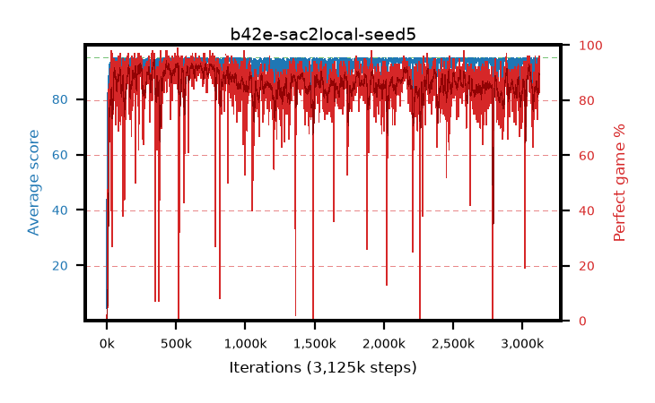

# b42e-sac2local-seed5

step **3,125,000** · 3125 evals · trailing **91.36** · peak **94.59** @2,167,000 · sef **84.8** · best30 **92.7** @347,000

## Config

| | |
|---|---|
| algo | sac2 |
| collect_envs | 16 |
| discount | 0.99 |
| eval_interval | 1000 |
| eval_queue | True |
| eval_queue_depth | 16 |
| eval_workers | 8 |
| fc_layers | (320,) |
| graph_eval_episodes | 100 |
| init_from | None |
| max_steps | 3125000 |
| min_checkpoint_score | 40.0 |
| sac_adam_epsilon | 1e-08 |
| sac_alpha | auto |
| sac_alpha_learning_rate | 0.0003 |
| sac_batch_size | 128 |
| sac_critic_combine | avg |
| sac_critic_learning_rate | 0.0003 |
| sac_critic_loss | huber |
| sac_entropy_penalty | 0.5 |
| sac_init_alpha | 1.0 |
| sac_learning_rate | 0.0003 |
| sac_n_step | 1 |
| sac_prefill | 20000 |
| sac_priority_exponent | 0.6 |
| sac_q_clip | 0.5 |
| sac_replay_buffer_max_length | 100000 |
| sac_replay_ratio | 0.5 |
| sac_target_entropy | 0.109861 |
| sac_target_entropy_ratio | 0.1 |
| sac_target_update_period | 8 |
| sac_tau | 1.0 |
| seed | 5 |
| torch_threads | 1 |

## Evals

| step | avg score | trailing avg | min score | max score | avg reward | perfect % | epsilon |
|---|---|---|---|---|---|---|---|
| 1000 | 4.56 | 4.56 | 1.0 | 95.0 | 4.987 | 1.0 |  |
| 2000 | 70.08 | 37.32 | 3.0 | 95.0 | 71.833 | 3.0 |  |
| 3000 | 80.6 | 51.75 | 1.0 | 95.0 | 91.361 | 12.0 |  |
| ... | ... | ... | ... | ... | ... | ... | ... |
| 3114000 | 94.01 | 90.9 | 56.0 | 95.0 | 174.337 | 82.0 |  |
| 3115000 | 94.73 | 91.07 | 86.0 | 95.0 | 185.209 | 92.0 |  |
| 3116000 | 89.15 | 91.11 | 0.0 | 95.0 | 171.625 | 84.0 |  |
| 3117000 | 94.48 | 91.39 | 68.0 | 95.0 | 183.947 | 91.0 |  |
| 3118000 | 89.85 | 91.23 | 1.0 | 95.0 | 174.404 | 86.0 |  |
| 3119000 | 94.91 | 91.27 | 92.0 | 95.0 | 188.385 | 95.0 |  |
| 3120000 | 94.57 | 91.3 | 82.0 | 95.0 | 181.07 | 88.0 |  |
| 3121000 | 94.84 | 91.31 | 90.0 | 95.0 | 189.28 | 96.0 |  |
| 3122000 | 94.88 | 91.39 | 90.0 | 95.0 | 189.422 | 96.0 |  |
| 3123000 | 88.74 | 91.21 | 0.0 | 95.0 | 170.198 | 83.0 |  |
| 3124000 | 93.85 | 91.19 | 72.0 | 95.0 | 176.061 | 84.0 |  |
| 3125000 | 92.84 | 91.36 | 0.0 | 95.0 | 180.312 | 89.0 |  |
