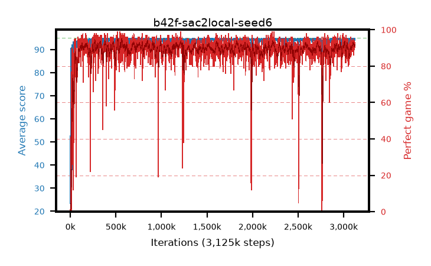

# b42f-sac2local-seed6

step **3,125,000** · 3125 evals · trailing **94.65** · peak **94.67** @3,118,000 · sef **95.2** · best30 **93.0** @569,000

## Config

| | |
|---|---|
| algo | sac2 |
| collect_envs | 16 |
| discount | 0.99 |
| eval_interval | 1000 |
| eval_queue | True |
| eval_queue_depth | 16 |
| eval_workers | 8 |
| fc_layers | (320,) |
| graph_eval_episodes | 100 |
| init_from | None |
| max_steps | 3125000 |
| min_checkpoint_score | 40.0 |
| sac_adam_epsilon | 1e-08 |
| sac_alpha | auto |
| sac_alpha_learning_rate | 0.0003 |
| sac_batch_size | 128 |
| sac_critic_combine | avg |
| sac_critic_learning_rate | 0.0003 |
| sac_critic_loss | huber |
| sac_entropy_penalty | 0.5 |
| sac_init_alpha | 1.0 |
| sac_learning_rate | 0.0003 |
| sac_n_step | 1 |
| sac_prefill | 20000 |
| sac_priority_exponent | 0.6 |
| sac_q_clip | 0.5 |
| sac_replay_buffer_max_length | 100000 |
| sac_replay_ratio | 0.5 |
| sac_target_entropy | 0.109861 |
| sac_target_entropy_ratio | 0.1 |
| sac_target_update_period | 8 |
| sac_tau | 1.0 |
| seed | 6 |
| torch_threads | 1 |

## Evals

| step | avg score | trailing avg | min score | max score | avg reward | perfect % | epsilon |
|---|---|---|---|---|---|---|---|
| 1000 | 23.42 | 23.42 | 1.0 | 95.0 | 23.192 | 1.0 |  |
| 2000 | 72.26 | 47.84 | 3.0 | 95.0 | 72.053 | 1.0 |  |
| 3000 | 74.17 | 56.62 | 38.0 | 95.0 | 74.916 | 2.0 |  |
| ... | ... | ... | ... | ... | ... | ... | ... |
| 3114000 | 94.57 | 94.62 | 79.0 | 95.0 | 184.779 | 92.0 |  |
| 3115000 | 94.76 | 94.62 | 88.0 | 95.0 | 184.977 | 92.0 |  |
| 3116000 | 94.85 | 94.65 | 89.0 | 95.0 | 187.139 | 94.0 |  |
| 3117000 | 94.69 | 94.66 | 74.0 | 95.0 | 184.929 | 92.0 |  |
| 3118000 | 94.83 | 94.67 | 88.0 | 95.0 | 185.086 | 92.0 |  |
| 3119000 | 94.46 | 94.67 | 80.0 | 95.0 | 181.519 | 89.0 |  |
| 3120000 | 94.39 | 94.65 | 60.0 | 95.0 | 182.545 | 90.0 |  |
| 3121000 | 94.75 | 94.67 | 88.0 | 95.0 | 183.93 | 91.0 |  |
| 3122000 | 94.37 | 94.66 | 48.0 | 95.0 | 184.604 | 92.0 |  |
| 3123000 | 94.11 | 94.64 | 52.0 | 95.0 | 184.349 | 92.0 |  |
| 3124000 | 94.71 | 94.65 | 85.0 | 95.0 | 183.892 | 91.0 |  |
| 3125000 | 94.84 | 94.65 | 92.0 | 95.0 | 186.113 | 93.0 |  |
