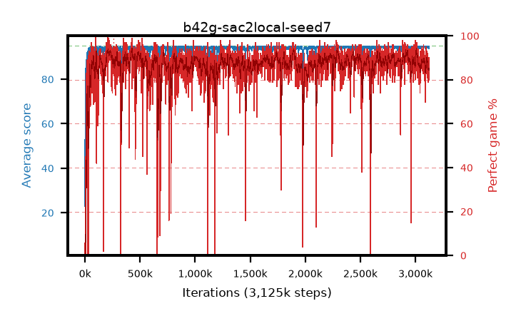

# b42g-sac2local-seed7

step **3,125,000** · 3125 evals · trailing **94.51** · peak **94.67** @2,241,000 · sef **89.9** · best30 **92.8** @233,000

## Config

| | |
|---|---|
| algo | sac2 |
| collect_envs | 16 |
| discount | 0.99 |
| eval_interval | 1000 |
| eval_queue | True |
| eval_queue_depth | 16 |
| eval_workers | 8 |
| fc_layers | (320,) |
| graph_eval_episodes | 100 |
| init_from | None |
| max_steps | 3125000 |
| min_checkpoint_score | 40.0 |
| sac_adam_epsilon | 1e-08 |
| sac_alpha | auto |
| sac_alpha_learning_rate | 0.0003 |
| sac_batch_size | 128 |
| sac_critic_combine | avg |
| sac_critic_learning_rate | 0.0003 |
| sac_critic_loss | huber |
| sac_entropy_penalty | 0.5 |
| sac_init_alpha | 1.0 |
| sac_learning_rate | 0.0003 |
| sac_n_step | 1 |
| sac_prefill | 20000 |
| sac_priority_exponent | 0.6 |
| sac_q_clip | 0.5 |
| sac_replay_buffer_max_length | 100000 |
| sac_replay_ratio | 0.5 |
| sac_target_entropy | 0.109861 |
| sac_target_entropy_ratio | 0.1 |
| sac_target_update_period | 8 |
| sac_tau | 1.0 |
| seed | 7 |
| torch_threads | 1 |

## Evals

| step | avg score | trailing avg | min score | max score | avg reward | perfect % | epsilon |
|---|---|---|---|---|---|---|---|
| 1000 | 23.02 | 23.02 | 1.0 | 95.0 | 22.892 | 1.0 |  |
| 2000 | 72.74 | 47.88 | 1.0 | 95.0 | 80.401 | 9.0 |  |
| 3000 | 77.06 | 57.61 | 31.0 | 95.0 | 85.595 | 10.0 |  |
| ... | ... | ... | ... | ... | ... | ... | ... |
| 3114000 | 93.97 | 94.53 | 82.0 | 95.0 | 171.436 | 79.0 |  |
| 3115000 | 94.7 | 94.53 | 90.0 | 95.0 | 182.029 | 89.0 |  |
| 3116000 | 94.37 | 94.53 | 81.0 | 95.0 | 176.615 | 84.0 |  |
| 3117000 | 94.54 | 94.54 | 84.0 | 95.0 | 174.69 | 82.0 |  |
| 3118000 | 94.58 | 94.54 | 84.0 | 95.0 | 180.868 | 88.0 |  |
| 3119000 | 94.53 | 94.56 | 86.0 | 95.0 | 175.76 | 83.0 |  |
| 3120000 | 94.75 | 94.56 | 90.0 | 95.0 | 179.969 | 87.0 |  |
| 3121000 | 94.46 | 94.56 | 71.0 | 95.0 | 182.756 | 90.0 |  |
| 3122000 | 94.57 | 94.57 | 88.0 | 95.0 | 176.755 | 84.0 |  |
| 3123000 | 94.67 | 94.58 | 90.0 | 95.0 | 177.788 | 85.0 |  |
| 3124000 | 94.16 | 94.55 | 75.0 | 95.0 | 172.122 | 80.0 |  |
| 3125000 | 93.67 | 94.51 | 4.0 | 95.0 | 178.901 | 87.0 |  |
