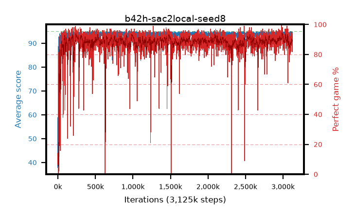

# b42h-sac2local-seed8

step **3,125,000** · 3125 evals · trailing **93.99** · peak **94.47** @1,496,000 · sef **93.9** · best30 **92.3** @257,000

## Config

| | |
|---|---|
| algo | sac2 |
| collect_envs | 16 |
| discount | 0.99 |
| eval_interval | 1000 |
| eval_queue | True |
| eval_queue_depth | 16 |
| eval_workers | 8 |
| fc_layers | (320,) |
| graph_eval_episodes | 100 |
| init_from | None |
| max_steps | 3125000 |
| min_checkpoint_score | 40.0 |
| sac_adam_epsilon | 1e-08 |
| sac_alpha | auto |
| sac_alpha_learning_rate | 0.0003 |
| sac_batch_size | 128 |
| sac_critic_combine | avg |
| sac_critic_learning_rate | 0.0003 |
| sac_critic_loss | huber |
| sac_entropy_penalty | 0.5 |
| sac_init_alpha | 1.0 |
| sac_learning_rate | 0.0003 |
| sac_n_step | 1 |
| sac_prefill | 20000 |
| sac_priority_exponent | 0.6 |
| sac_q_clip | 0.5 |
| sac_replay_buffer_max_length | 100000 |
| sac_replay_ratio | 0.5 |
| sac_target_entropy | 0.109861 |
| sac_target_entropy_ratio | 0.1 |
| sac_target_update_period | 8 |
| sac_tau | 1.0 |
| seed | 8 |
| torch_threads | 1 |

## Evals

| step | avg score | trailing avg | min score | max score | avg reward | perfect % | epsilon |
|---|---|---|---|---|---|---|---|
| 1000 | 37.91 | 37.91 | 1.0 | 95.0 | 50.062 | 14.0 |  |
| 2000 | 73.02 | 55.46 | 1.0 | 95.0 | 72.801 | 1.0 |  |
| 3000 | 74.79 | 61.91 | 3.0 | 95.0 | 77.536 | 4.0 |  |
| ... | ... | ... | ... | ... | ... | ... | ... |
| 3114000 | 94.51 | 93.98 | 84.0 | 95.0 | 181.61 | 89.0 |  |
| 3115000 | 94.09 | 93.98 | 50.0 | 95.0 | 179.111 | 87.0 |  |
| 3116000 | 92.45 | 93.95 | 11.0 | 95.0 | 178.498 | 88.0 |  |
| 3117000 | 94.37 | 93.99 | 78.0 | 95.0 | 184.608 | 92.0 |  |
| 3118000 | 94.25 | 94.01 | 82.0 | 95.0 | 178.202 | 86.0 |  |
| 3119000 | 94.35 | 94.03 | 52.0 | 95.0 | 186.654 | 94.0 |  |
| 3120000 | 93.7 | 94.01 | 4.0 | 95.0 | 176.68 | 85.0 |  |
| 3121000 | 94.45 | 94.03 | 82.0 | 95.0 | 180.52 | 88.0 |  |
| 3122000 | 94.61 | 94.05 | 80.0 | 95.0 | 184.847 | 92.0 |  |
| 3123000 | 94.74 | 94.07 | 86.0 | 95.0 | 186.005 | 93.0 |  |
| 3124000 | 91.6 | 93.98 | 1.0 | 95.0 | 171.513 | 82.0 |  |
| 3125000 | 93.63 | 93.99 | 74.0 | 95.0 | 178.691 | 87.0 |  |
