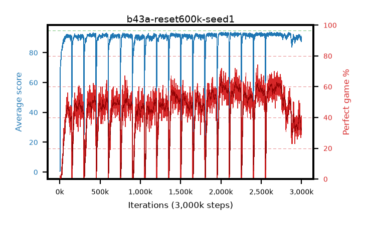

# b43a-reset600k-seed1

step **3,000,000** · 3000 evals · trailing **90.14** · peak **92.85** @2,010,000 · sef **0.0** · best30 **63.0** @2,012,000

## Config

| | |
|---|---|
| adam_epsilon | 1e-07 |
| algo | qrdqn |
| batch_size | 128 |
| beta_anneal_steps | 300000 |
| collect_envs | 1 |
| discount | 0.99 |
| dist_atoms | 51 |
| dist_embedding | 64 |
| dist_fraction_entropy | 0.001 |
| dist_fraction_lr | 2.5e-09 |
| dist_kappa | 1.0 |
| dist_policy_samples | 32 |
| dist_quantiles | 32 |
| dist_risk_alpha | 1.0 |
| dist_risk_train | False |
| dist_tau_prime_samples | 64 |
| dist_tau_samples | 64 |
| dist_v_max | 110.0 |
| dist_v_min | -10.0 |
| epsilon_anneal_steps | 250000 |
| epsilon_schedule | eval |
| eval_interval | 1000 |
| eval_queue | True |
| eval_queue_depth | 16 |
| eval_workers | 8 |
| fc_layers | (320,) |
| fork_branches | 4 |
| fork_max_steps | 60 |
| fork_min_length | 85 |
| fork_prob | 0.5 |
| gradient_clipping | 0.0 |
| graph_eval_episodes | 100 |
| guided_fraction | 0.8 |
| init_from | None |
| initial_collect_steps | 2000 |
| initial_epsilon | 0.4 |
| is_beta | 0.4 |
| is_beta_final | 1.0 |
| is_weights | True |
| learning_rate | 1e-05 |
| max_steps | 3000000 |
| min_checkpoint_score | 40.0 |
| min_epsilon | 0.002 |
| munchausen_alpha | 0.9 |
| munchausen_l0 | -1.0 |
| munchausen_tau | 0.03 |
| n_step_update | 1 |
| priority_exponent | 0.6 |
| replay_buffer_max_length | 100000 |
| replay_ratio | 1.0 |
| reset_alpha | 0.5 |
| reset_interval | 600000 |
| reset_stop_after | 10500000 |
| seed | 1 |
| target_update_period | 8 |
| target_update_tau | 1.0 |
| torch_threads | 1 |

## Evals

| step | avg score | trailing avg | min score | max score | avg reward | perfect % | epsilon |
|---|---|---|---|---|---|---|---|
| 1000 | 0.55 | 0.55 | 0.0 | 4.0 | -0.004 | 0.0 | 0.4 |
| 2000 | 0.52 | 0.54 | 0.0 | 4.0 | -0.033 | 0.0 | 0.4 |
| 3000 | 0.58 | 0.55 | 0.0 | 5.0 | 0.025 | 0.0 | 0.4 |
| ... | ... | ... | ... | ... | ... | ... | ... |
| 2989000 | 88.7 | 90.82 | 47.0 | 95.0 | 117.618 | 33.0 | 0.00509 |
| 2990000 | 90.91 | 90.8 | 60.0 | 95.0 | 119.867 | 33.0 | 0.0051 |
| 2991000 | 88.57 | 90.74 | 43.0 | 95.0 | 113.332 | 29.0 | 0.00513 |
| 2992000 | 89.29 | 90.7 | 42.0 | 95.0 | 114.029 | 29.0 | 0.00518 |
| 2993000 | 88.07 | 90.59 | 36.0 | 95.0 | 110.841 | 27.0 | 0.00521 |
| 2994000 | 88.92 | 90.54 | 47.0 | 95.0 | 114.813 | 30.0 | 0.00521 |
| 2995000 | 91.07 | 90.53 | 58.0 | 95.0 | 126.297 | 39.0 | 0.00526 |
| 2996000 | 89.31 | 90.46 | 20.0 | 95.0 | 126.554 | 41.0 | 0.0053 |
| 2997000 | 89.86 | 90.47 | 62.0 | 95.0 | 115.664 | 30.0 | 0.00532 |
| 2998000 | 87.49 | 90.31 | 28.0 | 95.0 | 112.402 | 29.0 | 0.00532 |
| 2999000 | 89.33 | 90.21 | 65.0 | 95.0 | 118.502 | 33.0 | 0.00537 |
| 3000000 | 89.7 | 90.14 | 42.0 | 95.0 | 124.983 | 39.0 | 0.00542 |
