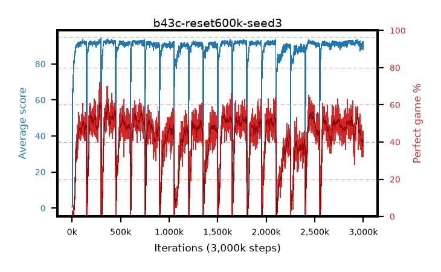

# b43c-reset600k-seed3

step **3,000,000** · 3000 evals · trailing **90.32** · peak **92.59** @381,000 · sef **0.0** · best30 **58.3** @299,000

## Config

| | |
|---|---|
| adam_epsilon | 1e-07 |
| algo | qrdqn |
| batch_size | 128 |
| beta_anneal_steps | 300000 |
| collect_envs | 1 |
| discount | 0.99 |
| dist_atoms | 51 |
| dist_embedding | 64 |
| dist_fraction_entropy | 0.001 |
| dist_fraction_lr | 2.5e-09 |
| dist_kappa | 1.0 |
| dist_policy_samples | 32 |
| dist_quantiles | 32 |
| dist_risk_alpha | 1.0 |
| dist_risk_train | False |
| dist_tau_prime_samples | 64 |
| dist_tau_samples | 64 |
| dist_v_max | 110.0 |
| dist_v_min | -10.0 |
| epsilon_anneal_steps | 250000 |
| epsilon_schedule | eval |
| eval_interval | 1000 |
| eval_queue | True |
| eval_queue_depth | 16 |
| eval_workers | 8 |
| fc_layers | (320,) |
| fork_branches | 4 |
| fork_max_steps | 60 |
| fork_min_length | 85 |
| fork_prob | 0.5 |
| gradient_clipping | 0.0 |
| graph_eval_episodes | 100 |
| guided_fraction | 0.8 |
| init_from | None |
| initial_collect_steps | 2000 |
| initial_epsilon | 0.4 |
| is_beta | 0.4 |
| is_beta_final | 1.0 |
| is_weights | True |
| learning_rate | 1e-05 |
| max_steps | 3000000 |
| min_checkpoint_score | 40.0 |
| min_epsilon | 0.002 |
| munchausen_alpha | 0.9 |
| munchausen_l0 | -1.0 |
| munchausen_tau | 0.03 |
| n_step_update | 1 |
| priority_exponent | 0.6 |
| replay_buffer_max_length | 100000 |
| replay_ratio | 1.0 |
| reset_alpha | 0.5 |
| reset_interval | 600000 |
| reset_stop_after | 10500000 |
| seed | 3 |
| target_update_period | 8 |
| target_update_tau | 1.0 |
| torch_threads | 1 |

## Evals

| step | avg score | trailing avg | min score | max score | avg reward | perfect % | epsilon |
|---|---|---|---|---|---|---|---|
| 1000 | 0.5 | 0.5 | 0.0 | 4.0 | -0.054 | 0.0 | 0.4 |
| 2000 | 0.65 | 0.57 | 0.0 | 5.0 | 0.096 | 0.0 | 0.4 |
| 3000 | 0.97 | 0.71 | 0.0 | 6.0 | 0.415 | 0.0 | 0.4 |
| ... | ... | ... | ... | ... | ... | ... | ... |
| 2989000 | 90.18 | 90.26 | 36.0 | 95.0 | 124.521 | 38.0 | 0.00472 |
| 2990000 | 90.42 | 90.21 | 21.0 | 95.0 | 121.595 | 35.0 | 0.00473 |
| 2991000 | 92.37 | 90.2 | 62.0 | 95.0 | 133.796 | 45.0 | 0.00474 |
| 2992000 | 91.15 | 90.24 | 15.0 | 95.0 | 125.526 | 38.0 | 0.00475 |
| 2993000 | 89.96 | 90.2 | 13.0 | 95.0 | 122.448 | 36.0 | 0.00477 |
| 2994000 | 90.46 | 90.23 | 45.0 | 95.0 | 132.978 | 46.0 | 0.0048 |
| 2995000 | 91.28 | 90.19 | 35.0 | 95.0 | 132.951 | 45.0 | 0.00485 |
| 2996000 | 92.19 | 90.21 | 50.0 | 95.0 | 134.623 | 46.0 | 0.00488 |
| 2997000 | 90.3 | 90.17 | 13.0 | 95.0 | 124.589 | 38.0 | 0.00488 |
| 2998000 | 92.37 | 90.24 | 60.0 | 95.0 | 131.702 | 43.0 | 0.00492 |
| 2999000 | 91.73 | 90.38 | 74.0 | 95.0 | 119.692 | 32.0 | 0.0049 |
| 3000000 | 87.86 | 90.32 | 25.0 | 95.0 | 116.867 | 33.0 | 0.00492 |
