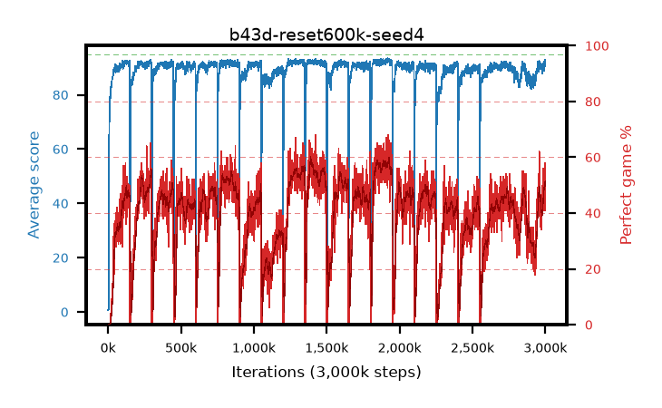

# b43d-reset600k-seed4

step **3,000,000** · 3000 evals · trailing **90.67** · peak **92.48** @1,937,000 · sef **0.0** · best30 **58.0** @1,926,000

## Config

| | |
|---|---|
| adam_epsilon | 1e-07 |
| algo | qrdqn |
| batch_size | 128 |
| beta_anneal_steps | 300000 |
| collect_envs | 1 |
| discount | 0.99 |
| dist_atoms | 51 |
| dist_embedding | 64 |
| dist_fraction_entropy | 0.001 |
| dist_fraction_lr | 2.5e-09 |
| dist_kappa | 1.0 |
| dist_policy_samples | 32 |
| dist_quantiles | 32 |
| dist_risk_alpha | 1.0 |
| dist_risk_train | False |
| dist_tau_prime_samples | 64 |
| dist_tau_samples | 64 |
| dist_v_max | 110.0 |
| dist_v_min | -10.0 |
| epsilon_anneal_steps | 250000 |
| epsilon_schedule | eval |
| eval_interval | 1000 |
| eval_queue | True |
| eval_queue_depth | 16 |
| eval_workers | 8 |
| fc_layers | (320,) |
| fork_branches | 4 |
| fork_max_steps | 60 |
| fork_min_length | 85 |
| fork_prob | 0.5 |
| gradient_clipping | 0.0 |
| graph_eval_episodes | 100 |
| guided_fraction | 0.8 |
| init_from | None |
| initial_collect_steps | 2000 |
| initial_epsilon | 0.4 |
| is_beta | 0.4 |
| is_beta_final | 1.0 |
| is_weights | True |
| learning_rate | 1e-05 |
| max_steps | 3000000 |
| min_checkpoint_score | 40.0 |
| min_epsilon | 0.002 |
| munchausen_alpha | 0.9 |
| munchausen_l0 | -1.0 |
| munchausen_tau | 0.03 |
| n_step_update | 1 |
| priority_exponent | 0.6 |
| replay_buffer_max_length | 100000 |
| replay_ratio | 1.0 |
| reset_alpha | 0.5 |
| reset_interval | 600000 |
| reset_stop_after | 10500000 |
| seed | 4 |
| target_update_period | 8 |
| target_update_tau | 1.0 |
| torch_threads | 1 |

## Evals

| step | avg score | trailing avg | min score | max score | avg reward | perfect % | epsilon |
|---|---|---|---|---|---|---|---|
| 1000 | 0.75 | 0.75 | 0.0 | 4.0 | 0.196 | 0.0 | 0.4 |
| 2000 | 0.61 | 0.68 | 0.0 | 4.0 | 0.056 | 0.0 | 0.4 |
| 3000 | 1.14 | 0.83 | 0.0 | 5.0 | 0.585 | 0.0 | 0.4 |
| ... | ... | ... | ... | ... | ... | ... | ... |
| 2989000 | 91.17 | 90.34 | 39.0 | 95.0 | 133.104 | 45.0 | 0.00462 |
| 2990000 | 88.92 | 90.26 | 1.0 | 95.0 | 126.919 | 41.0 | 0.00463 |
| 2991000 | 90.74 | 90.24 | 32.0 | 95.0 | 138.049 | 50.0 | 0.00465 |
| 2992000 | 92.38 | 90.3 | 52.0 | 95.0 | 142.753 | 53.0 | 0.00466 |
| 2993000 | 92.01 | 90.37 | 23.0 | 95.0 | 145.274 | 56.0 | 0.0047 |
| 2994000 | 91.73 | 90.38 | 54.0 | 95.0 | 140.816 | 52.0 | 0.00466 |
| 2995000 | 92.55 | 90.45 | 56.0 | 95.0 | 144.831 | 55.0 | 0.00461 |
| 2996000 | 90.64 | 90.5 | 9.0 | 95.0 | 132.659 | 45.0 | 0.00457 |
| 2997000 | 92.46 | 90.58 | 68.0 | 95.0 | 148.0 | 58.0 | 0.00455 |
| 2998000 | 90.38 | 90.54 | 32.0 | 95.0 | 128.274 | 41.0 | 0.00452 |
| 2999000 | 92.47 | 90.59 | 64.0 | 95.0 | 143.66 | 54.0 | 0.00448 |
| 3000000 | 92.91 | 90.67 | 76.0 | 95.0 | 142.149 | 52.0 | 0.00442 |
