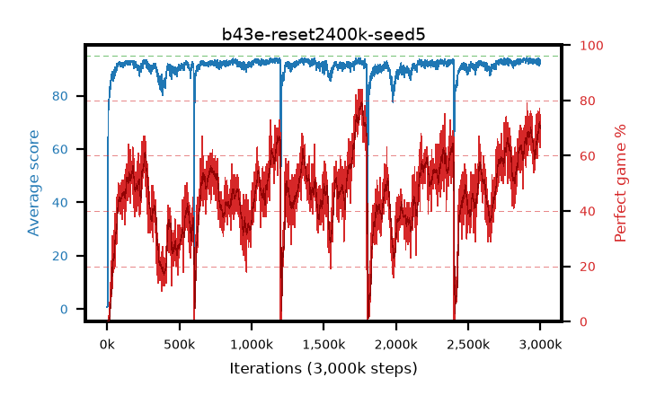

# b43e-reset2400k-seed5

step **3,000,000** · 3000 evals · trailing **93.11** · peak **93.45** @1,198,000 · sef **0.4** · best30 **78.1** @1,770,000

## Config

| | |
|---|---|
| adam_epsilon | 1e-07 |
| algo | qrdqn |
| batch_size | 128 |
| beta_anneal_steps | 300000 |
| collect_envs | 1 |
| discount | 0.99 |
| dist_atoms | 51 |
| dist_embedding | 64 |
| dist_fraction_entropy | 0.001 |
| dist_fraction_lr | 2.5e-09 |
| dist_kappa | 1.0 |
| dist_policy_samples | 32 |
| dist_quantiles | 32 |
| dist_risk_alpha | 1.0 |
| dist_risk_train | False |
| dist_tau_prime_samples | 64 |
| dist_tau_samples | 64 |
| dist_v_max | 110.0 |
| dist_v_min | -10.0 |
| epsilon_anneal_steps | 250000 |
| epsilon_schedule | eval |
| eval_interval | 1000 |
| eval_queue | True |
| eval_queue_depth | 16 |
| eval_workers | 8 |
| fc_layers | (320,) |
| fork_branches | 4 |
| fork_max_steps | 60 |
| fork_min_length | 85 |
| fork_prob | 0.5 |
| gradient_clipping | 0.0 |
| graph_eval_episodes | 100 |
| guided_fraction | 0.8 |
| init_from | None |
| initial_collect_steps | 2000 |
| initial_epsilon | 0.4 |
| is_beta | 0.4 |
| is_beta_final | 1.0 |
| is_weights | True |
| learning_rate | 1e-05 |
| max_steps | 3000000 |
| min_checkpoint_score | 40.0 |
| min_epsilon | 0.002 |
| munchausen_alpha | 0.9 |
| munchausen_l0 | -1.0 |
| munchausen_tau | 0.03 |
| n_step_update | 1 |
| priority_exponent | 0.6 |
| replay_buffer_max_length | 100000 |
| replay_ratio | 1.0 |
| reset_alpha | 0.5 |
| reset_interval | 2400000 |
| reset_stop_after | 10500000 |
| seed | 5 |
| target_update_period | 8 |
| target_update_tau | 1.0 |
| torch_threads | 1 |

## Evals

| step | avg score | trailing avg | min score | max score | avg reward | perfect % | epsilon |
|---|---|---|---|---|---|---|---|
| 1000 | 0.68 | 0.68 | 0.0 | 5.0 | 0.126 | 0.0 | 0.4 |
| 2000 | 0.56 | 0.62 | 0.0 | 4.0 | 0.007 | 0.0 | 0.4 |
| 3000 | 1.33 | 0.86 | 0.0 | 4.0 | 0.777 | 0.0 | 0.4 |
| ... | ... | ... | ... | ... | ... | ... | ... |
| 2989000 | 93.96 | 93.23 | 79.0 | 95.0 | 165.703 | 74.0 | 0.00277 |
| 2990000 | 92.4 | 93.2 | 39.0 | 95.0 | 161.255 | 71.0 | 0.00277 |
| 2991000 | 91.3 | 93.13 | 25.0 | 95.0 | 157.08 | 68.0 | 0.00269 |
| 2992000 | 93.58 | 93.16 | 67.0 | 95.0 | 164.218 | 73.0 | 0.00269 |
| 2993000 | 93.71 | 93.17 | 66.0 | 95.0 | 165.421 | 74.0 | 0.00268 |
| 2994000 | 92.51 | 93.15 | 50.0 | 95.0 | 161.2 | 71.0 | 0.00267 |
| 2995000 | 93.54 | 93.16 | 70.0 | 95.0 | 168.25 | 77.0 | 0.00265 |
| 2996000 | 93.07 | 93.15 | 73.0 | 95.0 | 157.657 | 67.0 | 0.00262 |
| 2997000 | 91.98 | 93.11 | 31.0 | 95.0 | 152.437 | 63.0 | 0.0026 |
| 2998000 | 92.55 | 93.11 | 61.0 | 95.0 | 153.908 | 64.0 | 0.00257 |
| 2999000 | 93.25 | 93.11 | 66.0 | 95.0 | 160.976 | 70.0 | 0.00257 |
| 3000000 | 93.49 | 93.11 | 76.0 | 95.0 | 160.96 | 70.0 | 0.00257 |
