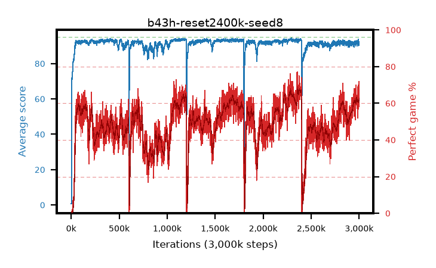

# b43h-reset2400k-seed8

step **3,000,000** · 3000 evals · trailing **91.94** · peak **93.73** @1,189,000 · sef **0.0** · best30 **67.3** @2,380,000

## Config

| | |
|---|---|
| adam_epsilon | 1e-07 |
| algo | qrdqn |
| batch_size | 128 |
| beta_anneal_steps | 300000 |
| collect_envs | 1 |
| discount | 0.99 |
| dist_atoms | 51 |
| dist_embedding | 64 |
| dist_fraction_entropy | 0.001 |
| dist_fraction_lr | 2.5e-09 |
| dist_kappa | 1.0 |
| dist_policy_samples | 32 |
| dist_quantiles | 32 |
| dist_risk_alpha | 1.0 |
| dist_risk_train | False |
| dist_tau_prime_samples | 64 |
| dist_tau_samples | 64 |
| dist_v_max | 110.0 |
| dist_v_min | -10.0 |
| epsilon_anneal_steps | 250000 |
| epsilon_schedule | eval |
| eval_interval | 1000 |
| eval_queue | True |
| eval_queue_depth | 16 |
| eval_workers | 8 |
| fc_layers | (320,) |
| fork_branches | 4 |
| fork_max_steps | 60 |
| fork_min_length | 85 |
| fork_prob | 0.5 |
| gradient_clipping | 0.0 |
| graph_eval_episodes | 100 |
| guided_fraction | 0.8 |
| init_from | None |
| initial_collect_steps | 2000 |
| initial_epsilon | 0.4 |
| is_beta | 0.4 |
| is_beta_final | 1.0 |
| is_weights | True |
| learning_rate | 1e-05 |
| max_steps | 3000000 |
| min_checkpoint_score | 40.0 |
| min_epsilon | 0.002 |
| munchausen_alpha | 0.9 |
| munchausen_l0 | -1.0 |
| munchausen_tau | 0.03 |
| n_step_update | 1 |
| priority_exponent | 0.6 |
| replay_buffer_max_length | 100000 |
| replay_ratio | 1.0 |
| reset_alpha | 0.5 |
| reset_interval | 2400000 |
| reset_stop_after | 10500000 |
| seed | 8 |
| target_update_period | 8 |
| target_update_tau | 1.0 |
| torch_threads | 1 |

## Evals

| step | avg score | trailing avg | min score | max score | avg reward | perfect % | epsilon |
|---|---|---|---|---|---|---|---|
| 1000 | 0.7 | 0.7 | 0.0 | 4.0 | 0.146 | 0.0 | 0.4 |
| 2000 | 0.57 | 0.64 | 0.0 | 3.0 | 0.016 | 0.0 | 0.4 |
| 3000 | 0.56 | 0.61 | 0.0 | 3.0 | 0.007 | 0.0 | 0.4 |
| ... | ... | ... | ... | ... | ... | ... | ... |
| 2989000 | 92.29 | 91.88 | 38.0 | 95.0 | 154.973 | 65.0 | 0.00306 |
| 2990000 | 92.04 | 91.9 | 43.0 | 95.0 | 146.531 | 57.0 | 0.00307 |
| 2991000 | 91.96 | 91.9 | 3.0 | 95.0 | 151.855 | 62.0 | 0.00307 |
| 2992000 | 92.02 | 91.9 | 68.0 | 95.0 | 148.879 | 59.0 | 0.00305 |
| 2993000 | 91.4 | 91.92 | 17.0 | 95.0 | 146.037 | 57.0 | 0.00304 |
| 2994000 | 93.77 | 91.99 | 85.0 | 95.0 | 161.671 | 70.0 | 0.00303 |
| 2995000 | 91.96 | 92.04 | 16.0 | 95.0 | 147.462 | 58.0 | 0.00303 |
| 2996000 | 91.01 | 92.08 | 9.0 | 95.0 | 155.909 | 67.0 | 0.00304 |
| 2997000 | 92.45 | 92.08 | 64.0 | 95.0 | 151.476 | 61.0 | 0.00302 |
| 2998000 | 91.18 | 92.04 | 21.0 | 95.0 | 147.046 | 58.0 | 0.00301 |
| 2999000 | 90.36 | 91.96 | 19.0 | 95.0 | 151.21 | 63.0 | 0.00301 |
| 3000000 | 92.49 | 91.94 | 55.0 | 95.0 | 162.57 | 72.0 | 0.00303 |
