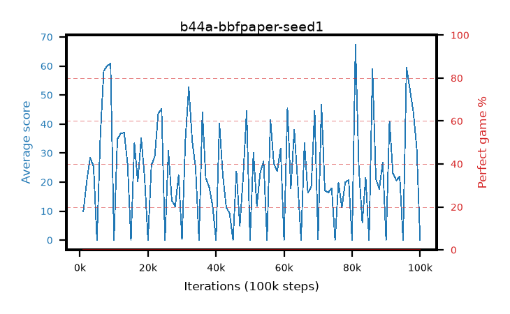

# b44a-bbfpaper-seed1

step **100,000** · 100 evals · trailing **23.6** · peak **33.26** @9,000 · sef **0.0** · best30 **0.0** @100,000

## Config

| | |
|---|---|
| adam_epsilon | 0.00015 |
| algo | bbf |
| batch_size | 32 |
| bbf_double | True |
| bbf_dueling | True |
| bbf_projection | 512 |
| bbf_spr_steps | 5 |
| bbf_spr_weight | 5.0 |
| bbf_transition_width | 256 |
| bbf_weight_decay | 0.1 |
| collect_envs | 1 |
| discount | 0.997 |
| dist_atoms | 51 |
| dist_v_max | 110.0 |
| dist_v_min | -10.0 |
| epsilon_anneal_steps | 2001 |
| eval_interval | 1000 |
| eval_queue | True |
| eval_queue_depth | 16 |
| eval_workers | 8 |
| fc_layers | (1280, 2048) |
| gradient_clipping | 10.0 |
| graph_eval_episodes | 100 |
| init_from | None |
| initial_collect_steps | 2000 |
| initial_epsilon | 1.0 |
| learning_rate | 0.0001 |
| max_steps | 100000 |
| min_checkpoint_score | 40.0 |
| min_epsilon | 0.0 |
| n_step_update | 3 |
| priority_exponent | 0.5 |
| replay_buffer_max_length | 1000000 |
| replay_ratio | 8.0 |
| reset_alpha | 0.5 |
| reset_anneal_gamma | 0.97,0.997 |
| reset_anneal_n_step | 10,3 |
| reset_anneal_steps | 10000 |
| reset_interval | 40000 |
| reset_stop_after | 0 |
| seed | 1 |
| target_update_tau | 0.005 |
| torch_threads | 1 |

## Evals

| step | avg score | trailing avg | min score | max score | avg reward | perfect % | epsilon |
|---|---|---|---|---|---|---|---|
| 1000 | 9.95 | 9.95 | 2.0 | 26.0 | 4.925 | 0.0 | 0.50075 |
| 2000 | 20.3 | 15.12 | 3.0 | 47.0 | 15.699 | 0.0 | 0.001 |
| 3000 | 28.47 | 19.57 | 0.0 | 55.0 | 23.51 | 0.0 | 0.0 |
| ... | ... | ... | ... | ... | ... | ... | ... |
| 89000 | 26.85 | 21.61 | 0.0 | 73.0 | 24.12 | 0.0 | 0.0 |
| 90000 | 0.09 | 21.62 | 0.0 | 1.0 | -4.914 | 0.0 | 0.0 |
| 91000 | 41.02 | 21.47 | 19.0 | 67.0 | 36.06 | 0.0 | 0.0 |
| 92000 | 23.12 | 21.65 | 0.0 | 51.0 | 21.194 | 0.0 | 0.0 |
| 93000 | 20.53 | 21.06 | 0.0 | 61.0 | 17.323 | 0.0 | 0.0 |
| 94000 | 21.97 | 21.12 | 0.0 | 85.0 | 20.566 | 0.0 | 0.0 |
| 95000 | 0.0 | 21.12 | 0.0 | 0.0 | -5.001 | 0.0 | 0.0 |
| 96000 | 59.45 | 21.99 | 8.0 | 90.0 | 56.302 | 0.0 | 0.0 |
| 97000 | 51.99 | 23.18 | 0.0 | 88.0 | 47.314 | 0.0 | 0.0 |
| 98000 | 44.23 | 24.04 | 0.0 | 85.0 | 39.742 | 0.0 | 0.0 |
| 99000 | 31.81 | 23.61 | 0.0 | 69.0 | 28.016 | 0.0 | 0.0 |
| 100000 | 0.0 | 23.6 | 0.0 | 0.0 | -5.001 | 0.0 | 0.0 |
