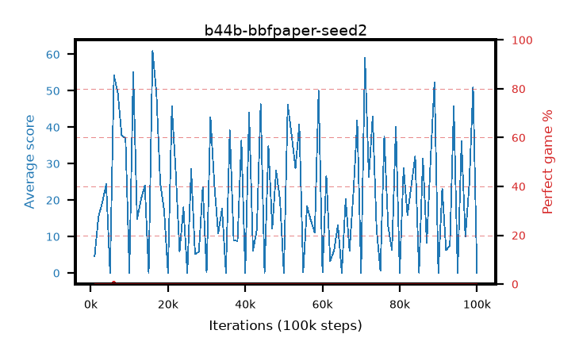

# b44b-bbfpaper-seed2

step **100,000** · 100 evals · trailing **22.19** · peak **27.46** @17,000 · sef **0.0** · best30 **0.0** @30,000

## Config

| | |
|---|---|
| adam_epsilon | 0.00015 |
| algo | bbf |
| batch_size | 32 |
| bbf_double | True |
| bbf_dueling | True |
| bbf_projection | 512 |
| bbf_spr_steps | 5 |
| bbf_spr_weight | 5.0 |
| bbf_transition_width | 256 |
| bbf_weight_decay | 0.1 |
| collect_envs | 1 |
| discount | 0.997 |
| dist_atoms | 51 |
| dist_v_max | 110.0 |
| dist_v_min | -10.0 |
| epsilon_anneal_steps | 2001 |
| eval_interval | 1000 |
| eval_queue | True |
| eval_queue_depth | 16 |
| eval_workers | 8 |
| fc_layers | (1280, 2048) |
| gradient_clipping | 10.0 |
| graph_eval_episodes | 100 |
| init_from | None |
| initial_collect_steps | 2000 |
| initial_epsilon | 1.0 |
| learning_rate | 0.0001 |
| max_steps | 100000 |
| min_checkpoint_score | 40.0 |
| min_epsilon | 0.0 |
| n_step_update | 3 |
| priority_exponent | 0.5 |
| replay_buffer_max_length | 1000000 |
| replay_ratio | 8.0 |
| reset_alpha | 0.5 |
| reset_anneal_gamma | 0.97,0.997 |
| reset_anneal_n_step | 10,3 |
| reset_anneal_steps | 10000 |
| reset_interval | 40000 |
| reset_stop_after | 0 |
| seed | 2 |
| target_update_tau | 0.005 |
| torch_threads | 1 |

## Evals

| step | avg score | trailing avg | min score | max score | avg reward | perfect % | epsilon |
|---|---|---|---|---|---|---|---|
| 1000 | 4.62 | 4.62 | 1.0 | 11.0 | 1.963 | 0.0 | 0.50075 |
| 2000 | 15.5 | 10.06 | 0.0 | 38.0 | 10.893 | 0.0 | 0.001 |
| 3000 | 19.39 | 13.17 | 3.0 | 37.0 | 14.682 | 0.0 | 0.0 |
| ... | ... | ... | ... | ... | ... | ... | ... |
| 89000 | 52.35 | 20.04 | 1.0 | 84.0 | 48.597 | 0.0 | 0.0 |
| 90000 | 0.02 | 20.04 | 0.0 | 1.0 | -4.981 | 0.0 | 0.0 |
| 91000 | 23.11 | 19.92 | 9.0 | 45.0 | 18.334 | 0.0 | 0.0 |
| 92000 | 6.24 | 20.02 | 3.0 | 13.0 | 4.043 | 0.0 | 0.0 |
| 93000 | 7.55 | 20.07 | 1.0 | 21.0 | 6.642 | 0.0 | 0.0 |
| 94000 | 45.81 | 21.15 | 0.0 | 83.0 | 42.888 | 0.0 | 0.0 |
| 95000 | 0.0 | 21.15 | 0.0 | 0.0 | -5.002 | 0.0 | 0.0 |
| 96000 | 36.22 | 21.68 | 17.0 | 63.0 | 31.193 | 0.0 | 0.0 |
| 97000 | 9.97 | 21.81 | 2.0 | 31.0 | 8.76 | 0.0 | 0.0 |
| 98000 | 24.12 | 21.89 | 0.0 | 68.0 | 20.3 | 0.0 | 0.0 |
| 99000 | 51.06 | 22.19 | 0.0 | 84.0 | 46.735 | 0.0 | 0.0 |
| 100000 | 0.03 | 22.19 | 0.0 | 1.0 | -4.973 | 0.0 | 0.0 |
