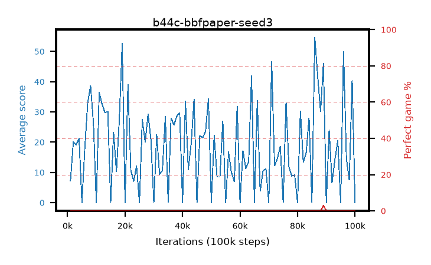

# b44c-bbfpaper-seed3

step **100,000** · 100 evals · trailing **19.79** · peak **22.42** @19,000 · sef **0.0** · best30 **0.1** @89,000

## Config

| | |
|---|---|
| adam_epsilon | 0.00015 |
| algo | bbf |
| batch_size | 32 |
| bbf_double | True |
| bbf_dueling | True |
| bbf_projection | 512 |
| bbf_spr_steps | 5 |
| bbf_spr_weight | 5.0 |
| bbf_transition_width | 256 |
| bbf_weight_decay | 0.1 |
| collect_envs | 1 |
| discount | 0.997 |
| dist_atoms | 51 |
| dist_v_max | 110.0 |
| dist_v_min | -10.0 |
| epsilon_anneal_steps | 2001 |
| eval_interval | 1000 |
| eval_queue | True |
| eval_queue_depth | 16 |
| eval_workers | 8 |
| fc_layers | (1280, 2048) |
| gradient_clipping | 10.0 |
| graph_eval_episodes | 100 |
| init_from | None |
| initial_collect_steps | 2000 |
| initial_epsilon | 1.0 |
| learning_rate | 0.0001 |
| max_steps | 100000 |
| min_checkpoint_score | 40.0 |
| min_epsilon | 0.0 |
| n_step_update | 3 |
| priority_exponent | 0.5 |
| replay_buffer_max_length | 1000000 |
| replay_ratio | 8.0 |
| reset_alpha | 0.5 |
| reset_anneal_gamma | 0.97,0.997 |
| reset_anneal_n_step | 10,3 |
| reset_anneal_steps | 10000 |
| reset_interval | 40000 |
| reset_stop_after | 0 |
| seed | 3 |
| target_update_tau | 0.005 |
| torch_threads | 1 |

## Evals

| step | avg score | trailing avg | min score | max score | avg reward | perfect % | epsilon |
|---|---|---|---|---|---|---|---|
| 1000 | 7.18 | 7.18 | 2.0 | 22.0 | 2.996 | 0.0 | 0.50075 |
| 2000 | 20.03 | 13.61 | 1.0 | 43.0 | 14.979 | 0.0 | 0.001 |
| 3000 | 19.14 | 15.45 | 2.0 | 45.0 | 14.224 | 0.0 | 0.0 |
| ... | ... | ... | ... | ... | ... | ... | ... |
| 89000 | 45.94 | 18.64 | 1.0 | 95.0 | 46.72 | 3.0 | 0.0 |
| 90000 | 0.03 | 18.64 | 0.0 | 1.0 | -4.971 | 0.0 | 0.0 |
| 91000 | 23.96 | 18.87 | 11.0 | 44.0 | 19.011 | 0.0 | 0.0 |
| 92000 | 6.62 | 18.71 | 3.0 | 16.0 | 3.954 | 0.0 | 0.0 |
| 93000 | 14.29 | 18.73 | 1.0 | 37.0 | 11.996 | 0.0 | 0.0 |
| 94000 | 20.48 | 18.02 | 0.0 | 49.0 | 17.919 | 0.0 | 0.0 |
| 95000 | 0.06 | 18.02 | 0.0 | 1.0 | -4.941 | 0.0 | 0.0 |
| 96000 | 49.89 | 18.56 | 23.0 | 81.0 | 44.838 | 0.0 | 0.0 |
| 97000 | 14.51 | 18.92 | 3.0 | 48.0 | 13.261 | 0.0 | 0.0 |
| 98000 | 7.54 | 18.82 | 0.0 | 18.0 | 6.943 | 0.0 | 0.0 |
| 99000 | 40.39 | 19.79 | 5.0 | 82.0 | 37.695 | 0.0 | 0.0 |
| 100000 | 0.01 | 19.79 | 0.0 | 1.0 | -4.991 | 0.0 | 0.0 |
