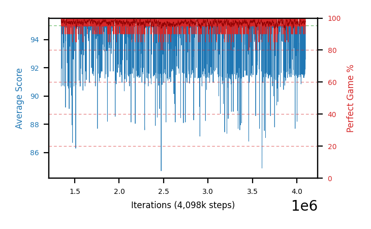

# b45b-lowlr8-b29a

Blue is average score (food eaten) on the left axis, red is perfect-game percentage on the right.

Latest eval: step 5000000, avg score 94.85, perfect games 95%.

## Config

| setting | value |
|---|---|
| policy_name | b45b-lowlr8-b29a |
| seed | 1 |
| zeroed_observations | none |
| learning_rate | 1e-08 |
| adam_epsilon | 1e-07 |
| perfect_game_reward | 100.0 |
| batch_size | 128 |
| discount | 0.9975 |
| target_update_period | 1000 |
| target_update_tau | 1.0 |
| gradient_clipping | none |
| n_step_update | 1 |
| initial_epsilon | 0.4 |
| min_epsilon | 0.002 |
| epsilon_schedule | bootstrap on avg_reward [2, 5, 10, 15, 20] then geometric to floor by 80% trailing-30 perfect |
| guided_fraction | 0.8 |
| forking | up to 4 live branches including the main line, fork p=0.5 at length >= 85, branch capped at 60 steps, one branch advanced per iteration |
| exploration_shield | 80% of refinement-phase episodes draw the epsilon move from non-fatal actions; greedy moves never shielded |
| fc_layer_params | (320,) |
| algo | ddqn, scalar head, Huber TD error |
| replay_buffer | cpprb prioritized, capacity 100000 |
| priority_exponent (alpha) | 0.6 |
| priority_signal | td_error |
| importance_sampling_beta | disabled |
| max_steps | 5000000 |
| initial_populate_steps | 1000 |
| eval | 20 episodes every 1000 steps |
| grid | 9x9, max possible score 95 |
| DEATH_REWARD | -5.0 |
| FOOD_REWARD | 1.0 |
| FOOD_DISTANCE_REWARD | 0.0 |
| CHASE_SAFE_SHAPING | c=0.1, potential-based on head/food/tail in one region, gated to snake length >= 75 |
| FREE_SPACE_SHAPING | off |
| eval_only | False |
| min_checkpoint_score | 40.0 |

## Evals

3654 evals so far. Full series in [`b45b-lowlr8-b29a_evals.json`](b45b-lowlr8-b29a_evals.json).

| step | avg score | trailing avg | min score | max score | avg reward | perfect % | epsilon |
|---|---|---|---|---|---|---|---|
| 1347000 | 95.0 | 95.0 | 95 | 95/95 | 193.956 | 100 | 0.002 |
| 1348000 | 90.7 | 90.7 | 9 | 95/95 | 184.676 | 95 | 0.002 |
| 1349000 | 94.9 | 92.8 | 93 | 95/95 | 188.878 | 95 | 0.002 |
| ... | | | | | | | |
| 4989000 | 94.85 | 94.24 | 92 | 95/95 | 188.828 | 95 | 0.002 |
| 4990000 | 91.45 | 94.24 | 24 | 95/95 | 185.433 | 95 | 0.002 |
| 4991000 | 95.0 | 94.24 | 95 | 95/95 | 193.947 | 100 | 0.002 |
| 4992000 | 91.6 | 93.56 | 27 | 95/95 | 185.581 | 95 | 0.002 |
| 4993000 | 95.0 | 93.58 | 95 | 95/95 | 193.955 | 100 | 0.002 |
| 4994000 | 94.75 | 93.56 | 90 | 95/95 | 188.73 | 95 | 0.002 |
| 4995000 | 95.0 | 94.27 | 95 | 95/95 | 193.955 | 100 | 0.002 |
| 4996000 | 95.0 | 94.27 | 95 | 95/95 | 193.955 | 100 | 0.002 |
| 4997000 | 94.05 | 94.76 | 76 | 95/95 | 188.025 | 95 | 0.002 |
| 4998000 | 95.0 | 94.76 | 95 | 95/95 | 193.948 | 100 | 0.002 |
| 4999000 | 95.0 | 94.81 | 95 | 95/95 | 193.951 | 100 | 0.002 |
| 5000000 | 94.85 | 94.78 | 92 | 95/95 | 188.824 | 95 | 0.002 |
