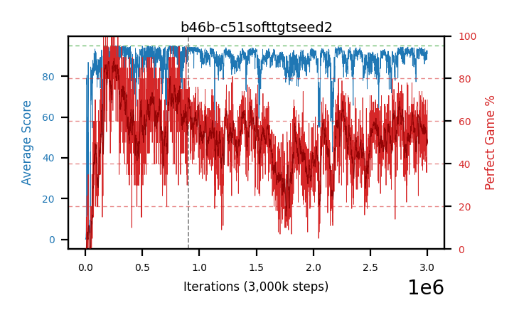

# b46b-c51softtgtseed2

Blue is average score (food eaten) on the left axis, red is perfect-game percentage on the right.

Latest eval: step 3000000, avg score 92.67, perfect games 70%.

Training was resumed at step 903000 (the dashed lines on the graph).

## Config

| setting | value |
|---|---|
| policy_name | b46b-c51softtgtseed2 |
| seed | 2 |
| zeroed_observations | none |
| learning_rate | 0.0001 |
| adam_epsilon | 0.0003125 |
| perfect_game_reward | 100.0 |
| batch_size | 128 |
| discount | 0.9975 |
| target_update_period | 1 |
| target_update_tau | 0.005 |
| gradient_clipping | none |
| n_step_update | 1 |
| initial_epsilon | 0.4 |
| min_epsilon | 0.002 |
| epsilon_schedule | bootstrap on avg_reward [2, 5, 10, 15, 20] then geometric to floor by 80% trailing-30 perfect |
| guided_fraction | 0.8 |
| forking | up to 4 live branches including the main line, fork p=0.5 at length >= 85, branch capped at 60 steps, one branch advanced per iteration |
| exploration_shield | 80% of refinement-phase episodes draw the epsilon move from non-fatal actions; greedy moves never shielded |
| fc_layer_params | (320,) |
| algo | c51 (distributional), 51 atoms over [-5.0, 120.0] at 2.500 spacing, cross-entropy loss, double (online argmax) target selection, standard init |
| replay_buffer | cpprb prioritized, capacity 100000 |
| priority_exponent (alpha) | 0.6 |
| priority_signal | kl (SNEK_PRIORITY_SIGNAL=td_error; a distributional agent has no TD error) |
| importance_sampling_beta | disabled |
| max_steps | 3000000 |
| initial_populate_steps | 1000 |
| eval | 100 episodes every 1000 steps, engine vec, 100 lanes in-process, no worker processes |
| grid | 9x9, max possible score 95 |
| DEATH_REWARD | -5.0 |
| FOOD_REWARD | 1.0 |
| FOOD_DISTANCE_REWARD | 0.0 |
| CHASE_SAFE_SHAPING | off |
| FREE_SPACE_SHAPING | off |
| eval_only | False |
| min_checkpoint_score | 40.0 |
| c51_support_note | support [-5.0, 120.0] is below the derived maximum return 194.0, so a return above 120.0 would be clipped. 14% headroom over the measured 105.0; spacing 2.500. This is a judgement, not an error. |

## Evals

3001 evals so far. Full series in [`b46b-c51softtgtseed2_evals.json`](b46b-c51softtgtseed2_evals.json).

| step | avg score | trailing avg | min score | max score | avg reward | perfect % | epsilon |
|---|---|---|---|---|---|---|---|
| 0 | 0.0 | 0.0 | 0 | 0/95 | -5.0 | 0 | 0.4 |
| 1000 | 0.25 | 0.25 | 0 | 1/95 | -0.25 | 0 | 0.4 |
| 2000 | 0.5 | 0.38 | 0 | 2/95 | 0.0 | 0 | 0.4 |
| ... | | | | | | | |
| 2989000 | 88.92 | 89.9 | 8 | 95/95 | 150.43 | 63 | 0.0034 |
| 2990000 | 88.11 | 89.49 | 10 | 95/95 | 136.46 | 50 | 0.0034 |
| 2991000 | 92.65 | 90.12 | 29 | 95/95 | 147.875 | 57 | 0.0035 |
| 2992000 | 88.78 | 89.62 | 12 | 95/95 | 131.885 | 45 | 0.0035 |
| 2993000 | 90.16 | 89.72 | 29 | 95/95 | 124.31 | 36 | 0.0036 |
| 2994000 | 92.08 | 90.36 | 27 | 95/95 | 133.375 | 43 | 0.0036 |
| 2995000 | 90.69 | 90.87 | 8 | 95/95 | 124.795 | 36 | 0.0037 |
| 2996000 | 88.2 | 89.98 | 10 | 95/95 | 151.88 | 65 | 0.0037 |
| 2997000 | 91.75 | 90.58 | 13 | 95/95 | 148.195 | 58 | 0.0036 |
| 2998000 | 92.16 | 90.98 | 25 | 95/95 | 147.565 | 57 | 0.0036 |
| 2999000 | 90.92 | 90.74 | 18 | 95/95 | 138.05 | 49 | 0.0037 |
| 3000000 | 92.67 | 91.14 | 40 | 95/95 | 161.19 | 70 | 0.0036 |
