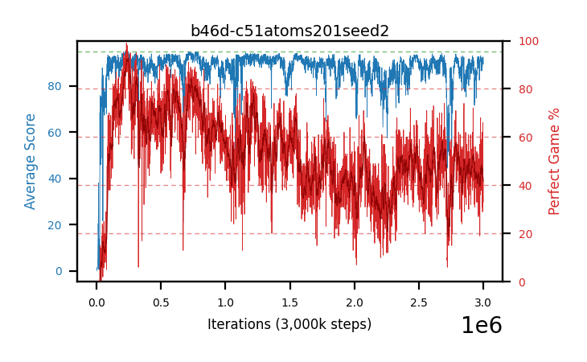

# b46d-c51atoms201seed2

Blue is average score (food eaten) on the left axis, red is perfect-game percentage on the right.

Latest eval: step 3000000, avg score 92.23, perfect games 42%.

## Config

| setting | value |
|---|---|
| policy_name | b46d-c51atoms201seed2 |
| seed | 2 |
| zeroed_observations | none |
| learning_rate | 0.0001 |
| adam_epsilon | 0.0003125 |
| perfect_game_reward | 100.0 |
| batch_size | 128 |
| discount | 0.9975 |
| target_update_period | 1000 |
| target_update_tau | 1.0 |
| gradient_clipping | none |
| n_step_update | 1 |
| initial_epsilon | 0.4 |
| min_epsilon | 0.002 |
| epsilon_schedule | bootstrap on avg_reward [2, 5, 10, 15, 20] then geometric to floor by 80% trailing-30 perfect |
| guided_fraction | 0.8 |
| forking | up to 4 live branches including the main line, fork p=0.5 at length >= 85, branch capped at 60 steps, one branch advanced per iteration |
| exploration_shield | 80% of refinement-phase episodes draw the epsilon move from non-fatal actions; greedy moves never shielded |
| fc_layer_params | (320,) |
| algo | c51 (distributional), 201 atoms over [-5.0, 120.0] at 0.625 spacing, cross-entropy loss, double (online argmax) target selection, standard init |
| replay_buffer | cpprb prioritized, capacity 100000 |
| priority_exponent (alpha) | 0.6 |
| priority_signal | kl (SNEK_PRIORITY_SIGNAL=td_error; a distributional agent has no TD error) |
| importance_sampling_beta | disabled |
| max_steps | 3000000 |
| initial_populate_steps | 1000 |
| eval | 100 episodes every 1000 steps, engine vec, 100 lanes in-process, no worker processes |
| grid | 9x9, max possible score 95 |
| DEATH_REWARD | -5.0 |
| FOOD_REWARD | 1.0 |
| FOOD_DISTANCE_REWARD | 0.0 |
| CHASE_SAFE_SHAPING | off |
| FREE_SPACE_SHAPING | off |
| eval_only | False |
| min_checkpoint_score | 40.0 |
| c51_support_note | support [-5.0, 120.0] is below the derived maximum return 194.0, so a return above 120.0 would be clipped. 14% headroom over the measured 105.0; spacing 0.625. This is a judgement, not an error. |

## Evals

3001 evals so far. Full series in [`b46d-c51atoms201seed2_evals.json`](b46d-c51atoms201seed2_evals.json).

| step | avg score | trailing avg | min score | max score | avg reward | perfect % | epsilon |
|---|---|---|---|---|---|---|---|
| 0 | 0.04 | 0.04 | 0 | 1/95 | -4.96 | 0 | 0.4 |
| 1000 | 0.79 | 0.79 | 0 | 10/95 | 0.29 | 0 | 0.4 |
| 2000 | 1.32 | 1.06 | 0 | 6/95 | 0.82 | 0 | 0.4 |
| ... | | | | | | | |
| 2989000 | 86.67 | 90.08 | 19 | 95/95 | 122.135 | 38 | 0.0046 |
| 2990000 | 90.36 | 89.79 | 25 | 95/95 | 135.91 | 48 | 0.0046 |
| 2991000 | 89.66 | 89.88 | 25 | 95/95 | 149.68 | 62 | 0.0045 |
| 2992000 | 88.2 | 89.05 | 23 | 95/95 | 116.385 | 31 | 0.0045 |
| 2993000 | 91.24 | 89.23 | 37 | 95/95 | 136.835 | 48 | 0.0045 |
| 2994000 | 89.37 | 89.77 | 16 | 95/95 | 115.43 | 29 | 0.0045 |
| 2995000 | 91.42 | 89.98 | 26 | 95/95 | 120.01 | 31 | 0.0046 |
| 2996000 | 90.38 | 90.12 | 24 | 95/95 | 128.06 | 40 | 0.0046 |
| 2997000 | 92.58 | 91.0 | 21 | 95/95 | 156.985 | 66 | 0.0045 |
| 2998000 | 90.1 | 90.77 | 23 | 95/95 | 124.66 | 37 | 0.0046 |
| 2999000 | 89.47 | 90.79 | 18 | 95/95 | 120.545 | 33 | 0.0045 |
| 3000000 | 92.23 | 90.95 | 18 | 95/95 | 132.755 | 42 | 0.0045 |
