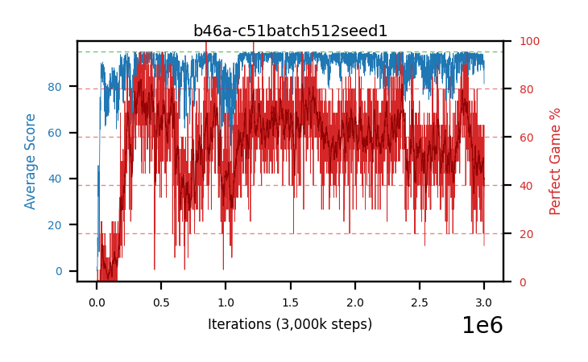

# b46a-c51batch512seed1

Blue is average score (food eaten) on the left axis, red is perfect-game percentage on the right.

Latest eval: step 3000000, avg score 81.15, perfect games 15%.

## Config

| setting | value |
|---|---|
| policy_name | b46a-c51batch512seed1 |
| seed | 1 |
| zeroed_observations | none |
| learning_rate | 0.0001 |
| adam_epsilon | 0.0003125 |
| perfect_game_reward | 100.0 |
| batch_size | 512 |
| discount | 0.9975 |
| target_update_period | 1000 |
| target_update_tau | 1.0 |
| gradient_clipping | none |
| n_step_update | 1 |
| initial_epsilon | 0.4 |
| min_epsilon | 0.002 |
| epsilon_schedule | bootstrap on avg_reward [2, 5, 10, 15, 20] then geometric to floor by 80% trailing-30 perfect |
| guided_fraction | 0.8 |
| forking | up to 4 live branches including the main line, fork p=0.5 at length >= 85, branch capped at 60 steps, one branch advanced per iteration |
| exploration_shield | 80% of refinement-phase episodes draw the epsilon move from non-fatal actions; greedy moves never shielded |
| fc_layer_params | (320,) |
| algo | c51 (distributional), 51 atoms over [-5.0, 120.0] at 2.500 spacing, cross-entropy loss, double (online argmax) target selection, standard init |
| replay_buffer | cpprb prioritized, capacity 100000 |
| priority_exponent (alpha) | 0.6 |
| priority_signal | kl (SNEK_PRIORITY_SIGNAL=td_error; a distributional agent has no TD error) |
| importance_sampling_beta | disabled |
| max_steps | 3000000 |
| initial_populate_steps | 1000 |
| eval | 20 episodes every 1000 steps |
| grid | 9x9, max possible score 95 |
| DEATH_REWARD | -5.0 |
| FOOD_REWARD | 1.0 |
| FOOD_DISTANCE_REWARD | 0.0 |
| CHASE_SAFE_SHAPING | off |
| FREE_SPACE_SHAPING | off |
| eval_only | False |
| min_checkpoint_score | 40.0 |
| c51_support_note | support [-5.0, 120.0] is below the derived maximum return 194.0, so a return above 120.0 would be clipped. 14% headroom over the measured 105.0; spacing 2.500. This is a judgement, not an error. |

## Evals

3001 evals so far. Full series in [`b46a-c51batch512seed1_evals.json`](b46a-c51batch512seed1_evals.json).

| step | avg score | trailing avg | min score | max score | avg reward | perfect % | epsilon |
|---|---|---|---|---|---|---|---|
| 0 | 0.0 | 0.0 | 0 | 0/95 | -5.0 | 0 | 0.4 |
| 1000 | 1.55 | 1.55 | 0 | 5/95 | 1.05 | 0 | 0.4 |
| 2000 | 1.25 | 1.4 | 0 | 4/95 | 0.75 | 0 | 0.4 |
| ... | | | | | | | |
| 2989000 | 92.15 | 91.66 | 77 | 95/95 | 150.45 | 60 | 0.0042 |
| 2990000 | 93.6 | 91.67 | 89 | 95/95 | 142.4 | 50 | 0.0042 |
| 2991000 | 93.9 | 92.45 | 89 | 95/95 | 157.85 | 65 | 0.0041 |
| 2992000 | 92.7 | 92.29 | 85 | 95/95 | 131.1 | 40 | 0.0041 |
| 2993000 | 90.75 | 92.62 | 37 | 95/95 | 138.65 | 50 | 0.0041 |
| 2994000 | 88.05 | 91.8 | 16 | 95/95 | 106.325 | 20 | 0.0042 |
| 2995000 | 88.65 | 90.81 | 28 | 95/95 | 116.425 | 30 | 0.0043 |
| 2996000 | 87.0 | 89.43 | 27 | 95/95 | 124.95 | 40 | 0.0043 |
| 2997000 | 90.65 | 89.02 | 37 | 95/95 | 122.95 | 35 | 0.0043 |
| 2998000 | 87.45 | 88.36 | 28 | 95/95 | 120.65 | 35 | 0.0044 |
| 2999000 | 91.15 | 88.98 | 30 | 95/95 | 154.875 | 65 | 0.0044 |
| 3000000 | 81.15 | 87.48 | 22 | 95/95 | 93.55 | 15 | 0.0045 |
